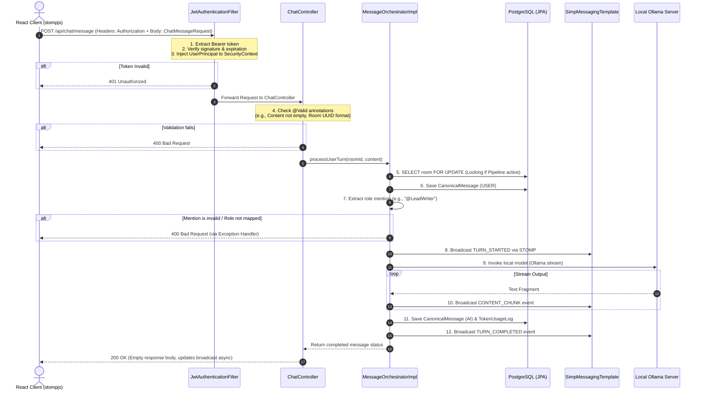

# API Specification: Conclave REST & STOMP Interfaces

This document defines the complete REST API contract and WebSocket STOMP protocol specification for the **Conclave** platform. 

---

## 1. Global Conventions

*   **Base REST Path:** `http://localhost:8080/api`
*   **WebSocket Upgrade Endpoint:** `ws://localhost:8080/ws-conclave`
*   **Authentication:** HTTP Authorization header containing JWT Bearer Token:
    ```http
    Authorization: Bearer <JWT_TOKEN>
    ```
*   **Payload Format:** JSON (`application/json`)
*   **Error Response Schema:** Exposes standard error responses captured by `GlobalExceptionHandler`:
    ```json
    {
      "status": 400,
      "error": "Bad Request",
      "message": "No role assignment found in room matching mention: @SecurityCritic",
      "timestamp": "2026-07-28T10:11:00.123"
    }
    ```

---

## 2. Request Lifecycle & Sequence Diagram

This sequence illustrates the end-to-end processing of a user's chat message containing a role mention:



---

## 3. REST Endpoint Registry

### 3.1 Authentication Services (`/auth`)

#### `POST /auth/register`
Creates a new user profile.
*   **Request Headers:** `Content-Type: application/json`
*   **Request Body Example:**
    ```json
    {
      "email": "candidate@engineer.com",
      "password": "SecurePassword123",
      "name": "Alex Candidate"
    }
    ```
*   **Response Body Example (200 OK):**
    ```json
    {
      "token": "eyJhbGciOiJIUzI1NiIsInR5cCI6IkpXVCJ9...",
      "user": {
        "id": "550e8400-e29b-41d4-a716-446655440000",
        "email": "candidate@engineer.com",
        "name": "Alex Candidate"
      }
    }
    ```
*   **Validation Rules:**
    *   `email`: Must be a valid email syntax, cannot be duplicate. Returns `409 Conflict` (via `EmailAlreadyExistsException`) if already in use.
    *   `password`: Minimum length of 6 characters.

#### `POST /auth/login`
Validates user credentials and returns a JWT.
*   **Request Body Example:**
    ```json
    {
      "email": "candidate@engineer.com",
      "password": "SecurePassword123"
    }
    ```
*   **Response Body Example (200 OK):**
    ```json
    {
      "token": "eyJhbGciOiJIUzI1NiIsInR5cCI6IkpXVCJ9...",
      "user": {
        "id": "550e8400-e29b-41d4-a716-446655440000",
        "email": "candidate@engineer.com",
        "name": "Alex Candidate"
      }
    }
    ```
*   **Error Codes:**
    *   `401 Unauthorized`: Returned for incorrect password or non-existent email.

---

### 3.2 Room Management Services (`/rooms`)

All room requests require a valid Bearer JWT.

#### `POST /rooms`
Creates a new collaborative session.
*   **Request Body Example:**
    ```json
    {
      "name": "System Architecture Draft",
      "objective": "Design the REST interface for a payments service",
      "roleAssignments": [
        {
          "roleName": "LeadWriter",
          "modelId": "llama3",
          "uiColorHex": "#8B5CF6"
        },
        {
          "roleName": "Critic",
          "modelId": "mistral",
          "uiColorHex": "#EAB308"
        }
      ],
      "pipelineSequenceList": ["LeadWriter", "Critic"]
    }
    ```
*   **Response Body Example (201 Created):**
    ```json
    {
      "roomId": "8432b21c-cfdf-474c-81b4-2da7135be362",
      "name": "System Architecture Draft",
      "objective": "Design the REST interface for a payments service",
      "status": "INITIALIZED",
      "roleAssignments": [
        {
          "roleName": "LeadWriter",
          "modelId": "llama3",
          "uiColorHex": "#8B5CF6"
        },
        {
          "roleName": "Critic",
          "modelId": "mistral",
          "uiColorHex": "#EAB308"
        }
      ],
      "workflowState": {
        "currentDraft": "",
        "reviewComments": "",
        "lastUpdatedAt": "2026-07-28T10:45:00.000"
      }
    }
    ```

#### `GET /rooms/{id}`
Retrieves the complete room state including active workflow state.
*   **Response Body Example (200 OK):**
    ```json
    {
      "roomId": "8432b21c-cfdf-474c-81b4-2da7135be362",
      "name": "System Architecture Draft",
      "objective": "Design the REST interface for a payments service",
      "status": "ACTIVE",
      "roleAssignments": [...],
      "workflowState": {
        "currentDraft": "Payment REST API endpoints:\n1. POST /api/payments",
        "reviewComments": "- Endpoint missing rate limiting fields.",
        "lastUpdatedAt": "2026-07-28T10:46:12.441"
      }
    }
    ```
*   **Error Codes:**
    *   `404 Not Found`: Room UUID does not exist in database.

---

### 3.3 Chat & Orchestration Services (`/chat`)

All orchestration requests require a valid Bearer JWT.

#### `POST /chat/message`
Dispatches user messages to the orchestration pipeline.
*   **Request Body Example:**
    ```json
    {
      "roomId": "8432b21c-cfdf-474c-81b4-2da7135be362",
      "content": "@LeadWriter draft the parameters for the checkout endpoint.",
      "isIntervention": false
    }
    ```
*   **Response (200 OK):** *(Body is empty; output streamed asynchronously via STOMP WebSockets)*
*   **Authorization Rules:** Only the room's owner (`owner_id` in database) can submit messages to the room. If a different authenticated user attempts to message, the system throws `UnauthorizedAccessException` yielding a `403 Forbidden` response.

#### `GET /chat/{roomId}/history`
Fetches the canonical history list for the workspace.
*   **Response Body Example (200 OK):**
    ```json
    [
      {
        "messageId": "ac82b3d2-3112-4c2c-882e-131154be1212",
        "senderType": "USER",
        "roleName": null,
        "modelId": null,
        "content": "@LeadWriter draft the parameters for the checkout endpoint.",
        "timestamp": "2026-07-28T10:45:50.000",
        "isMocked": false
      },
      {
        "messageId": "bd382c1e-3fdf-441c-b29e-445a16df3323",
        "senderType": "AI",
        "roleName": "LeadWriter",
        "modelId": "llama3",
        "content": "Here is the structure for `POST /api/checkout`...",
        "timestamp": "2026-07-28T10:46:02.122",
        "isMocked": false
      }
    ]
    ```

#### `POST /chat/pipeline/pause`
Halts sequential pipeline execution.
*   **Request Body Example:**
    ```json
    {
      "roomId": "8432b21c-cfdf-474c-81b4-2da7135be362"
    }
    ```
*   **Response Body Example (200 OK):**
    ```json
    {
      "status": "PAUSED"
    }
    ```

#### `POST /chat/pipeline/resume`
Resumes pipeline execution, triggering the next model sequentially.
*   **Request Body Example:**
    ```json
    {
      "roomId": "8432b21c-cfdf-474c-81b4-2da7135be362"
    }
    ```
*   **Response Body Example (200 OK):**
    ```json
    {
      "status": "ACTIVE"
    }
    ```

---

## 4. WebSocket STOMP Contract

Real-time streaming, status changes, and notifications run over the STOMP message channel.

*   **WebSocket Upgrade Endpoint:** `ws://localhost:8080/ws-conclave`
*   **Room Subscription Path:** `/topic/room/{roomId}`

### STOMP Broadcast Frame Schema

#### 4.1 `TURN_STARTED`
Broadcast immediately when a model is selected and execution begins:
```json
{
  "type": "TURN_STARTED",
  "roleName": "Critic",
  "modelId": "mistral",
  "isMocked": false
}
```

#### 4.2 `CONTENT_CHUNK`
Word-by-word streaming updates:
```json
{
  "type": "CONTENT_CHUNK",
  "delta": "This is a fragment ",
  "messageId": "bd382c1e-3fdf-441c-b29e-445a16df3323"
}
```

#### 4.3 `TURN_COMPLETED`
Fires when the stream ends, logging token usage metrics:
```json
{
  "type": "TURN_COMPLETED",
  "messageId": "bd382c1e-3fdf-441c-b29e-445a16df3323",
  "content": "The completed synthesized response block.",
  "usage": {
    "promptTokens": 145,
    "completionTokens": 320
  }
}
```

#### 4.4 `SYSTEM_INTERVENTION`
Sent when a user injects a manual override, or when an error occurs:
```json
{
  "type": "SYSTEM_INTERVENTION",
  "messageId": "249d9c22-bcfb-4e6f-82ff-11a56cfbe929",
  "content": "[Manual Correction]: Please focus only on PostgreSQL schemas."
}
```