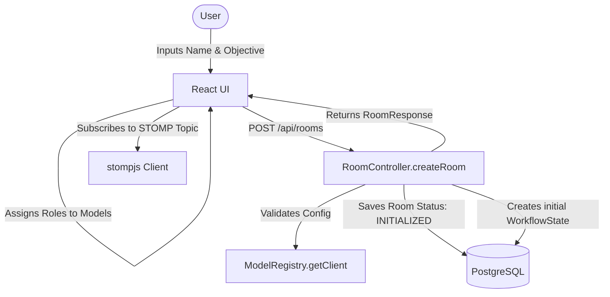

# App Flow & Execution Lifecycles: Conclave

This document defines the core user journeys, data state transitions, and backend service lifecycles of the Conclave platform. It details the execution flow for room initialization, @-mention turn orchestration, real-time sync, context compaction (Context Janitor), and manual pause/resume interventions.

---

## 1. Meeting Room Setup Lifecycle

Handles the transition from an empty dashboard to an orchestrated, multi-agent workspace.



1.  **Room Setup Init:** The user enters a room name and a system objective (e.g., "Write and review security schemas") in the React interface.
2.  **Role Assignment:** The user assigns specific roles (e.g., "Writer" to `llama3`, "Reviewer" to `mistral`) and sets the order of execution (Pipeline Sequence).
3.  **Config Dispatch:** The React client fires a `POST /api/rooms` request containing the config mappings to `RoomController`.
4.  **Registry Validation:** The backend validates that all assigned model IDs exist within the `ModelRegistry` bean map.
5.  **State Initialization:**
6.  A database transaction writes rows to the `rooms` and `role_assignments` tables.
7.  The room status is set to `INITIALIZED`.
8.  A default `WorkflowState` record is generated with empty fields for `current_draft` and `review_comments`.
9.  **Client Sync:** The controller returns `RoomResponse`. React navigates to the workspace view, establishes a WebSocket connection to the server, and subscribes to the STOMP channel `/topic/room/{roomId}`.

---

## 2. The @-Mention Turn Flow (Moderated Execution)

This lifecycle runs when a user explicitly routes a message to a specific role using the `@RoleName` trigger.

```mermaid
sequenceDiagram
    autonumber
    actor User as User (React Client)
    participant ChatCtrl as ChatController
    participant Orch as MessageOrchestratorImpl
    participant Reg as ModelRegistryImpl
    participant Adap as ModelAdapter (e.g., LlamaAdapter)
    participant ChatClt as OllamaChatModel
    participant WS as SimpMessagingTemplate
    participant DB as PostgreSQL

    User->>ChatCtrl: POST /api/chat/message (Body with @Role)
    ChatCtrl->>Orch: processUserTurn(roomId, content)
    
    rect rgb(20, 20, 25)
        Note over Orch, DB: Message Persistence
        Orch->>DB: Save CanonicalMessage (USER)
    end

    Orch->>Orch: Parse Mention (e.g., "@Writer")
    Orch->>Reg: getClient(modelId)
    Reg-->>Orch: Return OllamaChatModel Bean
    Orch->>Adap: toModelFormat(history, state)
    Adap-->>Orch: Return Model Request Prompt
    
    Orch->>WS: Broadcast TURN_STARTED Event
    
    rect rgb(20, 20, 25)
        Note over Orch, ChatClt: Real Local Inference
        Orch->>ChatClt: stream(Prompt)
        ChatClt-->>Orch: Flux<ChatResponse> (Chunks)
        loop Process Chunk Stream
            Orch->>WS: Broadcast CONTENT_CHUNK Event
        end
    end

    Orch->>Adap: fromModelFormat(responsePayload)
    Adap-->>Orch: Return CanonicalMessage (AI)
    Orch->>DB: Save CanonicalMessage (AI) & TokenUsageLog
    Orch->>WS: Broadcast TURN_COMPLETED Event
```



1.  **Command Dispatched:** The user types a message containing an @-mention (e.g., `"@LeadWriter draft the database schema"`).
2.  **Controller Injection:** `ChatController` intercepts the payload and invokes `MessageOrchestrator.processUserTurn`.
3.  **User Message Saved:** The raw user input is saved as a `CanonicalMessage` with `sender_type = USER`.
4.  **Mention Extraction:** `MentionParser` extracts the role name, looks up the assigned Model ID via `RoleAssignmentRepository`, and resolves the corresponding Spring AI `OllamaChatModel` from the `ModelRegistry`.
5.  **Adapter Translation:** The `ModelAdapter` implementation (e.g. `LlamaAdapter`) translates the canonical message history and the active `WorkflowState` into the exact prompt structure (including special chat templates and token structures) expected by the target local model.
6.  **Real-Time Broadcasts:**
    *   Backend broadcasts a `TURN_STARTED` event over the WebSocket topic.
    *   For streaming, `OllamaChatModel.stream()` returns a reactive `Flux<ChatResponse>`. The server consumes this flux on a Virtual Thread, writing incoming fragments directly to the WebSocket via `CONTENT_CHUNK` events in real-time.
7.  **Response Synthesis:** Once the stream completes, the final response is normalized back into a `CanonicalMessage` with `sender_type = AI`. It is saved to PostgreSQL, along with a `TokenUsageLog` audit record, and a `TURN_COMPLETED` STOMP frame is broadcast.

---

## 3. The Context Janitor Lifecycle (Context Compression)

To prevent conversation history from bloating token usage, a cleanup loop runs at the end of each turn.

```mermaid
flowchart TD
    Start([End of Turn]) --> Check{History Size > 10?}
    Check -- No --> End([End Journey])
    Check -- Yes --> Load[Load history & WorkflowState]
    Load --> Format[Format transcript into text block]
    Format --> Prompt[Compile Janitor System Prompt]
    Prompt --> API[Invoke local summarizer model (e.g. Llama 3)]
    API --> Parse{Parse JSON Response?}
    Parse -- Success --> Update[Update WorkflowState draft & comments]
    Parse -- JSON Failure --> Fallback[Set full output to draft & log error]
    Update --> Purge[Purge middle messages: Keep index 0 & last 2]
    Fallback --> Purge
    Purge --> Save[Save database changes]
    Save --> Broadcast[Broadcast updated state via STOMP]
    Broadcast --> End
```

1.  **Trigger Check:** At the end of `MessageOrchestratorImpl.executeStreamingTurnAsync`, the orchestrator invokes `WorkflowStateService.evaluateAndCompressHistory`.
2.  **Size Check:** If the current `conversation_history` count is less than or equal to 10 messages, the operation exits.
3.  **Summarization Compilation:** If history is > 10, the service formats the entire transcript and builds a compression prompt for the `Conclave Janitor`.
4.  **Consolidation Request:** The backend calls a local summarizer model (e.g., Llama 3 or Mistral) to incorporate agreed changes into the draft and extract unresolved tasks as review comments, requesting a strict JSON response:
    ```json
    { "currentDraft": "...", "reviewComments": "..." }
    ```
5.  **History Purging:** After updating `WorkflowState`, the database deletes the middle history rows, retaining only:
    *   **Index 0 (Context Foundation):** The system objective message.
    *   **Last 2 Messages:** The immediate conversation turn context to preserve short-term memory.
6.  **Client Sync:** The updated `WorkflowState` and purged message list are broadcast via WebSocket to sync the frontend UI panels.

---

## 4. Pause & Intervene Flow (Manual Override)

This flow allows a user to pause an active sequential pipeline (e.g., Writer &rarr; Critic) to inject manual corrections.

1.  **Pause Signal:** During a sequential multi-model loop, the user clicks the "Pause" button.
2.  **Pessimistic Locking:** The React client hits `POST /api/rooms/{roomId}/pause`. The backend invokes `PipelineManager.pausePipeline`, acquiring a pessimistic write lock on the `Room` entity:
    ```java
    // PipelineManagerImpl.java
    Room room = roomRepository.findWithLockById(roomId)
            .orElseThrow(() -> new ResourceNotFoundException("Room not found"));
    room.setStatus(RoomStatus.PAUSED);
    roomRepository.save(room);
    ```
3.  **Queue Lock:** The database status change to `PAUSED` prevents any subsequent models in the pipeline queue from triggering.
4.  **User Intervention:** The user types a correction (e.g., `"Focus more on the validation functions"`) and submits it.
5.  **Context Injection:** The backend flags this message as `isIntervention = true`. The user's input is saved as a `CanonicalMessage` and immediately merged into the `WorkflowState` draft context.
6.  **Pipeline Resume:** The user clicks the "Resume" button. The backend updates the room status back to `ACTIVE`, advances `currentPipelineIndex`, and triggers the next model turn. The target model receives the newly updated context containing the user's manual intervention.