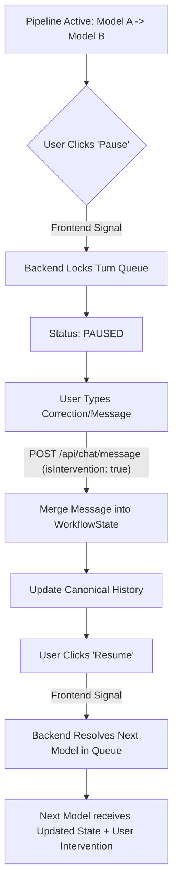

# App Flow & Execution Lifecycles: Conclave

This document outlines the user journeys, data state transitions, and cross-service execution lifecycles for **Conclave**. It details the orchestration of multi-provider AI turns and the management of the "Pause & Intervene" mechanism.

---

## 1. Meeting Room Setup Lifecycle

This flow handles the transition from an empty state to an orchestrated multi-model environment.

1.  **Room Initialization:** User enters a room name and task objective in the UI (React).
2.  **Role Assignment:** User maps specific roles (e.g., "Lead Writer", "Code Critic") to available models (React).
3.  **Config Persistence:** Frontend sends room config and model mapping to `POST /api/rooms` (React → Spring Boot).
4.  **Registry Binding:** Backend validates the mapping against the Model Registry (Spring Boot).
5.  **State Initialization:** A new `WorkflowState` is created, and the room status is set to `INITIALIZED` in PostgreSQL (Spring Boot).
6.  **System Prompting:** Backend generates a hidden "Context Foundation" message based on roles and the task objective (Spring Boot).
7.  **Client Sync:** Backend returns the `RoomResponse`; Frontend navigates to the chat view and opens a WebSocket connection to `/topic/room/{roomId}` (React).

---

## 2. The @-Mention Turn Flow (Moderated Execution)

This flow occurs when a user explicitly directs the conversation to a specific model.

1.  **Command Input:** User types a message containing an @-mention (e.g., "@Gemini, draft the intro") (React).
2.  **Message Dispatch:** Frontend sends the command to the backend via `POST /api/chat/message` (React → Spring Boot).
3.  **Role Resolution:** Backend parses the message to identify the target model from the room's Role Mapping and resolves the corresponding `ChatClient` bean from the Model Registry (Spring Boot).
4.  **Context Preparation:** Backend retrieves the current `WorkflowState` and canonical history (Spring Boot).
5.  **Adapter Translation:** The canonical history is passed through the provider-specific Adapter:
    *   **Gemini Adapter:** Maps to `user/model` schema (Spring Boot).
    *   **Fake OpenAI/Claude Adapters:** Maps to `user/assistant` schema (Spring Boot).
6.  **Inference Execution:**
    *   **Real Call (Gemini):** Dispatched via `VertexAiChatClient` (Spring Boot → Google API).
    *   **Fake Call (OpenAI/Claude):** Dispatched to `FakeChatClient` for stubbed response simulation (Spring Boot).
7.  **Canonical Normalization:** The raw response is translated back into the `CanonicalMessage` format (Spring Boot).
8.  **Workflow Update:** The `WorkflowState` is updated with a new summary of the turn (Spring Boot).
9.  **Real-time Broadcast:** The new message and updated state summary are pushed to the room's WebSocket topic via the `TURN_COMPLETED` event (Spring Boot → WebSocket).
10. **UI Update:** All connected clients receive the payload and append the color-coded message bubble to the thread (React).

---

## 3. Shared Context & Sync Flow

How Conclave ensures all participants (human and model) remain aligned.

1.  **Event Listeners:** All frontend clients maintain an active STOMP subscription to the room's topic (React).
2.  **State Trigger:** Any backend change (New Message, Status Change, Workflow Update) triggers a WebSocket broadcast event (`TURN_STARTED`, `CONTENT_CHUNK`, `TURN_COMPLETED`, or `SYSTEM_INTERVENTION`) (Spring Boot).
3.  **Zustand Sync:** Upon receiving a WebSocket event, the local Zustand store updates the `messages` array and `workflowState` object (React).
4.  **Re-render:** React triggers a partial re-render of the "Message Matrix" and "Context Sidebar" to reflect the unified history (React).
5.  **Consistency Check:** Periodically, the frontend polls the `GET /api/rooms/{id}` endpoint to resolve any dropped WebSocket frames and synchronize room and workflow state (React → Spring Boot).

---

## 4. Pause & Intervene Flow (Manual Override)

This logic allows users to break a sequential model pipeline to prevent drift.

1.  **Intervention Trigger:** During a multi-model sequence, the user clicks the "Pause" button in the UI (React).
2.  **Locking:** Backend receives the interrupt and sets the room status to `PAUSED`, halting the next model's execution (Spring Boot).
3.  **Manual Entry:** User submits a "Correction Message" (React).
4.  **State Merging:** Backend treats the intervention as a high-priority "System/User" message, appending it to the history and re-summarizing the `WorkflowState` (Spring Boot).
5.  **Resumption:** User clicks "Resume"; Backend unlocks the queue and triggers the next model using the newly corrected context (Spring Boot).
6.  **Context Awareness:** The next model in the pipeline "sees" the user's intervention as the most recent context, allowing it to pivot based on the manual guidance (Live/Fake Provider).