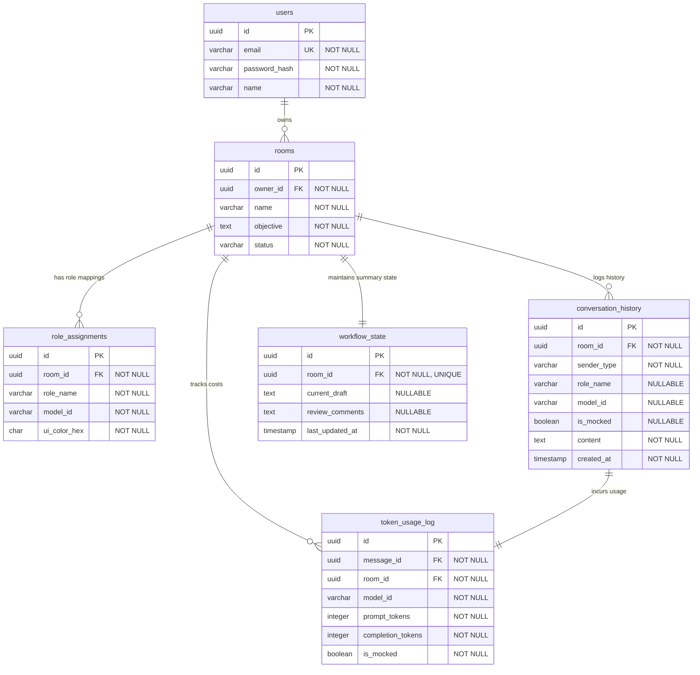

# DB Schema Specification: Conclave Persistence Model

This document defines the relational database schema, indexing strategies, transaction boundaries, locking mechanics, and growth considerations for the **Conclave** platform.

---

## 1. Entity Relationship Diagram (ERD)

The database models user authentication, isolated collaboration rooms, dynamic model-role maps, message logs, workflow states, and token metrics logs.



---

## 2. Table Specifications & Indexing Strategy

### 2.1 Entity Architectural Purposes
1.  **`users`:** Manages identity and BCrypt hashed credentials. Serves as the security anchor for JWT signature verification.
2.  **`rooms`:** The core unit of workspace isolation. Tracks project objectives and the overall pipeline state (`INITIALIZED`, `ACTIVE`, `PAUSED`, `ARCHIVED`).
3.  **`role_assignments`:** Exposes a dynamic registry linking custom roles (e.g. "Security Critic") to active Spring AI model beans. Ensures models are loosely-coupled from specific UI names.
4.  **`conversation_history`:** Stores the chronological log of all interactions in a unified format, allowing the adapter tier to reconstruct history for different APIs on demand.
5.  **`workflow_state`:** Serves as the primary source of truth for task progress (drafts, comments). Enables context compression by storing the long-term context while the message history is purged.
6.  **`token_usage_log`:** Logs input and output token consumption per turn for auditing, debugging, and future token monetization models.

---

### 2.2 Table Definitions & Indexes

#### 2.2.1 `users`
*   **Purpose:** User account storage.
*   **Indexes:**
    *   `PK_users`: Primary key index on `id` (UUID).
    *   `UK_users_email`: Unique index on `email` (B-Tree). Speeds up authentication checks during registration/login.

#### 2.2.2 `rooms`
*   **Purpose:** Collaboration room details.
*   **Indexes:**
    *   `PK_rooms`: Primary key index on `id`.
    *   `FK_rooms_owner`: Foreign key index on `owner_id`. Prevents full table scans when fetching rooms belonging to a specific user.

#### 2.2.3 `role_assignments`
*   **Purpose:** Maps custom roles to specific model engines.
*   **Indexes:**
    *   `PK_role_assignments`: Primary key index on `id`.
    *   `FK_role_assignments_room`: Foreign key index on `room_id`.
    *   `UK_role_assignments_room_role`: Unique composite index on `(room_id, role_name)`. Prevents assigning duplicate roles in the same room.

#### 2.2.4 `conversation_history`
*   **Purpose:** Unified message store.
*   **Indexes:**
    *   `PK_conversation_history`: Primary key index on `id`.
    *   `FK_conversation_history_room`: Foreign key index on `room_id`.
    *   `IDX_conv_history_room_created`: Composite index on `(room_id, created_at ASC)`. Critical for fetching the conversation history chronologically for adapter translation.

#### 2.2.5 `workflow_state`
*   **Purpose:** Task state summaries.
*   **Indexes:**
    *   `PK_workflow_state`: Primary key index on `id`.
    *   `UK_workflow_state_room`: Unique index on `room_id` to enforce the 1:1 relationship with the room.

#### 2.2.6 `token_usage_log`
*   **Purpose:** Token consumption logs.
*   **Indexes:**
    *   `PK_token_usage_log`: Primary key index on `id`.
    *   `FK_token_usage_log_room`: Foreign key index on `room_id`. Allows rapid retrieval of total token costs aggregated by room.
    *   `FK_token_usage_log_message`: Unique index on `message_id` to link usage to a specific turn.

---

## 3. Transactions & Pessimistic Locking Strategy

The Conclave service layer operates under standard JPA transaction scopes (`@Transactional`). In multi-agent sequential workflows, concurrency protection is enforced using database-level locking:

```
Transaction A (executeStreamingTurnAsync)               Transaction B (pausePipeline)
  │                                                      │
  ├──> SELECT room FOR UPDATE (locks Room UUID)           │
  │    * Status: ACTIVE                                  ├──> Attempt SELECT room FOR UPDATE
  │    * Virtual Thread executes API call                │    * BLOCKED (Waits for Transaction A)
  │    * Updates history & token logs                    │    .
  ├──> COMMIT / RELEASE LOCK ────────────────────────────┼──> Acquires lock
  │                                                      │    * Status: PAUSED
                                                         └──> COMMIT / RELEASE LOCK
```

### 3.1 Pessimistic Write Locking (`SELECT FOR UPDATE`)
To prevent a user from pausing a pipeline while an async LLM streaming turn is completing and advancing, the backend locks the `Room` record:
1.  Before executing a turn or pausing/resuming a pipeline, `PipelineManagerImpl` or `MessageOrchestratorImpl` calls `roomRepository.findWithLockById(roomId)`.
2.  This issues a PostgreSQL `SELECT ... FOR UPDATE` query, locking the row.
3.  Any concurrent transaction attempting to read or write this record is blocked until the active transaction commits.
4.  This ensures that pipeline status transitions are safe and sequential model invocations do not step on each other.

---

## 4. growth & Scaling Strategy

As users run multi-agent sessions, tables like `conversation_history` and `token_usage_log` will accumulate millions of records. The database architecture is designed with the following growth path:

### 4.1 Purge Heuristic (Context Janitor)
The **Context Janitor** (`WorkflowStateServiceImpl.evaluateAndCompressHistory`) acts as the first line of defense. By automatically purging the middle messages of a thread when it exceeds 10, it keeps the `conversation_history` table clean, preventing uncontrolled growth of chat messages.

### 4.2 Database Table Partitioning
For large scale production deployments:
*   **Partitioning Key:** Partition `conversation_history` and `token_usage_log` by `room_id` or `created_at` timestamp.
*   **Partition Strategy:** Range partitioning by month (e.g. `conversation_history_2026_07`). This allows archiving or dropping old partitions without executing slow delete statements.

### 4.3 Data Archiving
*   Rooms with status `ARCHIVED` can have their history and logs moved to a cold storage database or archived to object stores (e.g. AWS S3), keeping the active PostgreSQL instance small and performant.

### 4.4 Migration Considerations
*   **Database Migrations:** Use schema migration tools like **Flyway** or **Liquibase** to version database changes.
*   **Migration Safeties:** Avoid using default values that lock large tables during migrations. Use online schema change patterns (e.g., adding nullable columns, filling data in chunks, and then applying constraints).