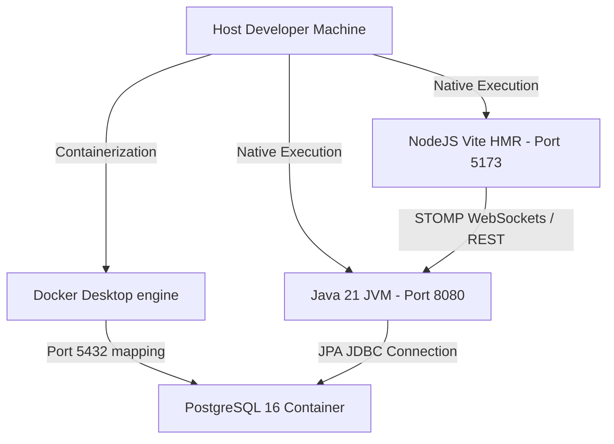
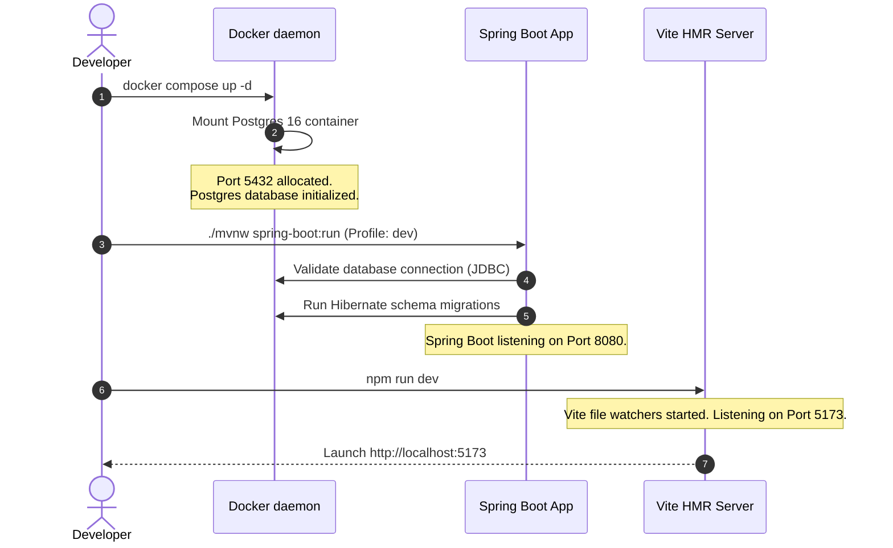

# Chapter 01: Developer Environment Setup

## 1. Problem Statement
Setting up a multi-model LLM orchestrator workspace requires aligning a PostgreSQL 16 database, Spring Boot application, React + Vite frontend, WebSocket STOMP network gateways, and Vertex AI API configurations. Without a standardized local setup, developers encounter:
*   **Version Drift:** Misaligned Java, Node, or PostgreSQL versions causing compilation or execution exceptions.
*   **Configuration Conflicts:** Port collisions (e.g. host Postgres occupying port 5432) and undocumented environment variables.
*   **Cost & Network Dependencies:** Relying on live API endpoints during local feature development introduces costs and rate-limiting blocks.

---

## 2. Background
Conclave relies on a monorepo structure containing a Spring Boot project (`backend/`) and a React client (`frontend/`). Developers need to boot the infrastructure quickly, run integration test suites offline (using local stubs), and swap configurations dynamically.

---

## 3. Architecture Decision
We chose a **hybrid local containerization model**:
*   **PostgreSQL 16** is run inside a Docker container using a declarative compose configuration, ensuring that database schema, triggers, and configurations are identical on all developer machines.
*   **Java 21 JVM** and **NodeJS (Vite)** run natively on the host machine. This avoids the compilation latency of nested Docker configurations, permitting rapid hot-reloading for both REST controllers and React layout modifications.

---

## 4. Alternatives Considered & Trade-offs
*   **Alternative 1: Full Docker Compose Setup (Frontend + Backend + Database in Docker):**
    *   *Trade-off:* While this provides a one-click startup, it increases Vite hot-reload response latency, complicates Java debug port attachments, and slows down maven build cycles.
*   **Alternative 2: Native Host PostgreSQL Installation:**
    *   *Trade-off:* Avoids Docker overhead, but developers run different Postgres versions, resulting in schema validation discrepancies or collations conflicts during local runs.

---

## 5. Internal Working
The local development environment coordinates:
1.  **Docker Compose** spinning up PostgreSQL 16 on port `5432` with username, password, and database parameters defined in `docker-compose.yml`.
2.  **Spring Boot DevTools** watching source directories and compiling changed classes in the background.
3.  **Vite HMR (Hot Module Replacement)** monitoring frontend file changes and injecting updates into the browser canvas without full page cascades.

---

## 6. Implementation Walkthrough & Terminal Commands

### Step 1: Booting the Database Container
Spin up the database container:
```bash
docker compose up -d
```
Verify container status:
```bash
docker compose ps
docker compose logs -f
```

### Step 2: Backend Configuration Setup
1.  Navigate to the backend directory: `cd backend`
2.  Copy `.env.example` (located at the root) to `.env` and configure keys.
3.  Boot the application using the `dev` profile:
    ```bash
    ./mvnw spring-boot:run -Dspring-boot.run.profiles=dev
    ```

### Step 3: Frontend Client Setup
1.  Navigate to the frontend directory: `cd frontend`
2.  Install dependencies and start Vite:
    ```bash
    npm install
    npm run dev
    ```
3.  Open browser to `http://localhost:5173`.

---

## 7. Relevant Classes
*   [docker-compose.yml](file:///d:/Coding/Projects----For%20Resume/Conclave/docker-compose.yml) - Declarative definition of Postgres 16 container.
*   [application-dev.yml](file:///d:/Coding/Projects----For%20Resume/Conclave/backend/src/main/resources/application-dev.yml) - Local developer environment database JDBC parameters and active flags.
*   [package.json](file:///d:/Coding/Projects----For%20Resume/Conclave/frontend/package.json) - Specifies NodeJS compilation commands and library requirements.

---

## 8. Environment Sequence & Component Diagrams

### 8.1 Runtime Component Hierarchy


### 8.2 Environment Boot Sequence


---

## 9. Common Bugs & Debug Checklist

*   **Bug 1: Port 5432 Connection Refused / DB Connection Crash**
    *   *Cause:* A native PostgreSQL instance is already running on the host machine, occupying port 5432.
    *   *Checklist:*
        1. Run `docker compose ps` to check if the container is blocked.
        2. Run `docker compose logs` to check for address allocation errors.
        3. Stop the host-level database service:
           *   Windows: Stop the service via `services.msc` or run `net stop postgresql-x64-16` in admin terminal.
           *   macOS: Run `brew services stop postgresql`.

*   **Bug 2: Node Module Compilation Failures**
    *   *Cause:* Node version on host machine is too old (e.g. below `18.x`).
    *   *Checklist:*
        1. Run `node -v` to check version.
        2. If outdated, run `nvm use 20` or update Node.js via official installers.

---

## 10. Performance, Security, & Testing Notes
*   **Performance:** Vite runs Hot Module Replacement (HMR) natively, enabling sub-100ms updates in the browser when editing React views.
*   **Security:** Avoid placing real Google Vertex AI API keys inside `application.yml`. Use `.env` files (which are ignored by Git) to inject secrets at runtime.
*   **Testing:** Playwright runs browser tests by spinning up virtual chrome browsers on dedicated test ports (e.g. `http://localhost:5173`), calling the backend configured with the `test` profile.

---

## 11. Mock Interview Questions & Sample Answers

### Q1: Why did you choose a hybrid local setup instead of containerizing the entire frontend and backend?
*Sample Answer:* "We containerized the database using Docker Compose to ensure that Postgres configurations, indexing schemas, and schema types are identical on all developer machines. However, we chose to run the Java JVM and Vite Node compiler natively on the host machine. This avoids the compilation latency of nested Docker mount volumes, allowing developers to benefit from native hot-reloading (Vite HMR and Spring DevTools) and easily attach debuggers without port mapping overhead."

### Q2: How does the Spring Boot application connect to the database container without hardcoding database credentials?
*Sample Answer:* "We decouple credentials from code using Spring configuration profiles. The main configuration (`application.yml`) defines fallback environment variables, while profile-specific configurations (like `application-dev.yml` or `application-test.yml`) inject local credentials or database names. Secrets are stored in a local `.env` file that is loaded at runtime, ensuring keys are never committed to the source control repository."

---

## 12. References
*   [Docker Compose Specification Documentation](https://docs.docker.com/compose/)
*   [Spring Boot Configuration Profiles Guide](https://docs.spring.io/spring-boot/docs/current/reference/html/features.html#features.profiles)
*   [Vite Environment Configurations](https://vitejs.dev/guide/env-and-mode.html)
