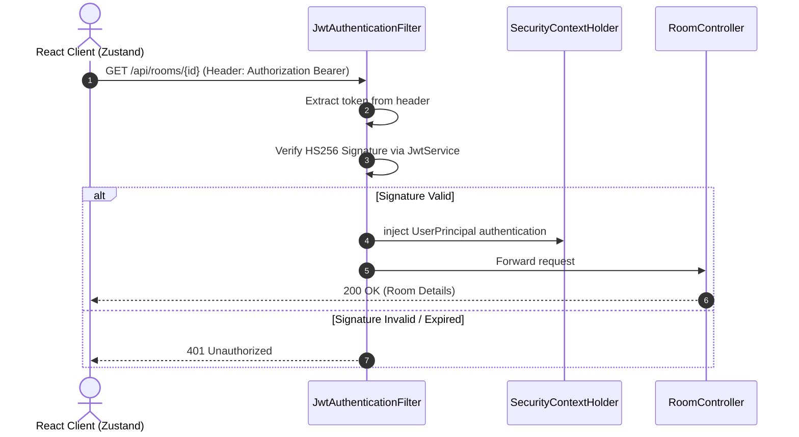
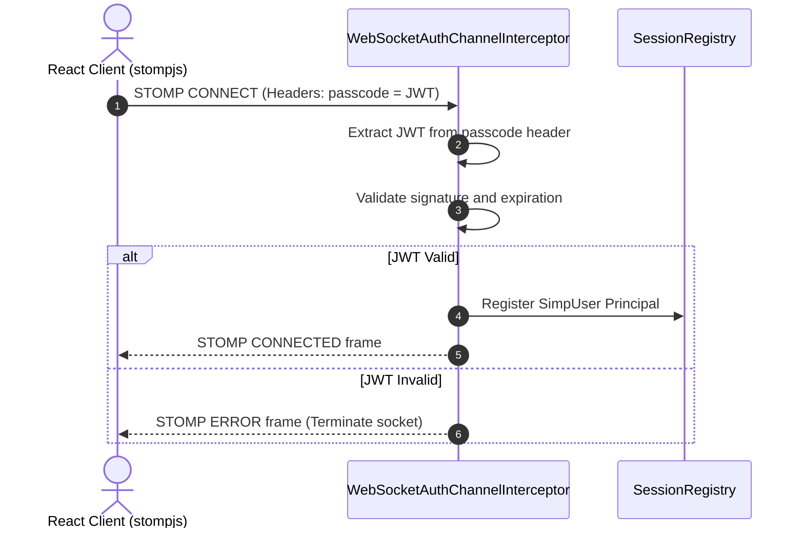

# Chapter 02: JWT Authentication Strategy

## 1. Problem Statement
In a multi-tenant application like Conclave, workspaces must be secure. If authentication relies on stateful HTTP sessions:
*   **Horizontal Scalability is blocked:** Servers must share session states, introducing Redis session clustering overhead.
*   **WebSocket Complications:** Default HTTP sessions do not map cleanly to WebSocket connections, making subscription-level security validation complex.
*   **Database Bottlenecks:** Querying the database to check sessions on every API call slows down request processing.

---

## 2. Background
Conclave contains endpoints for managing workspace rooms, modifying role assignments, and executing LLM turns. Users must be authenticated, and their identities must be bound to incoming requests.

---

## 3. Architecture Decision
We chose a **Stateless JWT (JSON Web Token) Security Model**:
*   Every client request includes a signed JWT token in the `Authorization: Bearer` header.
*   The Spring Boot application validates the signature and claims of the token stateless-style at the security filter tier.
*   For WebSocket connections, a custom STOMP inbound channel interceptor decodes the token from the headers during the handshake, binding the user to the socket session.

---

## 4. Alternatives Considered
*   **Alternative 1: Stateful HTTP Sessions (`HttpSession`):** Rejected because it requires session replication mechanisms in distributed environments and complicates token passing during WebSocket upgrades.
*   **Alternative 2: OAuth2 Resource Server (e.g. Keycloak):** Rejected to keep the codebase simple and self-contained, avoiding third-party authentication server dependencies.

---

## 5. Trade-offs
*   **Pros:** High scalability, no session state storage, and seamless integration with both REST filters and WebSocket channel interceptors.
*   **Cons:** Token revocation is difficult before expiration, and client stores must manually manage token storage and cleanup.

---

## 6. Internal Working
1.  **Token Generation:** During `/auth/login`, `JwtService` generates a signed token containing claims: `subject` (user email), `issuedAt`, and `expiration`. It signs the payload using `HS256` and a 256-bit secret key.
2.  **REST Filter Verification:** `JwtAuthenticationFilter` intercepts HTTP calls, extracts the token, verifies the signature, and injects `UserPrincipal` into Spring's `SecurityContextHolder`.
3.  **WebSocket Channel Interceptor:** During STOMP connection upgrades, `WebSocketAuthChannelInterceptor` extracts the token from the connection headers, validates it, and binds the principal to the active socket session.

---

## 7. Implementation Walkthrough
The following code snippet shows how the token validation filter maps to Spring's SecurityContext:
```java
// JwtAuthenticationFilter.java
String jwt = parseJwt(request);
if (jwt != null && jwtService.validateToken(jwt)) {
    String email = jwtService.getEmailFromToken(jwt);
    UserDetails userDetails = userDetailsService.loadUserByUsername(email);
    
    UsernamePasswordAuthenticationToken authentication = 
            new UsernamePasswordAuthenticationToken(userDetails, null, userDetails.getAuthorities());
            
    SecurityContextHolder.getContext().setAuthentication(authentication);
}
```

---

## 8. Relevant Classes
*   [SecurityConfig.java](file:///d:/Coding/Projects----For%20Resume/Conclave/backend/src/main/java/com/conclave/security/SecurityConfig.java) - Configures the stateless filter chain.
*   [JwtAuthenticationFilter.java](file:///d:/Coding/Projects----For%20Resume/Conclave/backend/src/main/java/com/conclave/security/JwtAuthenticationFilter.java) - Intercepts HTTP requests to extract and validate tokens.
*   [JwtService.java](file:///d:/Coding/Projects----For%20Resume/Conclave/backend/src/main/java/com/conclave/security/JwtService.java) - Generates and parses signed JWT tokens.
*   [WebSocketAuthChannelInterceptor.java](file:///d:/Coding/Projects----For%20Resume/Conclave/backend/src/main/java/com/conclave/security/WebSocketAuthChannelInterceptor.java) - Intercepts STOMP connection frames to authorize WebSocket channels.

---

## 9. Sequence & Component Diagrams

### 9.1 REST Auth Verification Flow


### 9.2 WebSocket STOMP Connection Authentication Flow


---

## 10. Common Bugs & Debug Checklist

*   **Bug 1: Weak JWT Secret Exception**
    *   *Cause:* The signing secret key defined in properties is shorter than 256 bits (32 characters), causing HS256 to throw an exception at startup.
    *   *Checklist:*
        1. Open `.env` or application config.
        2. Ensure `jwt.secret` contains a long, random base64 string.

*   **Bug 2: WebSocket 401 Upgrade Failures**
    *   *Cause:* Client fails to pass the JWT token in the passcode header of the connection frame during upgrade handshakes.
    *   *Checklist:*
        1. Open client configuration inside `Zustand` store.
        2. Verify that `connectHeaders` includes the token in the passcode field.

---

## 11. Performance, Security, & Testing Notes
*   **Performance:** Verifications are cryptographic operations done in-memory. They do not trigger database lookups, minimizing network roundtrips.
*   **Security:** Enforce short token lifetimes (e.g. 24 hours). Always use secure HTTPS endpoints to prevent token interception.
*   **Testing:** Use `@WithMockUser` or mock token generators in integration tests to inject security contexts.

---

## 12. Mock Interview Questions & Sample Answers

### Q1: How do you handle JWT token validation inside WebSocket channels in Spring Boot?
*Sample Answer:* "Since standard WebSockets do not support custom headers after the initial HTTP upgrade handshake, we configure a custom `ChannelInterceptor` registered in our `WebSocketMessageBrokerConfigurer`. When the client connects, it includes the token in the STOMP `CONNECT` frame passcode header. The interceptor intercepts this inbound message, validates the token using `JwtService`, and binds the resolved `UserPrincipal` as the principal user of the WebSocket session. This ensures that subsequent channel subscription commands (`SUBSCRIBE` to `/topic/room/{roomId}`) are verified against this principal."

### Q2: What are the security risks of stateless JWTs, and how did you mitigate them?
*Sample Answer:* "The main risk is that stateless JWTs cannot be easily revoked before they expire. If a token is compromised, an attacker can access the system until the token expires. We mitigate this risk by setting short token lifetimes (e.g. 24 hours). Additionally, we enforce room ownership checks at the database transaction layer on every write command. Even if a token is valid, the server verifies that the user is the owner of the room, preventing cross-tenant access."

---

## 13. References
*   [RFC 7519: JSON Web Token Standard Specification](https://tools.ietf.org/html/rfc7519)
*   [Spring Security WebSocket Security Guide](https://docs.spring.io/spring-security/site/docs/current/reference/html5/#websocket)
