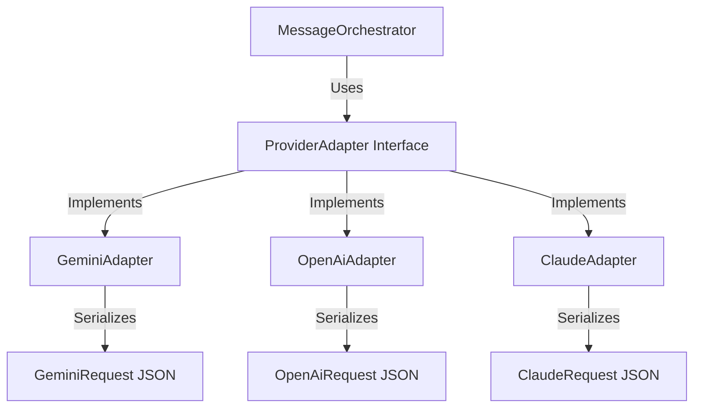
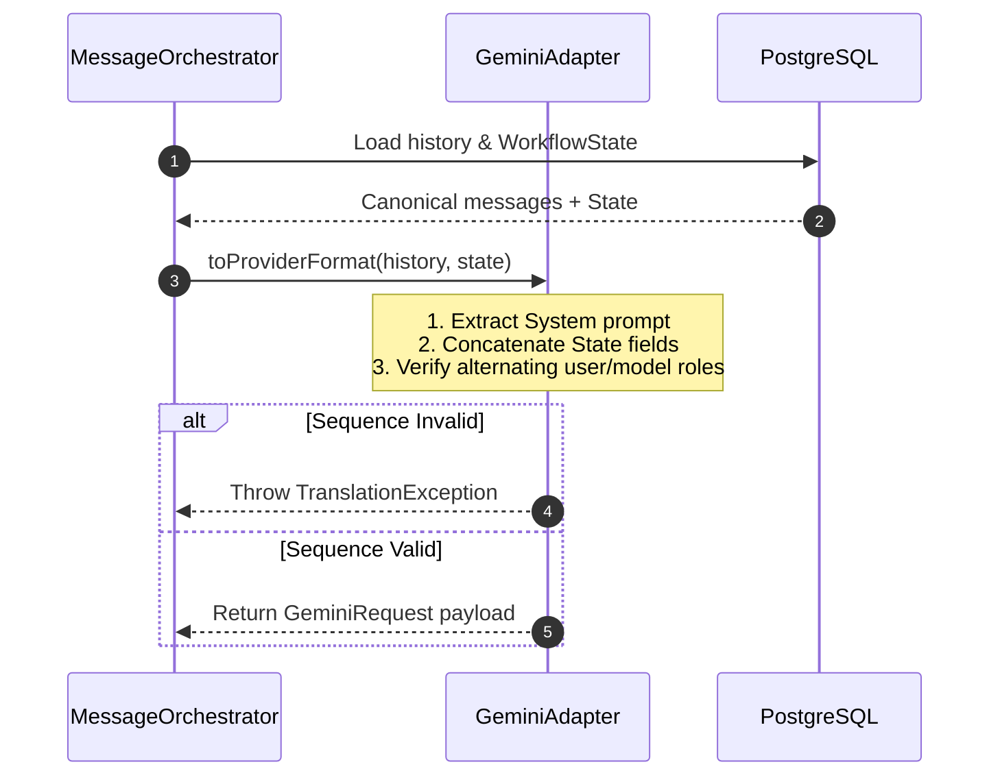

# Chapter 03: Provider Adapter Pattern

## 1. Problem Statement
Different LLM providers require unique API schemas for conversation history:
*   **Google Gemini** demands alternating `user`/`model` roles, starting with `user`, and does not support native `system` role objects within the message array.
*   **Anthropic Claude** requires the system prompt to be a root-level string parameter, with a separate list of alternating `user`/`assistant` messages.
*   **OpenAI GPT** accepts a flat list of `system`/`user`/`assistant` messages.

If the application binds its database logic directly to a single provider, adding new models becomes extremely difficult, resulting in vendor lock-in.

---

## 2. Background
Conclave allows multiple models to participate in the same conversation room. To achieve this, the application needs an abstraction layer that translates a single, unified database schema into the specific payload formats required by each vendor.

---

## 3. Architecture Decision
We implemented the **Adapter Design Pattern**:
*   A unified database schema, **`CanonicalMessage`**, stores all message turns.
*   A common interface, **`ProviderAdapter`**, defines the translation contract:
    ```java
    public interface ProviderAdapter {
        Object toProviderFormat(List<CanonicalMessage> history, WorkflowState state);
        CanonicalMessage fromProviderFormat(Object response);
    }
    ```
*   Each LLM vendor has a corresponding adapter class (e.g. `GeminiAdapter`, `OpenAiAdapter`, `ClaudeAdapter`) implementing this interface.

---

## 4. Alternatives Considered
*   **Alternative 1: Raw JSON Formatting in Service Controllers:** Formatting JSON inline. This was rejected because it violates the Single Responsibility Principle, cluttering orchestration classes with JSON mapping logic.
*   **Alternative 2: client-side Formatting:** Rejected because it exposes API structures and keys to the React client, increasing payload overhead and preventing backend validation.

---

## 5. Trade-offs
*   **Pros:** Strict separation of concerns, compile-time validation, and easy plug-and-play integrations for new models.
*   **Cons:** Introduces mapping overhead and requires keeping adapter serialization classes in sync with vendor API updates.

---

## 6. Internal Working
1.  **Incoming Request:** The orchestrator retrieves the `CanonicalMessage` history and `WorkflowState`.
2.  **Adapter Invocation:** The orchestrator calls `adapter.toProviderFormat(history, state)`.
3.  **Context Injection:** The adapter maps database roles to vendor roles, injecting the summarized `WorkflowState` (objective, draft, comments) as system context (or prefixing it for Gemini).
4.  **Alternating Check:** The adapter validates the sequence, checking that messages alternate roles (e.g. user &rarr; model).
5.  **Output Conversion:** Once the model completes its execution, `adapter.fromProviderFormat` translates the response back into a `CanonicalMessage`.

---

## 7. Implementation Walkthrough
The following code snippet from `GeminiAdapter.java` illustrates how the adapter enforces alternating roles:
```java
// GeminiAdapter.java
String expectedRole = "user";
for (int j = 0; j < nonSystemHistory.size(); j++) {
    CanonicalMessage msg = nonSystemHistory.get(j);
    String role = msg.getSenderType() == SenderType.USER ? "user" : "model";
    
    if (!role.equals(expectedRole)) {
        throw new TranslationException("Alternating role validation failed. Expected '" + expectedRole + "' but got '" + role + "'");
    }
    expectedRole = "user".equals(role) ? "model" : "user";
}
```

---

## 8. Relevant Classes
*   [ProviderAdapter.java](file:///d:/Coding/Projects----For%20Resume/Conclave/backend/src/main/java/com/conclave/integration/adapter/ProviderAdapter.java) - The core translation interface.
*   [GeminiAdapter.java](file:///d:/Coding/Projects----For%20Resume/Conclave/backend/src/main/java/com/conclave/integration/adapter/GeminiAdapter.java) - Maps history to Google Vertex AI formats.
*   [OpenAiAdapter.java](file:///d:/Coding/Projects----For%20Resume/Conclave/backend/src/main/java/com/conclave/integration/adapter/OpenAiAdapter.java) - Maps history to OpenAI formats.
*   [ClaudeAdapter.java](file:///d:/Coding/Projects----For%20Resume/Conclave/backend/src/main/java/com/conclave/integration/adapter/ClaudeAdapter.java) - Maps history to Anthropic Claude formats.

---

## 9. Sequence & Component Diagrams

### 9.1 Adapter Component Structure


### 9.2 Translation Sequence


---

## 10. Common Bugs & Debug Checklist

*   **Bug 1: Alternating Role Sequence Error in Gemini**
    *   *Cause:* The user submitted two consecutive messages (e.g. during an intervention) without an intervening model response, causing the sequence check to fail.
    *   *Checklist:*
        1. Review `conversation_history` database entries for the room.
        2. Verify that `sender_type` alternates between `USER` and `AI`.

*   **Bug 2: Missing System Prompt Context in Claude**
    *   *Cause:* The system prompt was passed in the messages list rather than the root `system` parameter of the request.
    *   *Checklist:*
        1. Trace `ClaudeAdapter.toProviderFormat`.
        2. Ensure all `SYSTEM` messages are filtered out of the message array and concatenated in the root `system` field.

---

## 11. Performance, Security, & Testing Notes
*   **Performance:** Translating schemas is done in-memory. It does not trigger database calls or network traffic, keeping latency low (sub-1ms).
*   **Security:** Verify that user inputs are not modified during mapping to prevent prompt injection.
*   **Testing:** Write JUnit tests using static mock JSON files to verify that inputs serialize correctly for each vendor without invoking live network connections.

---

## 12. Mock Interview Questions & Sample Answers

### Q1: Why did you choose to build a custom Adapter layer rather than relying on Spring AI's built-in client wrappers?
*Sample Answer:* "While Spring AI provides excellent wrappers for LLM clients, it doesn't enforce vendor-specific history rules (like Gemini's strict alternating user/model checks) at compile-time or validate them before making network requests. If the conversation sequence drifts, the application fails at runtime. By implementing a custom `ProviderAdapter` tier, we can validate the message history structure *before* executing the API call, ensuring that payload structures are secure and valid. This saves costs and prevents runtime integration failures."

### Q2: How does the Gemini adapter handle system prompts if the API doesn't support a native 'system' role in the contents array?
*Sample Answer:* "Since Gemini Vertex AI standard chat configurations do not accept a native `system` role within the alternating `contents` array, the `GeminiAdapter` concatenates all `SYSTEM` messages and `WorkflowState` summaries (objective, draft, comments) into a unified system header. It then prefixes this header to the very first `user` message in the array. This ensures that the model receives the objective and state context first, satisfying Gemini's strict sequence constraints."

---

## 13. References
*   [Google Vertex AI Chat API Documentation](https://cloud.google.com/vertex-ai/docs/generative-ai/chat/chat-prompts)
*   [Anthropic Claude Messages API Specifications](https://docs.anthropic.com/claude/reference/messages_post)
