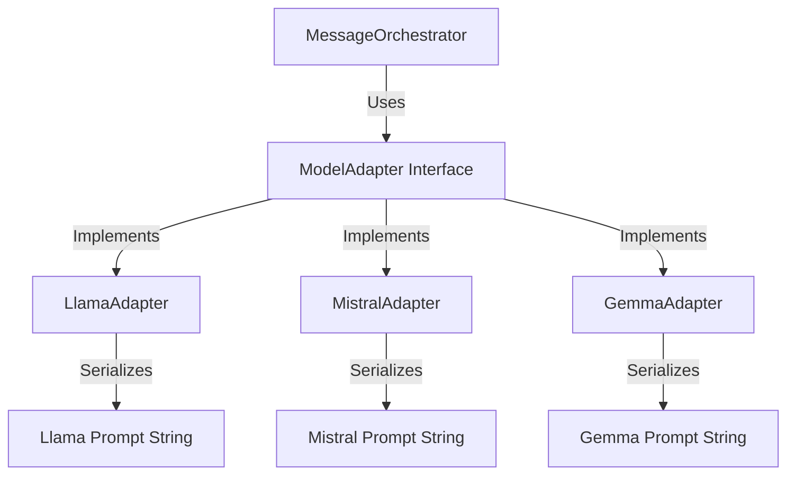
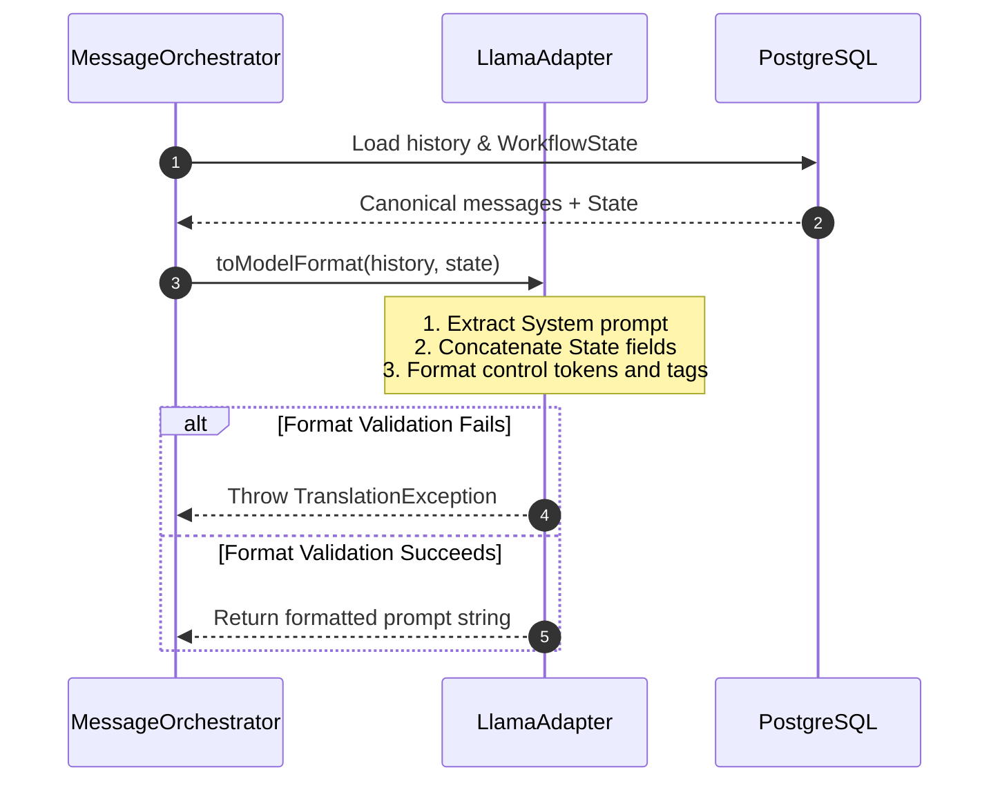

# Chapter 03: Model Adapter Pattern

## 1. Problem Statement
Different local LLM models require unique prompt template structures (chat templates) to perform correctly:
*   **Llama 3** expects a specific format with special tokens:
    `<|start_header_id|>system<|end_header_id|>\n\n{system_prompt}<|eot_id|><|start_header_id|>user<|end_header_id|>\n\n{user_prompt}<|eot_id|><|start_header_id|>assistant<|end_header_id|>`
*   **Mistral** expects history wrapped in instruction tags:
    `<s>[INST] {system_prompt}\n\n{user_prompt} [/INST] {assistant_response}</s>[INST] {next_user_prompt} [/INST]`
*   **Gemma** uses control tokens:
    `<start_of_turn>user\n{system_prompt}\n\n{user_prompt}<end_of_turn>\n<start_of_turn>model\n`

If the application binds its database logic directly to a single model's prompt format, adding new models becomes extremely difficult, resulting in model template lock-in.

Additionally, local environments are heavily constrained by **VRAM / RAM bounds** and have smaller default context windows (typically 2,048 to 8,192 tokens) compared to cloud-based APIs. Mismatched template formatting or context overflows degrade output quality or crash the local Ollama service.

---

## 2. Background
Conclave allows multiple models to participate in the same conversation room. To achieve this, the application needs an abstraction layer that translates a single, unified database schema into the specific template formats required by each local model served via Ollama.

---

## 3. Architecture Decision
We implemented the **Adapter Design Pattern**:
*   A unified database schema, **`CanonicalMessage`**, stores all message turns.
*   A common interface, **`ModelAdapter`**, defines the translation contract:
    ```java
    public interface ModelAdapter {
        List<Message> toModelFormat(List<CanonicalMessage> history, WorkflowState state);
        CanonicalMessage fromModelFormat(String responseText);
    }
    ```
*   Each local model template format has a corresponding adapter class (e.g. `LlamaAdapter`, `MistralAdapter`, `GemmaAdapter`) implementing this interface.

---

## 4. Alternatives Considered
*   **Alternative 1: Raw Prompt Formatting in Service Controllers:** Formatting prompt strings inline. This was rejected because it violates the Single Responsibility Principle, cluttering orchestration classes with string manipulation and template token logic.
*   **Alternative 2: Client-side Formatting:** Rejected because it exposes model formatting details and constraints to the React client, increasing payload overhead and preventing backend validation or background context compression.

---

## 5. Trade-offs
*   **Pros:** Strict separation of concerns, compile-time validation, easy plug-and-play integrations for new models, and precise character-level control over local prompt token assemblies.
*   **Cons:** Introduces mapping overhead and requires keeping adapter template classes in sync with newer model versions if their fine-tuned templates change.

---

## 6. Internal Working
1.  **Incoming Request:** The orchestrator retrieves the `CanonicalMessage` history and `WorkflowState`.
2.  **Adapter Invocation:** The orchestrator calls `adapter.toModelFormat(history, state)`.
3.  **Context Injection:** The adapter maps database roles to model roles, injecting the summarized `WorkflowState` (objective, draft, comments) as system context.
4.  **Template Generation:** The adapter generates the specific template tags (e.g. `[INST]` or `<|eot_id|>`).
5.  **Output Conversion:** Once the model completes its execution, `adapter.fromModelFormat` translates the response back into a `CanonicalMessage`.

---

## 7. Implementation Walkthrough
The following mock code snippet shows how a template adapter maps canonical message structures to model-specific formats:
```java
// LlamaAdapter.java
public List<Message> toModelFormat(List<CanonicalMessage> history, WorkflowState state) {
    StringBuilder prompt = new StringBuilder();
    
    // Inject system objective and workflow state
    prompt.append("<|start_header_id|>system<|end_header_id|>\n\n");
    prompt.append("Objective: ").append(state.getObjective()).append("\n");
    prompt.append("Current Draft: ").append(state.getCurrentDraft()).append("\n");
    prompt.append("<|eot_id|>");

    // Iterate through user and assistant history
    for (CanonicalMessage msg : history) {
        String role = msg.getSenderType() == SenderType.USER ? "user" : "assistant";
        prompt.append("<|start_header_id|>").append(role).append("<|end_header_id|>\n\n");
        prompt.append(msg.getContent()).append("<|eot_id|>");
    }
    
    prompt.append("<|start_header_id|>assistant<|end_header_id|>\n\n");
    return prompt.toString();
}
```

---

## 8. Relevant Classes
*   [ModelAdapter.java](file:///d:/Coding/Projects----For%20Resume/Conclave/backend/src/main/java/com/conclave/integration/adapter/ModelAdapter.java) - The core translation interface.
*   [LlamaAdapter.java](file:///d:/Coding/Projects----For%20Resume/Conclave/backend/src/main/java/com/conclave/integration/adapter/LlamaAdapter.java) - Maps history to Llama 3 chat template format.
*   [MistralAdapter.java](file:///d:/Coding/Projects----For%20Resume/Conclave/backend/src/main/java/com/conclave/integration/adapter/MistralAdapter.java) - Maps history to Mistral tag format.
*   [GemmaAdapter.java](file:///d:/Coding/Projects----For%20Resume/Conclave/backend/src/main/java/com/conclave/integration/adapter/GemmaAdapter.java) - Maps history to Gemma control token format.

---

## 9. Sequence & Component Diagrams

### 9.1 Adapter Component Structure


### 9.2 Translation Sequence


---

## 10. Common Bugs & Debug Checklist

*   **Bug 1: Out of VRAM (OOM) on local server**
    *   *Cause:* Conversation history size grew too large, exceeding the local model's token limits and GPU VRAM capacity.
    *   *Checklist:*
        1. Verify that `WorkflowStateServiceImpl` is running the Context Janitor compaction when history size > 10.
        2. Verify that middle messages are deleted from the database.
        3. Check Ollama server logs for VRAM memory allocations.

*   **Bug 2: Missing System Prompt Context in Mistral**
    *   *Cause:* The system prompt was omitted or formatted incorrectly since Mistral does not support a native `system` role tag, requiring injection inside the first `[INST]` block.
    *   *Checklist:*
        1. Trace `MistralAdapter.toModelFormat`.
        2. Ensure all `SYSTEM` messages and `WorkflowState` metrics are prepended inside the first `[INST] ... [/INST]` block.

---

## 11. Performance, Security, & Testing Notes
*   **Performance:** Translating schemas is done in-memory. It does not trigger database calls or network traffic, keeping latency low (sub-1ms).
*   **Security:** Local inference ensures 100% data privacy. No data ever leaves the local network boundary, preventing public cloud leakage.
*   **Testing:** Write JUnit tests to verify that mappers output the exact control tokens and tags expected by local models (e.g. Llama 3 special headers) without calling Ollama.

---

## 12. Mock Interview Questions & Sample Answers

### Q1: Why did you choose to build a custom Adapter layer rather than relying on Spring AI's built-in client wrappers?
*Sample Answer:* "While Spring AI provides excellent abstractions, it does not enforce model-specific template structures at compile-time or validate them before dispatching requests. Mismatched control tokens or unformatted system instructions cause local open-source models to drift or produce garbage outputs. By implementing a custom `ModelAdapter` tier, we ensure that prompt templates are assembled accurately for models like Llama 3 or Mistral before calling Ollama, preserving inference accuracy and structure."

### Q2: How does the Mistral adapter handle system prompts if the model's template doesn't support a native 'system' role?
*Sample Answer:* "Since Mistral's basic chat template does not support a native separate system role tag (like Llama 3), the `MistralAdapter` prepends all system objectives and consolidated `WorkflowState` drafts inside the very first `[INST]` instruction block. This forces the model to digest the workspace objective and task state as part of the initial turn context, satisfying Mistral's structural constraints."

---

## 13. References
*   [Ollama API Reference & Custom Model Templates](https://github.com/ollama/ollama/blob/main/docs/modelfile.md#template)
*   [Llama 3 Model Formatting Guidelines](https://llama.meta.com/docs/model-cards-and-prompt-formats/meta-llama-3/)
