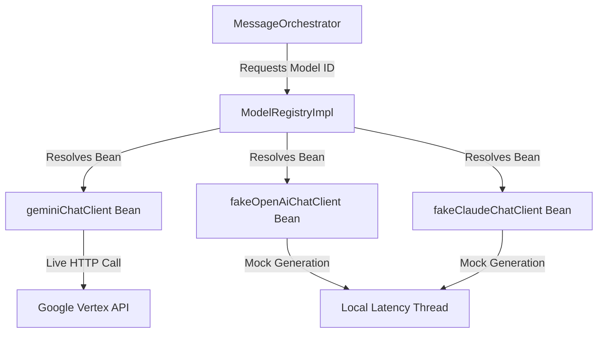
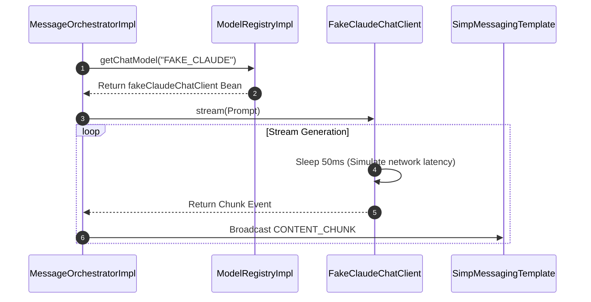

# Chapter 04: Model Registry & Fake ChatClients

## 1. Problem Statement
Orchestrating multi-model interactions during local development introduces key integration problems:
*   **API Cost Accumulation:** Running live integrations for all models (Gemini, OpenAI, Claude) during routine coding and testing builds up high monthly API costs.
*   **Dependency on External Services:** Outages or API modifications in third-party services disrupt local feature development and testing pipelines.
*   **Non-Deterministic Latency:** Real models return outputs with variable delays, making testing of real-time WebSocket sync features unstable and difficult to reproduce.

---

## 2. Background
Conclave requires a mechanism to resolve model integrations at runtime based on the role configuration of a room. It also needs a way to simulate expensive models (OpenAI/Claude) locally, ensuring developers can test the complete system lifecycle without live credentials.

---

## 3. Architecture Decision
We implemented a **Dynamic Model Registry** combined with **Java-level Mock Clients**:
*   A centralized registry service (`ModelRegistry`) maps model configuration keys to concrete Spring AI client beans.
*   Google Gemini uses a live implementation (`VertexAiChatClient`).
*   OpenAI and Claude are implemented as custom Java beans (`FakeOpenAiChatClient`, `FakeClaudeChatClient`) implementing Spring AI’s `ChatClient` and `ChatModel` interfaces. These stubs simulate model output latency and structure.

---

## 4. Alternatives Considered
*   **Alternative 1: Direct Network Proxying (WireMock):** Intercepting HTTP requests at the socket level. This was rejected because it only tests raw network traffic serialization and bypasses the Spring bean dependency injection lifecycle.
*   **Alternative 2: Conditional Client Exclusions in Code:** Writing if/else conditionals in the controller to skip API calls. This was rejected because it pollutes the core orchestration code with mock configurations.

---

## 5. Trade-offs
*   **Pros:** Exercises the adapter mapping logic directly in Java, enables testing without external keys, and supports profile-based hot-swapping.
*   **Cons:** Stubs must be manually maintained to match updated API behaviors, and mock responses are static.

---

## 6. Internal Working
1.  **Bean Initialization:** At startup, `SpringAiConfig` instantiates the real Gemini client and the fake OpenAI and Claude client beans.
2.  **Turn Invocation:** When a message is sent to a role, `MessageOrchestrator` queries the `ModelRegistry` using the mapped model key (e.g. `FAKE_CLAUDE`).
3.  **Bean Resolution:** The registry returns the matching `ChatClient`/`ChatModel` bean.
4.  **Latency Simulation:** The fake client generates a mock response, splits it into fragments, and publishes chunks with a simulated delay (e.g. 50ms per chunk) on virtual threads, mimicking a live API stream.

---

## 7. Implementation Walkthrough
The following code snippet shows how `ModelRegistryImpl` resolves clients dynamically:
```java
// ModelRegistryImpl.java
@Service
@RequiredArgsConstructor
public class ModelRegistryImpl implements ModelRegistry {
    private final ChatClient geminiChatClient;
    private final ChatClient fakeOpenAiChatClient;
    private final ChatClient fakeClaudeChatClient;

    @Override
    public ChatClient getClient(String modelId) {
        if ("GEMINI_PRO".equalsIgnoreCase(modelId)) {
            return geminiChatClient;
        } else if ("FAKE_OPENAI".equalsIgnoreCase(modelId)) {
            return fakeOpenAiChatClient;
        } else if ("FAKE_CLAUDE".equalsIgnoreCase(modelId)) {
            return fakeClaudeChatClient;
        }
        throw new OrchestrationException("Unsupported modelId: " + modelId);
    }
}
```

---

## 8. Relevant Classes
*   [ModelRegistry.java](file:///d:/Coding/Projects----For%20Resume/Conclave/backend/src/main/java/com/conclave/integration/registry/ModelRegistry.java) - Registry interface.
*   [ModelRegistryImpl.java](file:///d:/Coding/Projects----For%20Resume/Conclave/backend/src/main/java/com/conclave/integration/registry/ModelRegistryImpl.java) - Maps keys to active Spring AI client beans.
*   [FakeOpenAiChatClient.java](file:///d:/Coding/Projects----For%20Resume/Conclave/backend/src/main/java/com/conclave/integration/client/FakeOpenAiChatClient.java) - Mock OpenAI client.
*   [FakeClaudeChatClient.java](file:///d:/Coding/Projects----For%20Resume/Conclave/backend/src/main/java/com/conclave/integration/client/FakeClaudeChatClient.java) - Mock Anthropic Claude client.

---

## 9. Sequence & Component Diagrams

### 9.1 Model Resolution Component Model


### 9.2 Execution Resolution Sequence


---

## 10. Common Bugs & Debug Checklist

*   **Bug 1: BeanResolutionException / Unregistered Model ID Error**
    *   *Cause:* The database model mapping configuration references a model ID (e.g. `CLAUDE_3_OPUS`) that has not been mapped to a bean in the registry.
    *   *Checklist:*
        1. Trace `ModelRegistryImpl.getClient`.
        2. Verify that the requested model ID matches registry mappings.

*   **Bug 2: Concurrency Blocking During Mock Generation**
    *   *Cause:* The mock client uses `Thread.sleep` to simulate latency, blocking carrier threads if not executed on a Virtual Thread.
    *   *Checklist:*
        1. Verify that `AsyncConfig` is configured to use virtual threads.
        2. Ensure the async execution tasks are scheduled via `AsyncTaskExecutor`.

---

## 11. Performance, Security, & Testing Notes
*   **Performance:** Mock beans execute locally, bypassing network latency and external routing overhead.
*   **Security:** By using local stubs, developers do not need to configure OpenAI or Anthropic API keys locally, preventing key exposure.
*   **Testing:** Mock clients provide deterministic responses, making integration test assertions stable and repeatable.

---

## 12. Mock Interview Questions & Sample Answers

### Q1: Why did you implement mock clients in Java code instead of using network-level mocking tools like WireMock?
*Sample Answer:* "We implemented mock clients in Java implementing Spring AI’s `ChatClient` interface to test **Internal Interface Engineering** and the Bean lifecycle directly. WireMock intercepts network calls, which only validates HTTP serialization. By creating custom beans like `FakeOpenAiChatClient`, we force the application to run the actual translation code (`ProviderAdapter.toProviderFormat`) and resolve beans dynamically via the `ModelRegistry`. This exercises the entire software stack under realistic latency conditions, completely offline."

### Q2: How do you swap a mock provider for a live API integration in a future release?
*Sample Answer:* "The architecture implements Dependency Inversion, meaning our orchestration logic depends on the `ChatClient` and `ProviderAdapter` interfaces rather than concrete implementations. To swap a model from 'Fake' to 'Live', we only need to change the bean configuration in `SpringAiConfig`. By using Spring `@Profile("prod")` or conditional properties annotations, we can swap the local fake bean for Spring AI's auto-configured client bean, requiring zero modifications to our orchestration services."

---

## 13. References
*   [Spring AI Reference Manual: Chat Client Interfaces](https://docs.spring.io/spring-ai/reference/api/chatclient.html)
*   [Dependency Inversion Principle (DIP) Overview](https://deviq.com/principles/dependency-inversion-principle)
