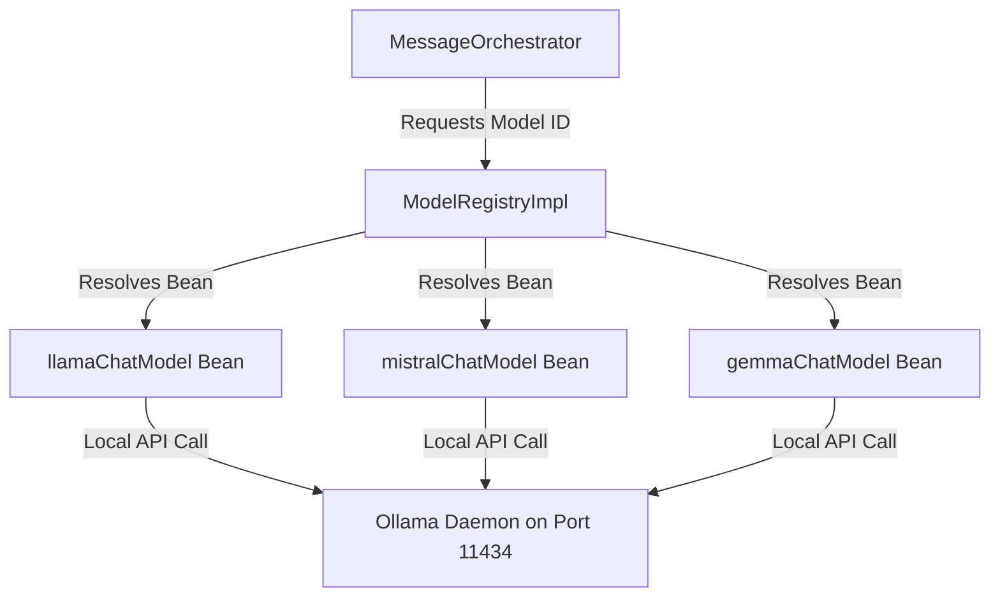
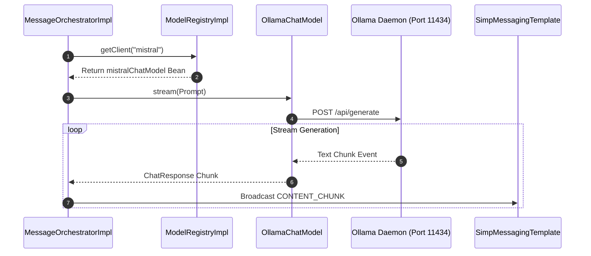

# Chapter 04: Model Registry & Ollama Clients

## 1. Problem Statement
Orchestrating multi-model interactions locally during development and testing introduces key configuration issues:
*   **Dependency on Cloud APIs:** Relying on external cloud AI vendors (e.g. OpenAI, Claude) during development triggers recurring API costs and introduces rate limit barriers.
*   **API Key Management Overhead:** Managing credentials across development, staging, and CI/CD pipelines increases the risk of API key exposure.
*   **Lack of Offline Capabilities:** Inability to run, test, and demonstrate features without active internet connections or vendor API uptime.

---

## 2. Background
Conclave resolves model configurations dynamically at runtime based on active room role-assignment parameters. To enable a zero-cost, high-privacy, and fully offline environment, the system utilizes a local **Ollama** server deployment for all agent role executions.

---

## 3. Architecture Decision
We implemented a **Dynamic Model Registry** connecting directly to configured instances of local Ollama chat models:
*   A centralized registry service (`ModelRegistry`) maps standard model identifier keys (`llama3`, `mistral`, `gemma`) to configured `OllamaChatModel` beans.
*   Every agent turn resolves its target model through the registry and executes real inference locally. No mocked or fake chat clients are used.
*   The Spring Boot application interfaces with the local Ollama daemon (by default on port `11434`), streaming response chunks word-by-word via STOMP WebSockets.

---

## 4. Alternatives Considered
*   **Alternative 1: Simulated ChatClient Fakes:** Implementing mock Java beans that return static text under fake delays. While this enables offline development, it fails to verify actual model reasoning, context limitations, and token metrics. Swapping to real local models provides 100% real inference behavior with $0 cost.
*   **Alternative 2: Direct Network-level Mocking (WireMock):** Intercepting outgoing HTTP connections to cloud APIs. This was rejected because it only tests raw network responses and does not support dynamic local model resolution.

---

## 5. Trade-offs
*   **Pros:** Real model reasoning during local development, absolute data isolation (zero prompt leakage to external clouds), zero billing costs, and high-fidelity testing of streaming latency.
*   **Cons:** Local execution speed is bounded by the developer's hardware (GPU VRAM/RAM), and hosting multiple large models concurrently can lead to slower tokens-per-second rates.

---

## 6. Internal Working
1.  **Bean Initialization:** At startup, `OllamaConfig` instantiates the connection properties and creates client beans for the local models using Spring AI's Ollama integration.
2.  **Turn Invocation:** When a message is sent to a role, `MessageOrchestrator` queries the `ModelRegistry` using the mapped model key (e.g. `mistral`).
3.  **Bean Resolution:** The registry returns the matching `OllamaChatModel` bean.
4.  **Real Inference Execution:** The orchestrator triggers model inference. The local Ollama server streams response fragments over a WebSocket connection, providing actual token usage statistics in the response metadata.

---

## 7. Implementation Walkthrough
The following code snippet shows how `ModelRegistryImpl` maps and resolves Ollama model beans:
```java
// ModelRegistryImpl.java
@Service
@RequiredArgsConstructor
public class ModelRegistryImpl implements ModelRegistry {
    private final ChatModel llamaChatModel;
    private final ChatModel mistralChatModel;
    private final ChatModel gemmaChatModel;

    @Override
    public ChatModel getClient(String modelId) {
        if ("llama3".equalsIgnoreCase(modelId)) {
            return llamaChatModel;
        } else if ("mistral".equalsIgnoreCase(modelId)) {
            return mistralChatModel;
        } else if ("gemma".equalsIgnoreCase(modelId)) {
            return gemmaChatModel;
        }
        throw new OrchestrationException("Unsupported modelId: " + modelId);
    }
}
```

---

## 8. Relevant Classes
*   [ModelRegistry.java](file:///d:/Coding/Projects----For%20Resume/Conclave/backend/src/main/java/com/conclave/integration/registry/ModelRegistry.java) - Registry interface.
*   [ModelRegistryImpl.java](file:///d:/Coding/Projects----For%20Resume/Conclave/backend/src/main/java/com/conclave/integration/registry/ModelRegistryImpl.java) - Maps keys to active Ollama client beans.
*   [OllamaConfig.java](file:///d:/Coding/Projects----For%20Resume/Conclave/backend/src/main/java/com/conclave/config/OllamaConfig.java) - Bootstraps local Ollama daemon connections.

---

## 9. Sequence & Component Diagrams

### 9.1 Model Resolution Component Model


### 9.2 Execution Resolution Sequence


---

## 10. Common Bugs & Debug Checklist

*   **Bug 1: ConnectionRefusedException / Ollama Offline**
    *   *Cause:* The local Ollama service is not running, or is running on a different port than configured in `application.yml`.
    *   *Checklist:*
        1. Open terminal and run `ollama list` to verify if the daemon is online.
        2. Verify that `spring.ai.ollama.base-url` matches your local server endpoint (`http://localhost:11434`).

*   **Bug 2: Model Not Found (Ollama returns 404)**
    *   *Cause:* The target model (e.g. `gemma`) is registered in Conclave but has not been pulled onto the local machine.
    *   *Checklist:*
        1. Verify installed models using `ollama list`.
        2. Pull the missing model using `ollama pull gemma` in your command line.

---

## 11. Performance, Security, & Testing Notes
*   **Performance:** Inference speeds (tokens per second) are highly dependent on GPU VRAM. Hosting multiple models can trigger swapping overhead. We mitigate this by utilizing lightweight model variants (e.g. 8B parameters or smaller) for local workflows.
*   **Security:** Since all prompts and context summaries are processed locally, there is zero risk of data leakage, cloud credentials theft, or vendor cost abuse.
*   **Testing:** End-to-end tests use real local model executions via a local test profile, providing high-fidelity latency checks.

---

## 12. Mock Interview Questions & Sample Answers

### Q1: Why did you choose local Ollama integration instead of simulated fake chat clients or mock servers?
*Sample Answer:* "While mock clients or WireMock allow offline testing, they only simulate basic string returns and artificial latency. They cannot verify real model reasoning, prompt template structures, context window limits, or token usage logs. By integrating with local Ollama-served models, we get 100% real inference and actual token counts with zero external API key requirements and $0 cost. This provides a production-equivalent workspace environment that can run entirely on local developer machines."

### Q2: How does the application handle switching between different local models at runtime?
*Sample Answer:* "We implement Dependency Inversion combined with a dynamic model registry. The orchestrator references a common `ChatModel` interface and resolves the target model at runtime via the `ModelRegistry` using the active room configuration mappings. Adding or swapping a model only requires registering its model key and pointing it to the Ollama server, requiring zero modifications to our core business logic."

---

## 13. References
*   [Spring AI Ollama Integration Guide](https://docs.spring.io/spring-ai/reference/api/chat/ollama-chat.html)
*   [Ollama Official Documentation & Model Library](https://ollama.com/)
