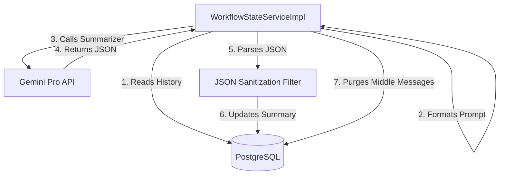

# Chapter 05: Context Compression & Janitor Service

## 1. Problem Statement
In multi-agent collaborative workflows:
*   **Context Window Saturation:** As message histories grow, sending the entire transcript to multiple models runs into provider context limits.
*   **Escalating Token Costs:** Large transcripts increase token consumption, leading to high usage costs.
*   **Information Decay:** Over long transcripts, models can lose focus on primary objectives, drifting away from tasks.

---

## 2. Background
Rather than sending full transcripts, Conclave maintains a consolidated state summary (`WorkflowState`) consisting of the **Project Objective**, the **Current Draft**, and **Review Comments**. It also includes the last two messages to preserve short-term conversational context.

---

## 3. Architecture Decision
We implemented a **Context Janitor Pattern** managed by `WorkflowStateServiceImpl`:
*   When history in a room exceeds **10 messages**, a background compression job is triggered.
*   The service formats the history, compiles a system prompt for the `Conclave Janitor`, and calls Google Gemini Pro to summarize progress into a strict JSON payload.
*   The database updates the `workflow_state` table and purges middle history messages, retaining only the system prompt (index 0) and the last two turns.

---

## 4. Alternatives Considered
*   **Alternative 1: Simple Message Limit (Rolling Window):** Deleting messages older than index N. This was rejected because models lose access to critical historical decisions or structural requirements generated early in the session.
*   **Alternative 2: Client-side Context Truncation:** Letting the client choose what messages to send. This was rejected because users cannot manually track token boundaries efficiently.

---

## 5. Trade-offs
*   **Pros:** Keeps token usage low, preserves historical draft changes, and maintains short-term conversational context.
*   **Cons:** Summarization calls introduce minor API latency and run the risk of losing small details during compaction.

---

## 6. Internal Working
1.  **Orchestration Check:** At the end of a turn, `WorkflowStateServiceImpl.evaluateAndCompressHistory` checks message count.
2.  **Janitor Invocation:** If message count is > 10, the service formats the transcript and issues a prompt:
    ```
    Output result strictly in JSON format with exactly two keys: 'currentDraft' and 'reviewComments'.
    ```
3.  **JSON Sanitization:** The service parses the JSON response, stripping out markdown block markers (` ```json `) if present.
4.  **History Purging:** The service executes a delete command (`messageRepository.deleteAll`) on the middle messages of the history (retaining index 0 and the last two turns).
5.  **State Synchronization:** The updated state is saved and broadcast via STOMP to synchronize client dashboards.

---

## 7. Implementation Walkthrough
The following code snippet from `WorkflowStateServiceImpl.java` shows the parsing and purging logic:
```java
// WorkflowStateServiceImpl.java
if (history.size() <= 10) return;

// Invoke Gemini summarizer...
String responseText = geminiClient.prompt().user(summarizerPrompt).call().content();

// Parse and update state
updateStateFromResponse(state, responseText);
workflowStateRepository.save(state);

// Purge middle history messages
List<CanonicalMessage> toDelete = new ArrayList<>();
for (int i = 1; i < history.size() - 2; i++) {
    toDelete.add(history.get(i));
}
messageRepository.deleteAll(toDelete);
```

---

## 8. Relevant Classes
*   [WorkflowState.java](file:///d:/Coding/Projects----For%20Resume/Conclave/backend/src/main/java/com/conclave/domain/WorkflowState.java) - Relational entity mapping drafts and review comments.
*   [WorkflowStateService.java](file:///d:/Coding/Projects----For%20Resume/Conclave/backend/src/main/java/com/conclave/service/WorkflowStateService.java) - Context compression interface.
*   [WorkflowStateServiceImpl.java](file:///d:/Coding/Projects----For%20Resume/Conclave/backend/src/main/java/com/conclave/service/WorkflowStateServiceImpl.java) - Processes prompt summaries and middle history purges.

---

## 9. Sequence & Component Diagrams

### 9.1 Context Compactor Component Model


### 9.2 Compactor Execution Sequence

```mermaid
sequenceDiagram
    autonumber
    participant Orch as MessageOrchestratorImpl
    participant Service as WorkflowStateServiceImpl
    participant Gemini as Gemini Pro API
    participant DB as PostgreSQL

    Orch->>Service: evaluateAndCompressHistory(roomId)
    Service->>DB: Fetch message history count
    DB-->>Service: Return count (e.g., 12 messages)
    
    rect rgb(25, 25, 30)
        Note over Service, Gemini: Janitor Summarization Loop
        Service->>Gemini: Invoke summarizer prompt (Transcript details)
        Gemini-->>Service: Return JSON block (currentDraft, reviewComments)
    end
    
    Service->>Service: Sanitize JSON block & strip markdown markers
    Service->>DB: Update workflow_state summary row
    Service->>DB: DELETE messages from index 1 to (size - 3)
    Service-->>Orch: Complete compression transaction
```


---

## 10. Common Bugs & Debug Checklist

*   **Bug 1: JSON Parsing Exception (Malformed Summaries)**
    *   *Cause:* Gemini includes markdown blocks (` ```json ` or ` ``` `) or conversational filler text in the response, causing Jackson parser to throw exceptions.
    *   *Checklist:*
        1. Review log output in `WorkflowStateServiceImpl`.
        2. Ensure the JSON sanitization logic strips out markdown markers (`indexOf("```json")`) before parsing.
        3. Verify the fallback logic is activated: maps raw text to `currentDraft` and logs the exception to `reviewComments`.

*   **Bug 2: Missing System Context During Purging**
    *   *Cause:* The index 0 message was accidentally deleted during history purging, removing the system prompt.
    *   *Checklist:*
        1. Verify that the loop starts at index `1` and ends at `history.size() - 2`.
        2. Verify database records to ensure the first message remains intact.

---

## 11. Performance, Security, & Testing Notes
*   **Performance:** Triggering summarization checks on every turn is fast. The summarization API call runs in the background on Virtual Threads, preventing Tomcat worker thread blocking.
*   **Security:** Ensure the summarization prompt specifies that no raw user passwords or JWT credentials are included in the generated draft.
*   **Testing:** Set up unit tests verifying that malformed JSON responses degrade gracefully and do not crash the transaction.

---

## 12. Mock Interview Questions & Sample Answers

### Q1: How does your context compression algorithm prevent database bloat and token saturation?
*Sample Answer:* "We implement a Context Janitor pattern. When a room's history exceeds 10 messages, a background compression process compiles the history transcript and invokes Gemini to extract progress into a structured `WorkflowState` (draft and comments). Once saved, the database purges the middle messages (from index 1 to size-3), retaining only the first message (context foundation) and the last two turns (short-term memory). This keeps the database small, and ensures outgoing prompts contain condensed context summaries rather than bloated transcripts."

### Q2: What happens if the LLM summarizer returns malformed JSON that fails to parse?
*Sample Answer:* "If the summarizer output fails JSON parsing, we implement a graceful degradation fallback. The catch block intercepts the parsing exception, assigns the entire raw response string directly to `currentDraft`, and writes a warning message to the `reviewComments` field. The transaction is not rolled back, allowing the user to view the full draft output and manually resolve the formatting issue without losing data or crashing the workspace."

---

## 13. References
*   [Google Generative AI JSON Output Specifications](https://ai.google.dev/gemini-api/docs/structured-output)
*   [Hibernate Cascading Deletes Guide](https://docs.jboss.org/hibernate/orm/current/userguide/html_single/Hibernate_User_Guide.html#pc-cascade)
