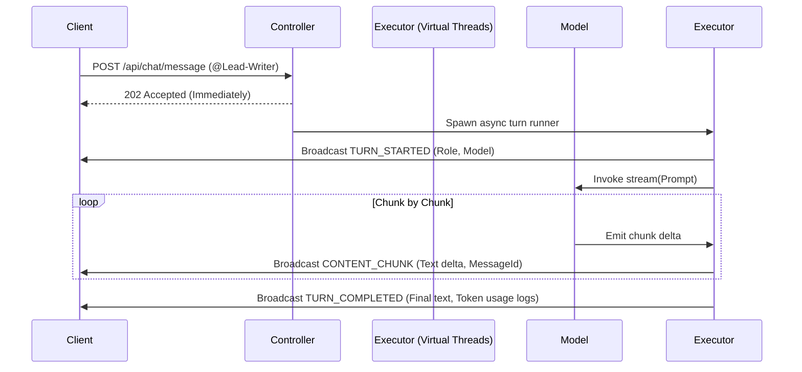

# Learning Doc: Real-time Streaming with STOMP WebSockets

This document covers the architecture, configuration, security, and payload design of the real-time notification and chunk streaming layer in Conclave.

## 1. Overview of WebSockets & STOMP

WebSockets provide a full-duplex communication channel over a single TCP connection, allowing the server to push updates to the client in real-time.

To avoid inventing a custom message format, Conclave uses **STOMP** (Simple Text Oriented Messaging Protocol), which defines standard message headers and frames (e.g. `CONNECT`, `SUBSCRIBE`, `SEND`, `MESSAGE`).

### Communication Flow:
1. **Handshake**: The client initiates an HTTP request upgrading to WebSocket via `/ws-conclave`.
2. **Authentication**: The client sends a `CONNECT` command with the Bearer JWT token in the `Authorization` header.
3. **Subscription**: Upon successful authentication, the client subscribes to a specific room topic: `/topic/room/{roomId}`.
4. **Asynchronous Streaming**: When a message is posted via REST (`POST /api/chat/message`), the server handles it asynchronously and streams events back over the WebSocket channel.

---

## 2. Security Channel Interceptor

In a classic REST architecture, JWT authentication is validated per HTTP request. With WebSockets, because the connection is persistent, security validation happens once during the initial **handshake / connect frame**.

Spring's WebSocket support implements this via a `ChannelInterceptor` registered in the inbound client channel.

### Key Logic in `WebSocketAuthChannelInterceptor`:
- Intercepts inbound channel messages.
- Decodes the STOMP header accessor.
- If the command is `CONNECT`, extracts the native `"Authorization"` header.
- Extracts and validates the JWT Bearer token using `JwtService`.
- If the token is valid, resolves the user context and associates it with the WebSocket session principal via `accessor.setUser(authentication)`.
- If invalid or missing, raises an `IllegalArgumentException`, dropping the connection instantly.

---

## 3. Streaming Event Life Cycle

AI agent turns follow a strict real-time event flow. Each event is wrapped in a type-safe `WsEvent` payload:

### Event Specifications:

1. **`TURN_STARTED`**
   - **Type**: `TURN_STARTED`
   - **Fields**: `roleName`, `modelId`, `isMocked`
   - **Purpose**: Informs UI to show a typing indicator for the mentioned agent.

2. **`CONTENT_CHUNK`**
   - **Type**: `CONTENT_CHUNK`
   - **Fields**: `content` (delta text), `messageId` (UUID)
   - **Purpose**: Appends token content in real-time onto the message bubble matching `messageId`.

3. **`TURN_COMPLETED`**
   - **Type**: `TURN_COMPLETED`
   - **Fields**: `messageId`, `summary` (full message draft), `usage` (prompt and completion tokens)
   - **Purpose**: Completes the message block and updates the workspace state.

4. **`SYSTEM_INTERVENTION`**
   - **Type**: `SYSTEM_INTERVENTION`
   - **Fields**: `message`
   - **Purpose**: Informs the user of system-level alerts, moderation issues, or execution errors.

---

## 4. Virtual Thread Execution

AI streaming operations are I/O bound. Blocking a native OS thread per active stream would limit concurrency. 

Conclave leverages **Java 21 Virtual Threads** (via `AsyncTaskExecutor` backed by `Executors.newVirtualThreadPerTaskExecutor()`). This allows hundreds of concurrent room streams to execute efficiently in parallel, where each virtual thread blocks naturally on reactive flux iterables and TCP sockets without consuming active operating system threads.
