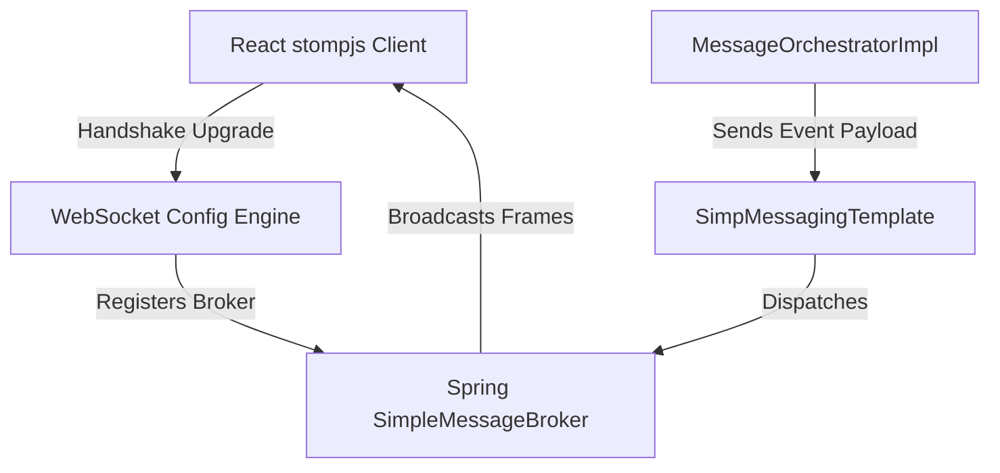
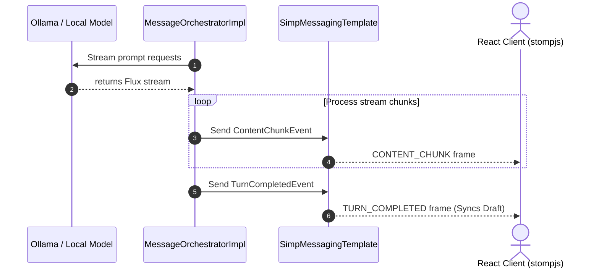

# Chapter 06: WebSocket Realtime Streaming with STOMP

## 1. Problem Statement
Collaborative AI workspaces need real-time feedback. When multiple LLMs execute, users need to see words stream in real-time.
*   **Unidirectional SSE Limitations:** Server-Sent Events (SSE) only support server-to-client updates. Bidirectional commands (like manual pause/resume interventions) require separate HTTP POST requests, introducing sync latency.
*   **Raw WebSockets Complexity:** Building custom framing, multiplexing, and routing over raw sockets requires extensive custom coding and lacks standardization.

---

## 2. Background
Conclave uses WebSockets to connect the React client with the Spring Boot server, utilizing the **STOMP** protocol to manage topic subscriptions and frame delivery.

---

## 3. Architecture Decision
We chose the **WebSocket STOMP (Simple Text Oriented Messaging Protocol)** architecture:
*   Exposes a connection upgrade path `/ws-conclave`.
*   Registers an in-memory Simple Message Broker with a topic prefix `/topic`.
*   Clients subscribe to `/topic/room/{roomId}` to capture streaming turns.
*   The backend streams responses from the AI clients as a reactive `Flux`, consuming the chunks on Virtual Threads and broadcasting STOMP frames over the topic.

---

## 4. Alternatives Considered
*   **Alternative 1: Server-Sent Events (SSE):** Easy to implement for streaming but lacks built-in bidirectional channels and requires writing separate HTTP controllers for clients to push controls.
*   **Alternative 2: Raw WebSockets (no STOMP):** Avoids protocol overhead, but requires writing a custom routing and frame decoding tier on both the client and server.

---

## 5. Trade-offs
*   **Pros:** Out-of-the-box routing patterns, standardized frames (like `SUBSCRIBE`, `SEND`, `ERROR`), and native Spring Messaging support.
*   **Cons:** Higher initial setup complexity than SSE and minor network protocol framing overhead.

---

## 6. Internal Working
1.  **WebSocket Handshake:** Client connects to `ws://localhost:8080/ws-conclave`.
2.  **STOMP Subscription:** Client subscribes to `/topic/room/{roomId}`.
3.  **Stream Consumption:** During turn execution, `MessageOrchestrator` consumes the reactive `Flux<ChatResponse>` chunk-by-chunk using standard iteration.
4.  **Frame Broadcast:** As each chunk is read on a Virtual Thread, the server sends a `ContentChunkEvent` JSON frame to the room's topic.
5.  **Completion:** A final `TurnCompletedEvent` frame containing the full response and token counts is broadcast once the stream ends.

---

## 7. Implementation Walkthrough
The following code from `MessageOrchestratorImpl.java` shows how Flux streaming maps to STOMP broadcasts:
```java
// MessageOrchestratorImpl.java
Flux<ChatResponse> responseFlux = chatModel.stream(new Prompt(promptContent));
Iterable<ChatResponse> chunks = responseFlux.toIterable(); // Blocking-style read on Virtual Thread

for (ChatResponse chunk : chunks) {
    if (chunk.getResult() != null && chunk.getResult().getOutput() != null) {
        String chunkText = chunk.getResult().getOutput().getContent();
        if (chunkText != null) {
            // Broadcast text delta chunk to WebSocket topic
            messagingTemplate.convertAndSend(
                "/topic/room/" + roomId, 
                new ContentChunkEvent(chunkText, aiMessageId)
            );
        }
    }
}
```

---

## 8. Relevant Classes
*   [WebSocketConfig.java](file:///d:/Coding/Projects----For%20Resume/Conclave/backend/src/main/java/com/conclave/config/WebSocketConfig.java) - Configures the message broker and upgrade endpoints.
*   [MessageOrchestratorImpl.java](file:///d:/Coding/Projects----For%20Resume/Conclave/backend/src/main/java/com/conclave/service/MessageOrchestratorImpl.java) - Processes streams and dispatches STOMP events.
*   [TurnStartedEvent.java](file:///d:/Coding/Projects----For%20Resume/Conclave/backend/src/main/java/com/conclave/dto/ws/TurnStartedEvent.java) - Sent at the start of a turn.
*   [ContentChunkEvent.java](file:///d:/Coding/Projects----For%20Resume/Conclave/backend/src/main/java/com/conclave/dto/ws/ContentChunkEvent.java) - Sent for streaming text deltas.
*   [TurnCompletedEvent.java](file:///d:/Coding/Projects----For%20Resume/Conclave/backend/src/main/java/com/conclave/dto/ws/TurnCompletedEvent.java) - Sent at the end of a turn.

---

## 9. Sequence & Component Diagrams

### 9.1 WebSocket STOMP Routing Diagram


### 9.2 Streaming Sequence


---

## 10. Common Bugs & Debug Checklist

*   **Bug 1: Connection Refused / Handshake Upgrades Blocked**
    *   *Cause:* Cross-Origin Resource Sharing (CORS) configurations are missing or block the client origin.
    *   *Checklist:*
        1. Open `WebSocketConfig.java`.
        2. Ensure `registerStompEndpoints` includes `.setAllowedOrigins("http://localhost:5173")` or `.setAllowedOriginPatterns("*")`.

*   **Bug 2: Socket Disconnect on Latency Spikes**
    *   *Cause:* Heartbeat timeouts are triggered if the client or server fails to send dummy ping frames within the threshold.
    *   *Checklist:*
        1. Verify heartbeat intervals inside client settings.
        2. Ensure the broker is configured with standard server heartbeat settings (e.g. `10000ms`).

---

## 11. Performance, Security, & Testing Notes
*   **Performance:** Consuming the Flux stream via `.toIterable()` blocks the thread, which is why it must be executed on a **Virtual Thread** to prevent carrier thread starvation.
*   **Security:** Always authorize subscription paths using a `ChannelInterceptor` to ensure users cannot subscribe to rooms they do not own.
*   **Testing:** Use Spring Security's mock STOMP clients to subscribe to topics and assert frame sequences during integration tests.

---

## 12. Mock Interview Questions & Sample Answers

### Q1: How does Spring AI's stream output interact with your WebSocket STOMP messaging layer?
*Sample Answer:* "We map Spring AI's streaming response to WebSockets by subscribing to the `Flux<ChatResponse>` returned by the model. Because our message orchestrator runs on background Virtual Threads, we can convert the Flux into a blocking iterator (`.toIterable()`). We loop through incoming chunks, extract the text fragment, wrap it in a `ContentChunkEvent` DTO, and broadcast it to the room's STOMP topic `/topic/room/{roomId}` using `SimpMessagingTemplate`. When the stream finishes, we send a final `TurnCompletedEvent` frame containing the full response and token counts."

### Q2: What happens if a WebSocket frame is dropped due to a network glitch? How does the client reconcile state?
*Sample Answer:* "We handle network drops using two layers of protection. First, client-side `@stomp/stompjs` is configured with auto-reconnect logic that retries the handshake if the connection drops. Second, we implement a state reconciliation fallback. If the client disconnects or misses a packet (such as the final `TURN_COMPLETED` frame), a background task on the frontend periodically polls the REST endpoint `GET /api/rooms/{id}` every 15 seconds. This fetches the complete, database-backed state and reconciles the local Zustand store, ensuring the UI recovers from missed frames."

---

## 13. References
*   [Spring Framework WebSocket Messaging Documentation](https://docs.spring.io/spring-framework/docs/current/reference/html/web.html#websocket)
*   [STOMP Protocol Specification](https://stomp.github.io/stomp-specification-1.2.html)
