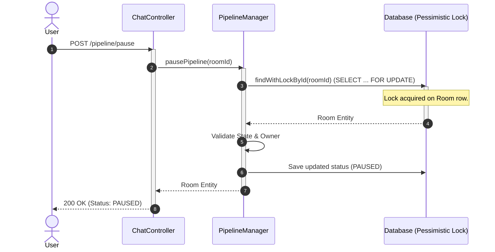
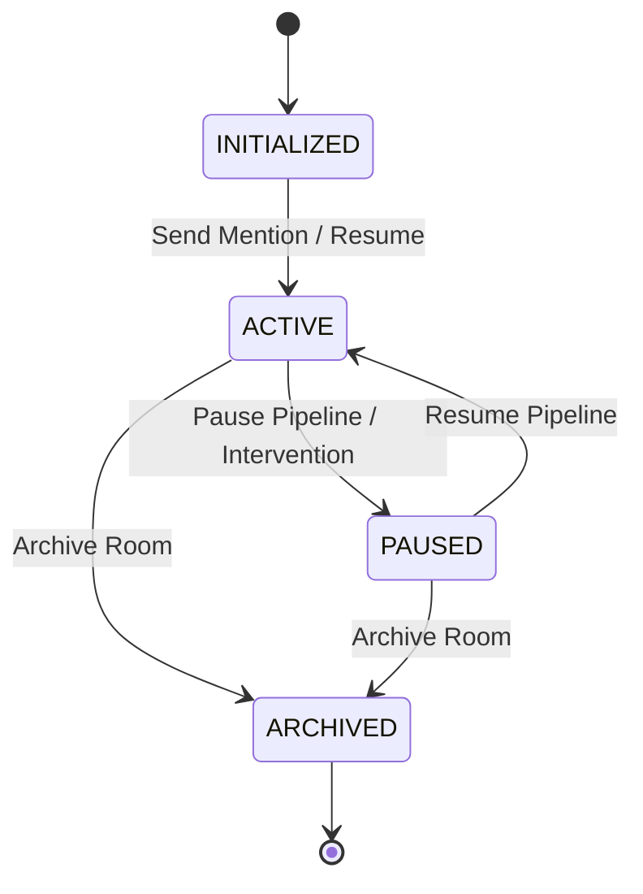

# Pipeline Control: Pause, Intervene & Pessimistic Locking

This document outlines the architecture, concurrency model, and state transitions used to manage sequentially executed AI model pipelines in Conclave.

## 1. Concurrency Model: Pessimistic Write Locking

To coordinate multi-agent sequential pipeline flows and prevent race conditions (e.g. a user pausing a pipeline or submitting feedback while an AI agent is in the middle of streaming a response), Conclave utilizes **Pessimistic Write Locking** at the database level.

When a pipeline state transition is requested or an AI turn begins:
1. The transaction calls `RoomRepository.findWithLockById(roomId)`.
2. Hibernate translates this into a database-level write lock query:
   ```sql
   SELECT ... FROM rooms WHERE id = ? FOR UPDATE;
   ```
3. Any concurrent requests (e.g., REST requests to pause/resume or additional user messages) targeting the same room ID are blocked until the lock-holding transaction commits or rolls back.



---

## 2. Room Pipeline State Transitions

The room state machine enforces strict execution rules. The single authority of execution state is the `PipelineManager`.

### Allowed Transitions:
*   `INITIALIZED` $\rightarrow$ `ACTIVE`: Triggered when execution starts or the first user message with an agent mention is sent.
*   `ACTIVE` $\rightarrow$ `PAUSED`: Triggered when an explicit pause request is received, or a user sends an intervention message (`isIntervention: true`).
*   `PAUSED` $\rightarrow$ `ACTIVE`: Triggered when the user invokes the resume endpoint, advancing the pipeline to the next agent in the sequence.
*   `ACTIVE` $\rightarrow$ `ARCHIVED`: Triggered when the room is closed or archived.

Any other transition (e.g. `INITIALIZED` $\rightarrow$ `PAUSED` or `ARCHIVED` $\rightarrow$ `ACTIVE`) is rejected with an `OrchestrationException`.



---

## 3. User Intervention Flow

If the user intervenes in a pipeline execution (e.g., they disagree with the output direction of a model), they send a message with `isIntervention: true`:
1. The room is locked and its status is set to `PAUSED`.
2. The user feedback is appended to the history.
3. The Context Janitor (`WorkflowStateService.evaluateAndCompressHistory`) is immediately triggered to rebuild the draft and review comments based on the updated feedback.
4. The updated summaries are broadcast to all subscribers via the WebSocket destination `/topic/room/{roomId}` in a `SYSTEM_INTERVENTION` event.
5. All further sequential execution is halted until the user explicitly calls the `POST /pipeline/resume` endpoint.

---

## 4. Sequential Auto-Advance Sequencer Loop

When the room status is `ACTIVE` and there is a configured `pipelineSequence` (e.g., `["Lead-Writer", "Code-Critic"]`):
1. Upon completing a turn, the orchestrator re-acquires a pessimistic write lock on the room.
2. It verifies if the room status is still `ACTIVE`.
3. If yes, it increments `currentPipelineIndex`.
4. If the new index is less than the sequence size, it retrieves the next role name and schedules the next turn asynchronously:
   ```java
   self.executeStreamingTurn(roomId, nextRoleName, promptContent);
   ```
5. Each turn executes in its own transaction on a dedicated Virtual Thread, ensuring high throughput and keeping resource locking durations minimal.
