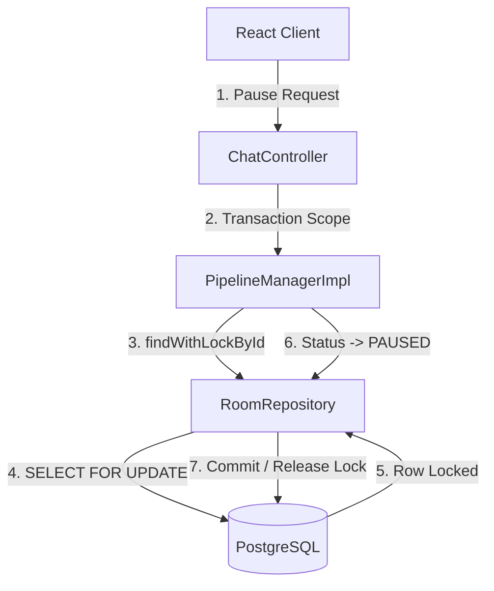

# Chapter 07: Pause & Intervene Pipeline Locking

## 1. Problem Statement
In sequential multi-agent workflows (e.g. Model A &rarr; Model B &rarr; Model C):
*   **Race Conditions:** If a user clicks "Pause" or submits an intervention message at the exact millisecond a model turn finishes, the status updates can overwrite each other.
*   **Pipeline Drift:** Uncontrolled loops continue executing even if the output drifts, wasting tokens and producing low-quality drafts.
*   **State Collision:** Concurrent write updates to database records (`rooms`, `workflow_state`) can cause transactional deadlocks or write discrepancies.

---

## 2. Background
Conclave provides a **Pause & Intervene** mechanism. Users can halt a sequential model queue, submit manual modifications, and resume the pipeline. The next model executes using the updated manual context.

---

## 3. Architecture Decision
We implemented **Pessimistic Write Locking** at the database layer using Spring Data JPA (`LockModeType.PESSIMISTIC_WRITE`):
*   Every critical pipeline operation (pausing, resuming, or completing turns) issues a `SELECT ... FOR UPDATE` query on the `Room` record, locking it.
*   Concurrent threads attempting to alter status or history block until the active transaction commits.
*   The orchestrator checks status values *inside the lock scope*, preventing models from executing if the status has transitioned to `PAUSED`.

---

## 4. Alternatives Considered
*   **Alternative 1: Optimistic Locking (`@Version`):**
    *   *Trade-off:* Relies on version numbers. While low-overhead, it throws exceptions when conflicts occur, failing requests rather than blocking and queuing them, forcing the client to implement complex retry logic.
*   **Alternative 2: In-Memory Java Locks (`ReentrantLock`):**
    *   *Trade-off:* Only locks execution threads on a single server node. If the application is scaled horizontally, in-memory locks do not protect against database race conditions.

---

## 5. Trade-offs
*   **Pros:** Enforces strict sequential consistency, guarantees thread safety across scaled server nodes, and queues conflicting operations rather than throwing errors.
*   **Cons:** Increases database transaction block times, potentially reducing throughput under heavy concurrent loads.

---

## 6. Internal Working
1.  **Pause Command:** User clicks pause. Client requests `POST /chat/pipeline/pause`.
2.  **Acquiring Lock:** `PipelineManagerImpl` locks the `Room` using `findWithLockById`.
3.  **Status Transition:** Status changes to `PAUSED`. Transaction commits and releases the lock.
4.  **Turn Check:** Before executing the next model, `MessageOrchestratorImpl` locks the `Room` and checks the status:
    ```java
    if (updatedRoom.getStatus() != RoomStatus.ACTIVE) {
        log.info("Halt turn execution: Room status is PAUSED");
        return; // Pipeline stops
    }
    ```
5.  **Intervention & Resumption:** The user submits a correction (`isIntervention = true`). When they click resume, the status updates back to `ACTIVE`, the index increments, and `executeStreamingTurn` triggers the next model.

---

## 7. Implementation Walkthrough
The following code from `PipelineManagerImpl.java` illustrates how the pessimistic write lock is applied during pause commands:
```java
// PipelineManagerImpl.java
@Override
@Transactional
public Room pausePipeline(UUID roomId, User requester) {
    // Acquire pessimistic write lock on the Room row (SELECT FOR UPDATE)
    Room room = roomRepository.findWithLockById(roomId)
            .orElseThrow(() -> new ResourceNotFoundException("Room not found"));

    if (!room.getOwner().getId().equals(requester.getId())) {
        throw new UnauthorizedAccessException("Only the room owner can pause the pipeline");
    }

    if (room.getStatus() != RoomStatus.ACTIVE) {
        throw new OrchestrationException("Cannot pause pipeline: Room status is not ACTIVE.");
    }

    room.setStatus(RoomStatus.PAUSED);
    return roomRepository.save(room);
}
```

---

## 8. Relevant Classes
*   [RoomStatus.java](file:///d:/Coding/Projects----For%20Resume/Conclave/backend/src/main/java/com/conclave/domain/enums/RoomStatus.java) - Enum defining `INITIALIZED`, `ACTIVE`, `PAUSED`, `ARCHIVED` states.
*   [RoomRepository.java](file:///d:/Coding/Projects----For%20Resume/Conclave/backend/src/main/java/com/conclave/repository/RoomRepository.java) - Exposes the `@Lock(LockModeType.PESSIMISTIC_WRITE)` query.
*   [PipelineManagerImpl.java](file:///d:/Coding/Projects----For%20Resume/Conclave/backend/src/main/java/com/conclave/service/PipelineManagerImpl.java) - Coordinates locks and status transitions.
*   [MessageOrchestratorImpl.java](file:///d:/Coding/Projects----For%20Resume/Conclave/backend/src/main/java/com/conclave/service/MessageOrchestratorImpl.java) - Asserts room status inside database locks.

---

## 9. Sequence & Component Diagrams

### 9.1 Pessimistic Locking Component Model


### 9.2 Locking Sequence during Turn Completions

```mermaid
sequenceDiagram
    autonumber
    actor User as React User (Pause)
    participant PM as PipelineManagerImpl
    participant Orch as MessageOrchestratorImpl
    participant DB as PostgreSQL

    rect rgb(20, 20, 25)
        Note over Orch, DB: Transaction A (LLM Turn Completes)
        Orch->>DB: SELECT room FOR UPDATE (Locked)
        Orch->>DB: Save AI Message
    end
    
    User->>PM: POST /pipeline/pause
    PM->>DB: SELECT room FOR UPDATE (Attempts Lock)
    Note over PM, DB: Thread BLOCKED. Waits for Transaction A.

    Orch->>DB: Commit & Release Lock
    Note over PM, DB: Thread UNBLOCKED. Lock acquired by PM.
    
    PM->>DB: Update Room Status -> PAUSED
    PM->>DB: Commit & Release Lock
```


---

## 10. Common Bugs & Debug Checklist

*   **Bug 1: Transaction Deadlocks**
    *   *Cause:* Different parts of the application acquire locks on entities in different orders (e.g. locking `Room` then `Message` in Thread 1, and `Message` then `Room` in Thread 2).
    *   *Checklist:*
        1. Review logs for PostgreSQL deadlock exceptions.
        2. Ensure all pipeline operations acquire locks on the `Room` record first, maintaining a consistent locking hierarchy.

*   **Bug 2: Locked Status Bypass (Race Condition)**
    *   *Cause:* The orchestrator checked `room.getStatus()` without acquiring a lock first, missing a concurrent status update.
    *   *Checklist:*
        1. Trace `MessageOrchestratorImpl.executeStreamingTurnAsync`.
        2. Ensure the code uses `roomRepository.findWithLockById` to re-fetch the room state from the database inside the lock scope.

---

## 11. Performance, Security, & Testing Notes
*   **Performance:** Keep transactions as short as possible. Perform HTTP networking calls *outside* of locked scopes where possible to prevent database lock timeout errors.
*   **Security:** Verify room ownership within the lock transaction to prevent unauthorized users from pausing rooms.
*   **Testing:** Set up multi-threaded tests using `CountDownLatch` to assert that concurrent update attempts execute sequentially.

---

## 12. Mock Interview Questions & Sample Answers

### Q1: Why did you choose Pessimistic Write Locking instead of Optimistic Locking to manage pipeline pause/resume states?
*Sample Answer:* "We chose database-level Pessimistic Write Locking (`LockModeType.PESSIMISTIC_WRITE`) because it blocks and queues concurrent requests. In an AI pipeline, an async streaming turn can take seconds. If a user clicks 'Pause' while a stream is completing, Optimistic Locking would throw a version conflict exception and fail the user's request. Pessimistic Locking forces the pause transaction to wait (block) until the active stream transaction commits, updating the status safely without failing user operations."

### Q2: How does the system ensure that a paused room doesn't trigger the next model in the queue?
*Sample Answer:* "When a model finishes streaming, the orchestrator checks if there is a next step in the pipeline. To do this safely, it calls `roomRepository.findWithLockById(roomId)` to acquire a pessimistic lock on the room record. It then checks the room status *inside* this transaction scope. If a user has clicked 'Pause', the database status is already `PAUSED`. The orchestrator detects this status, logs the halt, and exits the loop without triggering the next model, stopping the pipeline safely."

---

## 13. References
*   [PostgreSQL Locking Documentation: SELECT FOR UPDATE](https://www.postgresql.org/docs/current/explicit-locking.html#LOCKING-ROWS)
*   [Java Concurrency: CountDownLatch JavaDoc Reference](https://docs.oracle.com/en/java/javase/21/docs/api/java.base/java/util/concurrent/CountDownLatch.html)
