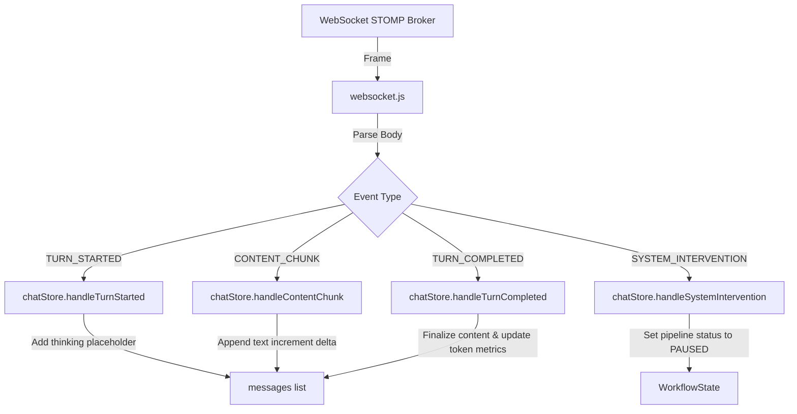

# State Management & WebSocket Synchronization with Zustand

This document outlines the architecture, data flows, and design patterns utilized in Conclave to synchronize global frontend client state with real-time Spring Boot WebSocket / STOMP brokers.

---

## 1. Global State Stores with Zustand

Conclave uses **Zustand** for lightweight, decentralized global state management. Frontend state is divided into three distinct modules to maintain separation of concerns:

```
                  ┌───────────────┐
                  │   authStore   │ ◄──── Persistence in LocalStorage
                  └───────┬───────┘
                          │
            ┌─────────────┴─────────────┐
            ▼                           ▼
    ┌───────────────┐           ┌───────────────┐
    │   roomStore   │           │   chatStore   │ ◄──── single source of truth for STOMP events
    └───────────────┘           └───────────────┘
```

1.  **`authStore`**: Manages user profiles and JWT token state. Persists token credentials inside `localStorage` for session maintenance.
2.  **`roomStore`**: Coordinates room creation (`POST /api/rooms`) and active room selector caching.
3.  **`chatStore`**: Holds active room message lists, current `WorkflowState` (draft & review comments), token usage metrics, and streaming chunk states.

---

## 2. WebSocket Real-time STOMP Interceptors & State Mapping

The WebSocket client (`websocket.js`) acts as a wrapper around the `@stomp/stompjs` client, responsible for session lifecycle, handshakes, and event propagation.

### Connection Handshake
Upon selecting a room, `websocket.js` initiates a STOMP session over raw WebSockets at `ws://localhost:8080/ws-conclave`:
*   Reads the JWT from `authStore.getState().token`.
*   Injects the credential into standard STOMP header fields:
    ```javascript
    connectHeaders: {
        Authorization: `Bearer ${token}`
    }
    ```

### Message Subscription & Action Dispatch
The WebSocket client subscribes to `/topic/room/{roomId}`. Received JSON payloads are parsed and mapped to `chatStore` actions:



---

## 3. Resilience: Reconnect Logic & Dropped Frames Sync

WebSockets are transport channels prone to network disruptions. Conclave implements three levels of synchronization resilience to handle dropped connections:

### 3.1. Automatic STOMP Reconnect Loops
The `@stomp/stompjs` client is configured with a `reconnectDelay`:
```javascript
reconnectDelay: 5000
```
If the connection drops (e.g. temporary server shutdown, network switch), the STOMP manager automatically initiates a connection handshake retry every 5 seconds.

### 3.2. State Synchronization on Connection Restored
When connection is restored, the STOMP `onConnect` handler triggers the subscription setup callback. Since frames may have been missed during the offline period:
*   The `onConnect` callback immediately triggers a fetch call to:
    ```
    GET /api/rooms/{roomId}
    ```
*   This pulls the latest consolidated `WorkflowState` (current draft summary + critic reviews) from the database to synchronize the sidebar.

### 3.3. Session Cleanup on Logout
To prevent memory leaks and dangling socket connections:
*   Calling `authStore.logout()` immediately triggers `disconnectWebSocket()`.
*   This terminates the connection, unsubscribes active paths, and purges the cached STOMP client instance.
