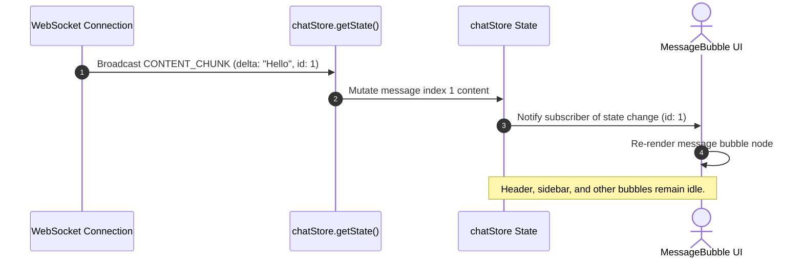

# Chapter 08: Zustand State Synchronization

## 1. Problem Statement
Handling high-frequency updates (such as word-by-word text streaming from an LLM) in a React client introduces major layout performance challenges:
*   **Component Rendering Thrashing:** If streaming chunks update parent state, the entire chat page (and all historical bubbles) re-renders, causing input lag and UI freezing.
*   **Boilerplate Bloat:** Using Redux for real-time sockets requires extensive boilerplate code (actions, reducers, dispatchers), slowing down feature development.
*   **State Coupling:** Coupling WebSocket callback handlers directly to React UI lifecycles causes connection terminations or state losses when components unmount.

---

## 2. Background
Conclave contains stores managing user authentication, room configurations, and chat messages. The client needs to handle incoming WebSocket STOMP packets smoothly, updating the UI dynamically without degrading performance.

---

## 3. Architecture Decision
We chose **Zustand** as our state management store:
*   Global state is kept in lightweight stores (`authStore`, `roomStore`, `chatStore`) outside the React component lifecycle.
*   WebSocket callbacks interact directly with the store via `useChatStore.getState().actionName()`, updating the store independently of the React layout.
*   Components utilize selective hooks (`useChatStore(state => state.messages)`) to subscribe to specific slices of state, preventing unnecessary parent re-renders during active streams.

---

## 4. Alternatives Considered
*   **Alternative 1: Redux Toolkit (RTK):**
    *   *Trade-off:* Standard in enterprise applications, but introduces significant boilerplate and makes updating deep nested state objects during rapid streams complex.
*   **Alternative 2: React Context API:**
    *   *Trade-off:* Self-contained, but lacks rendering optimizations. Every state update forces all components wrapped in the context provider to re-render, leading to performance lags during streams.

---

## 5. Trade-offs
*   **Pros:** Very low boilerplate, updates can be dispatched from outside the React rendering tree, and selective selectors prevent unnecessary re-renders.
*   **Cons:** Lacks Redux's extensive middleware ecosystem and devtool timeline debugging.

---

## 6. Internal Working
1.  **Event Callback:** The client receives a `CONTENT_CHUNK` WebSocket packet.
2.  **State Action Trigger:** The socket subscription callback calls the Zustand action `appendMessageChunk(chunk, messageId)`.
3.  **Store Mutation:** Zustand modifies the `messages` array in-place, appending the text delta to the target message object.
4.  **Selective Re-render:** Only the specific `MessageBubble` component subscribing to `messages` for that ID re-renders. The rest of the page (header, sidebars, other bubbles) remains untouched.

---

## 7. Implementation Walkthrough
The following code from `chatStore.js` shows how text deltas are appended to messages:
```javascript
// chatStore.js
export const useChatStore = create((set) => ({
  messages: [],
  appendMessageChunk: (chunkText, messageId) => set((state) => ({
    messages: state.messages.map((msg) =>
      msg.messageId === messageId
        ? { ...msg, content: msg.content + chunkText }
        : msg
    ),
  })),
}));
```
In the UI component, we subscribe using a selective selector to prevent parent re-renders:
```javascript
// MessageBubble.jsx
const message = useChatStore(
  (state) => state.messages.find((m) => m.messageId === id)
);
```

---

## 8. Relevant Classes
*   [authStore.js](file:///d:/Coding/Projects----For%20Resume/Conclave/frontend/src/store/authStore.js) - Manages JWT sessions and credentials.
*   [roomStore.js](file:///d:/Coding/Projects----For%20Resume/Conclave/frontend/src/store/roomStore.js) - Tracks room objectives and statuses.
*   [chatStore.js](file:///d:/Coding/Projects----For%20Resume/Conclave/frontend/src/store/chatStore.js) - Stores messages, drafts, and token logs.

---

## 9. Sequence & Component Diagrams

### 9.1 Store Data Injection Layout
```mermaid
graph TD
    Socket{{WebSocket STOMP}} -->|1. CONTENT_CHUNK payload| Callback[stompjs OnMessage Callback]
    Callback -->|2. Direct Mutation| Action[useChatStore.getState().appendMessageChunk]
    Action -->|3. Updates Slice| Store[(chatStore State)]
    
    Store -->|4. Selective Hook| Bubble[MessageBubble - messageId: X]
    Store -.->|5. Ignored by| Sidebar[Sidebar - Objective Summary]
    Store -.->|6. Ignored by| Input[ChatBar - User Input]
    
    Bubble -->|7. Re-renders text node| DOM[DOM update]
```

### 9.2 State Sync Sequence


---

## 10. Common Bugs & Debug Checklist

*   **Bug 1: State Loss on Component Unmounting**
    *   *Cause:* The WebSocket subscription was tied to a React component's `useEffect`, causing the connection to disconnect and subscribe repeatedly during layout changes.
    *   *Checklist:*
        1. Move the connection lifecycle and subscription registration to the global store initialization or a root provider level.
        2. Ensure the subscription is maintained globally throughout the user session.

*   **Bug 2: Unintentional Global Re-renders**
    *   *Cause:* Component reads the entire store state (e.g. `const state = useChatStore()`) rather than subscribing to a specific slice.
    *   *Checklist:*
        1. Replace global state hooks with selective hooks (e.g., `const messages = useChatStore(state => state.messages)`).
        2. Verify rendering efficiency using browser developer tools (profiler).

---

## 11. Performance, Security, & Testing Notes
*   **Performance:** Selective selectors keep React UI rendering responsive, keeping inputs smooth even during high-frequency delta broadcasts.
*   **Security:** Clear all stores (Zustand state reset) during sign-out to prevent session leakage between users on the same machine.
*   **Testing:** Mock store actions in unit tests to verify UI layout response to state changes without running real WebSocket connections.

---

## 12. Mock Interview Questions & Sample Answers

### Q1: Why did you choose Zustand instead of React's Context API or Redux for real-time WebSocket sync?
*Sample Answer:* "We chose Zustand because it manages global state outside the React component rendering tree. With React's Context API, any update (like high-frequency WebSocket streaming chunks) forces all components wrapped in the Provider to re-render, causing lag. Zustand allows us to update the store state from WebSocket callbacks outside the React tree, and components use selective hooks to subscribe to specific slices of state. This keeps updates highly efficient, preventing layout lag during streams."

### Q2: How do you prevent input lag when typing in the Chat input while an LLM stream is actively updating the screen?
*Sample Answer:* "We prevent input lag by decoupling the chat input component from the streaming message state. The chat input component (`ChatBar`) uses local state for typing characters. The streaming chunks update the message history array in `chatStore` directly. Since `ChatBar` does not subscribe to the `messages` slice, it does not re-render when chunks arrive. Only the specific `MessageBubble` rendering that message ID updates, keeping the input completely responsive."

---

## 13. References
*   [Zustand Documentation: Selective Selectors Guide](https://github.com/pmndrs/zustand#selecting-state)
*   [React 18/19 Rendering Performance Best Practices](https://react.dev/reference/react/useMemo)
