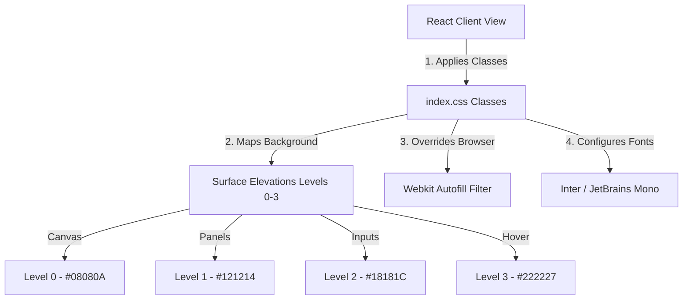
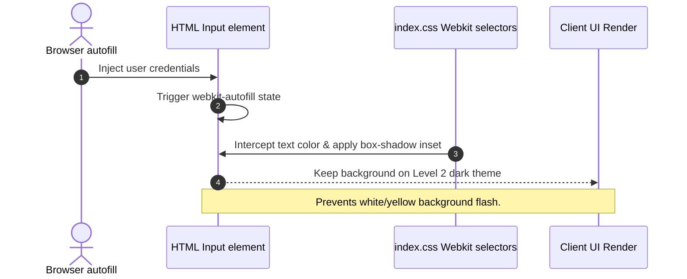

# Chapter 09: Tailwind Customization for Tactical UIs

## 1. Problem Statement
Default web design systems and UI libraries (like Bootstrap or standard material UI elements) are ill-suited for developer console environments:
*   **Aesthetic Fatigue:** High-contrast bright themes or generic solid black/white panels increase cognitive strain during extended usage.
*   **Default Input Styling Clashes:** Browsers automatically apply yellow/white backgrounds to credentials autofill inputs, breaking dark theme visual designs.
*   **Poor Spatial Density:** Oversized buttons, generic cards, and deep padding consume valuable screen space, reducing the visibility of streamed data and token telemetry logs.

---

## 2. Background
Conclave is styled as an **internal developer console** (similar to Linear, Cursor, or compiler setting sheets). The layout requires high information density, dark HSL color palettes, and custom input states.

---

## 3. Architecture Decision
We implemented a **Custom Tailwind Token System** combined with base CSS overrides:
*   Layout colors use a dedicated **Surface Elevation System** based on low-contrast dark HSL color tokens (Levels 0-3).
*   Browser defaults are overridden in `index.css` using custom webkit-autofill hooks to protect credentials input boxes from layout breaking.
*   The system uses monospace fonts (`JetBrains Mono`) for telemetry figures and statuses, and standard sans-serif (`Inter`) for readability.

---

## 4. Alternatives Considered
*   **Alternative 1: Solid Dark Colors (e.g. `#000000` base, `#ffffff` card):**
    *   *Trade-off:* High-contrast black/white layouts cause eye strain. Elevating surfaces using shades of gray or HSL values creates depth and improves readability.
*   **Alternative 2: Pre-built UI Library (e.g. Material UI, Bootstrap):**
    *   *Trade-off:* Easy to start, but customization is difficult. Custom CSS overrides are required to remove padding, border outlines, and animations, causing styling conflicts.

---

## 5. Trade-offs
*   **Pros:** Tailored developer look, low file footprint, and precise control over spacing and input layouts.
*   **Cons:** Requires manual development of basic components (like buttons, modals, dropdowns) from scratch.

---

## 6. Internal Working
1.  **Tailwind Configuration:** Custom tokens are mapped in Tailwind’s utility configuration, defining backgrounds (`bg-brand-level0`, `bg-brand-level1`), borders, and typography.
2.  **Autofill Override Filter:** The browser intercepts input completion and applies vendor pseudo-selectors (like `input:-webkit-autofill`), keeping inputs dark (`#18181C`).
3.  **Low-Contrast Grid Elevation:** Layout sections are separated using thin `1px` borders (`border-brand-border/60`) instead of thick card frames, keeping the console looking clean.

---

## 7. Implementation Walkthrough
The following code from `index.css` shows the autofill styles and surface elevations:
```css
/* index.css */
input:-webkit-autofill,
input:-webkit-autofill:hover,
input:-webkit-autofill:focus,
input:-webkit-autofill:active {
  -webkit-text-fill-color: #F4F4F6 !important;
  -webkit-box-shadow: 0 0 0px 1000px #18181C inset !important;
  caret-color: #F4F4F6 !important;
}

/* Custom background elevations */
.bg-level0 { background-color: #08080A; } /* Base canvas */
.bg-level1 { background-color: #121214; } /* Sidebars / panels */
.bg-level2 { background-color: #18181C; } /* Inputs / buttons */
.bg-level3 { background-color: #222227; } /* Hover / active states */
```

---

## 8. Relevant Classes
*   [index.css](file:///d:/Coding/Projects----For%20Resume/Conclave/frontend/src/index.css) - Contains the autofill overrides, HSL color tokens, and custom scrollbar styles.
*   [tailwind.config.js](file:///d:/Coding/Projects----For%20Resume/Conclave/frontend/tailwind.config.js) - Defines spacing parameters, fonts, and border widths.
*   [RoomView.jsx](file:///d:/Coding/Projects----For%20Resume/Conclave/frontend/src/views/RoomView.jsx) - Main console view employing custom elevations and layout grids.

---

## 9. Sequence & Component Diagrams

### 9.1 CSS Styles Layer Component Model


### 9.2 Autofill Override Flow


---

## 10. Common Bugs & Debug Checklist

*   **Bug 1: White Flash on Credentials Input Autofill**
    *   *Cause:* The browser's native autofill styles override background styles.
    *   *Checklist:*
        1. Open `index.css`.
        2. Ensure the `-webkit-box-shadow` inset property is correctly defined for all input states (`input:-webkit-autofill`).
        3. Verify that `!important` tags are attached to the declarations.

*   **Bug 2: Monospace Alignment Overflow**
    *   *Cause:* Variable-width characters causing alignment shifts in structured telemetry tables.
    *   *Checklist:*
        1. Verify the classes applied to telemetry columns.
        2. Ensure that numbers and status labels utilize monospace font families (`font-mono`) to guarantee consistent column alignment.

---

## 11. Performance, Security, & Testing Notes
*   **Performance:** Utility-first styling keeps the bundle size small, avoiding the runtime parsing overhead of CSS-in-JS libraries.
*   **Security:** Ensure form fields use correct semantic `autoComplete` attributes to allow secure credential manager integrations without browser styling conflicts.
*   **Testing:** Verify contrast ratios (e.g. `#F4F4F6` text on `#08080A` background) against WCAG contrast tools, ensuring a minimum contrast ratio of **4.5:1** (WCAG AA).

---

## 12. Mock Interview Questions & Sample Answers

### Q1: How do you prevent browser autofill from breaking dark themes in input components?
*Sample Answer:* "We resolve browser autofill style overrides by targeting webkit vendor pseudo-classes (`input:-webkit-autofill`) in `index.css`. When the browser injects credentials, it defaults to a white or yellow background. We override this behavior using an inner box-shadow inset (`-webkit-box-shadow: 0 0 0px 1000px #18181C inset !important`) and setting the text fill color explicitly. This forces the input background to remain on the dark Level 2 theme surface, preventing visual disruption."

### Q2: What is a Surface Elevation system, and how does it improve developer console designs?
*Sample Answer:* "A Surface Elevation system organizes layouts using different color values to establish structural depth. In Conclave, we use HSL color tokens to define four elevation levels: Level 0 is the base canvas background, Level 1 isolates primary panels (sidebars and headers), Level 2 marks inputs and buttons, and Level 3 indicates hover or active states. This low-contrast design reduces eye strain during extended developer sessions, separates logical layouts without relying on thick borders, and maintains a premium, cohesive aesthetic."

---

## 13. References
*   [Tailwind CSS Customization Guidelines](https://tailwindcss.com/docs/configuration)
*   [MDN Web Docs: -webkit-autofill Pseudo-Class Guide](https://developer.mozilla.org/en-US/docs/Web/CSS/:-webkit-autofill)
