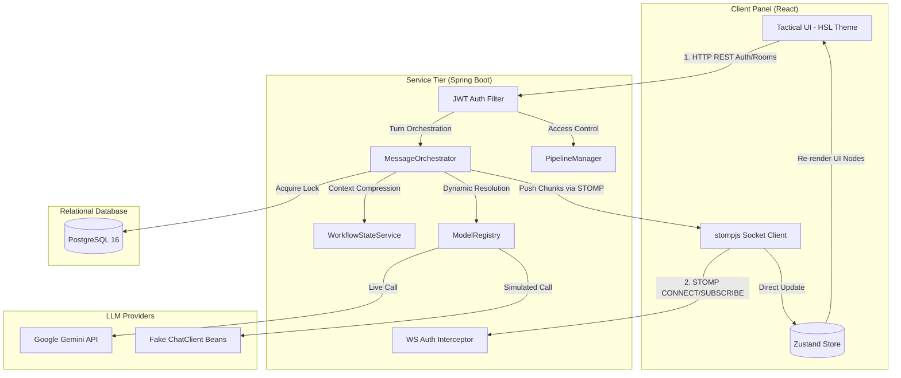

# Internal Engineering Handbook: Conclave

Welcome to the **Conclave Internal Engineering Handbook**. This repository is an orchestrator backend (Java/Spring Boot) and rich split-panel console client (React) designed to unify conversation context across multiple LLM APIs.

This handbook is designed as an onboarding curriculum for new engineers joining the project. After reading these guides, you should be able to understand, debug, test, and extend any module in the system without reading the source code first.

---

## 1. System Block Diagram

The following architecture diagram outlines how the distinct modules detailed in this handbook interact across the React frontend and Spring Boot backend:

---

## 2. Handbook Chapters Index

Click on the links below to study specific topics:

### Part A: Environment & Core Infrastructure
*   **[Chapter 01: Developer Environment Setup](file:///d:/Coding/Projects----For%20Resume/Conclave/Docs/Learning/01_Developer_Environment_Setup.md)**
    *   Docker Compose containers, local runtimes (JVM 21, Node), Playwright test environments, and setup troubleshooting.
*   **[Chapter 02: JWT Authentication Strategy](file:///d:/Coding/Projects----For%20Resume/Conclave/Docs/Learning/02_JWT_Authentication_Strategy.md)**
    *   Stateless REST security filters, WebSocket STOMP handshake interceptions, role verification, and signature debugging.

### Part B: Orchestration & AI Integration
*   **[Chapter 03: Provider Adapter Pattern](file:///d:/Coding/Projects----For%20Resume/Conclave/Docs/Learning/03_Provider_Adapter_Pattern.md)**
    *   Mapping canonical DB message schemas to Gemini's alternating roles, Claude's top-level parameter configurations, and OpenAI's flat payloads.
*   **[Chapter 04: Model Registry & Fake ChatClients](file:///d:/Coding/Projects----For%20Resume/Conclave/Docs/Learning/04_Model_Registry_And_Fake_ChatClients.md)**
    *   Conditional registry mapping beans, stubbing OpenAI/Claude responses, simulating network latency on virtual threads, and test profiles.
*   **[Chapter 05: Context Compression & Janitor Service](file:///d:/Coding/Projects----For%20Resume/Conclave/Docs/Learning/05_Context_Compression_And_Janitor_Service.md)**
    *   The `Conclave Janitor` history compression engine, JSON summarizer prompts, parsing recovery strategies, and database middle-message purging.

### Part C: Real-Time Event Sync & Layout
*   **[Chapter 06: WebSocket Realtime Streaming with STOMP](file:///d:/Coding/Projects----For%20Resume/Conclave/Docs/Learning/06_WebSocket_Realtime_Streaming_With_STOMP.md)**
    *   Spring message brokers, STOMP routing configurations, streaming Flux chunk-by-chunk broadcasts, and connection loss recovery.
*   **[Chapter 07: Pause & Intervene Pipeline Locking](file:///d:/Coding/Projects----For%20Resume/Conclave/Docs/Learning/07_Pause_And_Intervene_Pipeline_Locking.md)**
    *   Pessimistic database locking, active turn interrupts, manual correction context injections, and sequential task state resumes.
*   **[Chapter 08: Zustand State Synchronization](file:///d:/Coding/Projects----For%20Resume/Conclave/Docs/Learning/08_Zustand_State_Synchronization_With_WebSockets.md)**
    *   Zustand store slices, updating messages directly from WebSocket callbacks outside the React tree, and UI rendering performance optimizations.
*   **[Chapter 09: Tailwind Customization for Tactical UIs](file:///d:/Coding/Projects----For%20Resume/Conclave/Docs/Learning/09_Tailwind_Customization_For_Tactical_UIs.md)**
    *   Design tokens, HSL color schemes, Surface Elevations (Levels 0-3), and CSS overrides to block browser credentials autofill.
