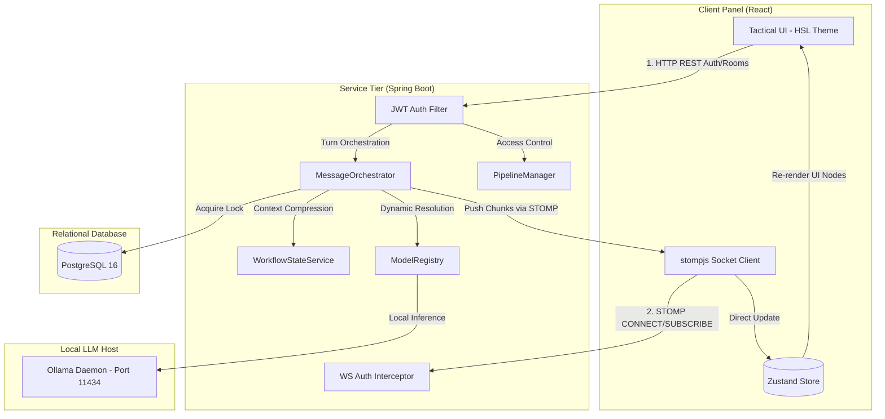

# Internal Engineering Onboarding Handbook

Welcome to the **Conclave Engineering Handbook**. This directory serves as a structured onboarding curriculum and reference manual for engineers joining the project. 

The handbook is designed to go beyond code comments, teaching you the architectural patterns, concurrency mechanisms, and transport protocols that form the Conclave engine.

---

## 💡 Learning & Onboarding Philosophy
At Conclave, we believe in **Systems-First Understanding**. Before modifying database schemas or building React nodes, developers must understand:
1.  **State Mappings:** How a client UI state binds to transactional records.
2.  **Thread Lifecycles:** How Java virtual threads handle slow I/O blockings without hogging standard pool executors.
3.  **Protocol Boundaries:** How messages transition from stateless REST APIs to stateful, real-time WebSocket subscriptions.

### Relationship to Implementation
The handbook chapters correspond directly to the 12 phases in the [Implementation Roadmap](file:///d:/Coding/Projects----For%20Resume/Conclave/Docs/Roadmap/README.md). When starting a new phase, read the corresponding chapter first.

### Relationship to Portfolio & Technical Interviews
If you are preparing to defend this codebase in a technical interview, use this handbook to study the systems-level design decisions. It provides the rationale behind selecting Project Loom, using PostgreSQL pessimistic locks, and decoupling WebSocket callbacks using Zustand.

---

## 🚀 System Topology

The following diagram maps how the distinct modules detailed in this handbook interact across the React frontend and Spring Boot backend:

---

## 🗂️ Handbook Chapters by Category

To help you find information, the 9 chapters are categorized below by their engineering domain:

### 🛠️ Developer Experience & Environment
*   **[Chapter 01: Developer Environment Setup](file:///d:/Coding/Projects----For%20Resume/Conclave/Docs/Learning/01_Developer_Environment_Setup.md)**
    *   *Summary:* Details local setup commands for Postgres container initialization, Ollama CLI downloads, backend and frontend dev runs, and common startup troubleshooting diagnostics.

### 🔐 Security & Access Control
*   **[Chapter 02: JWT Authentication Strategy](file:///d:/Coding/Projects----For%20Resume/Conclave/Docs/Learning/02_JWT_Authentication_Strategy.md)**
    *   *Summary:* Breaks down stateless Spring Security filters mapping JSON requests, JWT structure configurations, and custom STOMP connection frame interceptors validating tokens during socket handshake upgrades.

### 🧠 Backend Architecture & Spring AI
*   **[Chapter 03: Model Adapter Pattern](file:///d:/Coding/Projects----For%20Resume/Conclave/Docs/Learning/03_Model_Adapter_Pattern.md)**
    *   *Summary:* Explains how the backend maps provider-agnostic `CanonicalMessage` lists to model-specific instruct prompt structures (Llama 3 header tags, Mistral `[INST]` tags, and Gemma control tags).
*   **[Chapter 04: Model Registry & Ollama Clients](file:///d:/Coding/Projects----For%20Resume/Conclave/Docs/Learning/04_Model_Registry_And_Ollama_Clients.md)**
    *   *Summary:* Documents the dynamic registry scanning `@Component` adapter beans, mapping roles to model IDs, and invoking Ollama local inference clients via Project Loom Virtual Threads.

### 💾 Concurrency, Persistence, & Compaction
*   **[Chapter 05: Context Compression & Janitor Service](file:///d:/Coding/Projects----For%20Resume/Conclave/Docs/Learning/05_Context_Compression_And_Janitor_Service.md)**
    *   *Summary:* Outlines the Llama 3-driven `Conclave Janitor` history compression workflow, detailing structured JSON prompt formats and the purge mechanism that cleans older messages from the database.
*   **[Chapter 07: Pause & Intervene Pipeline Locking](file:///d:/Coding/Projects----For%20Resume/Conclave/Docs/Learning/07_Pause_And_Intervene_Pipeline_Locking.md)**
    *   *Summary:* Explains how pessimistic write locks (`SELECT FOR UPDATE`) on PostgreSQL room entities halt execution loops immediately, allowing users to inject manual correction messages and safely resume threads.

### 🌐 Real-Time Integration & Transport
*   **[Chapter 06: WebSocket Realtime Streaming with STOMP](file:///d:/Coding/Projects----For%20Resume/Conclave/Docs/Learning/06_WebSocket_Realtime_Streaming_With_STOMP.md)**
    *   *Summary:* Documents Spring's in-memory STOMP broker configurations, connection-loss recovery strategies, and streaming Flux chunk push sequences.

### 🎨 Frontend & Tactical Interface
*   **[Chapter 08: Zustand State Synchronization](file:///d:/Coding/Projects----For%20Resume/Conclave/Docs/Learning/08_Zustand_State_Synchronization_With_WebSockets.md)**
    *   *Summary:* Explains how Conclave decouples high-frequency WebSocket updates from the React render tree by editing Zustand stores directly, preventing render thrashing and maximizing frames-per-second performance.
*   **[Chapter 09: Tailwind Customization for Tactical UIs](file:///d:/Coding/Projects----For%20Resume/Conclave/Docs/Learning/09_Tailwind_Customization_For_Tactical_UIs.md)**
    *   *Summary:* Establishes UI styling standards, detailing HSL color palettes, Slate surface elevations Level 0-3, border colors, and Webkit autofill CSS resets.
