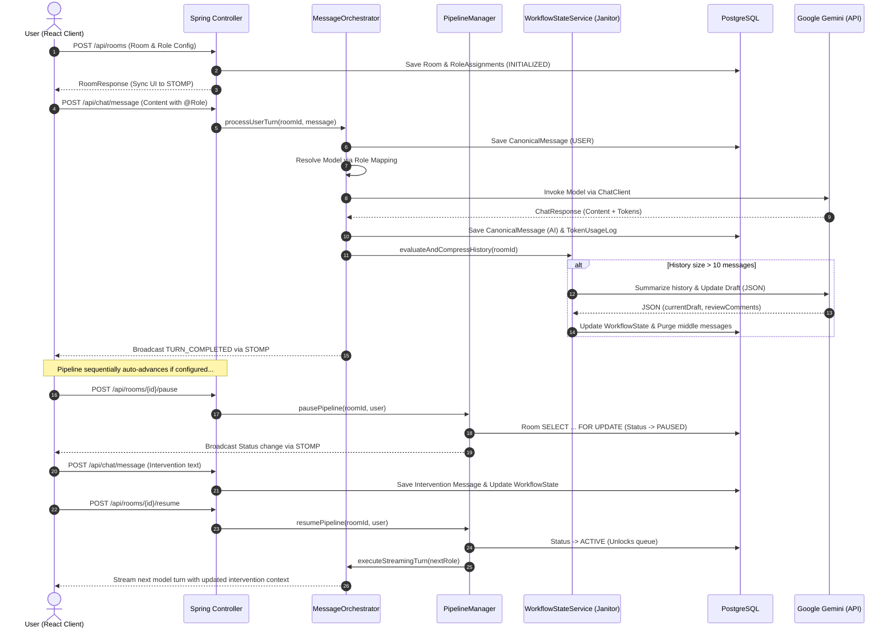

# Product Requirements Document (PRD): Conclave

**Project Name:** Conclave — Multi-Provider Context Unification Platform  
**Status:** Planning / Architecture Phase  
**Document Version:** 1.1  
**Target Audience:** Technical Interviewers, Engineering Leaders, and Systems Architects

---

## 1. Product Overview & Problem Statement

### 1.1 Context & Problem
The modern generative AI landscape is highly fragmented. To solve complex tasks, power users frequently "tab-hop" between different large language model (LLM) interfaces (e.g., OpenAI ChatGPT, Anthropic Claude, Google Gemini) to leverage their respective strengths—such as Claude's precise code synthesis, GPT-4's logical reasoning, and Gemini's massive context window. 

The primary friction in this multi-model workflow is **Context Fragmentation**. Users must manually copy-paste background information, previous prompts, and model responses between browser tabs to maintain a coherent thread. This results in a heavy "context tax":
*   **Cognitive Overhead:** Manually tracking what each model knows.
*   **Information Decay:** Nuance is lost during manual summarization and copy-pasting.
*   **Token Inefficiency:** Entire transcripts are repeatedly sent to models, leading to bloated token usage.

### 1.2 The Conclave Solution
Conclave solves this problem by establishing a unified **"meeting room"** where multiple LLMs participate as distinct agents in a single, moderated conversation. The core thesis is **Context Unification**: engineering a backend capable of translating a single canonical conversation history into the specific, varying API shapes required by different providers. This ensures that all models share the same "memory" and task state without manual intervention.

---

## 2. Target Persona & Core Use Case

### 2.1 Target Persona
*   **Primary Audience:** Technical Recruiters, Engineering Managers, and Systems Architects evaluating systems integration skills.
*   **Objective:** To serve as a high-fidelity portfolio piece demonstrating advanced Java/Spring Boot capabilities, integration design patterns, real-time messaging, and multi-vendor API orchestration.

### 2.2 Core Use Case
A user initializes a collaborative workspace (e.g., "Software Design Workshop"), defines a shared task objective (e.g., "Draft a REST API for a payment gateway"), and assigns roles:
*   **Lead Writer** mapped to `Google Gemini` (Live API).
*   **Code Critic** mapped to a fake/stubbed `Anthropic Claude` instance.
*   **Security Reviewer** mapped to a fake/stubbed `OpenAI GPT` instance.

The user directs the workflow using @-mentions (e.g., `@LeadWriter draft the endpoint schemas`). The backend orchestrates the state translation and history mapping so that when the Critic or Reviewer is subsequently invoked, they receive the updated conversation history and the consolidated task state (`WorkflowState`) automatically.

---

## 3. Alternatives Considered & Architectural Trade-offs

During the design phase, several alternative architectural patterns were evaluated for multi-provider orchestration:

### 3.1 Alternative 1: Centralized Python Orchestrator (e.g., LangChain/LangGraph)
*   **Description:** Building the orchestration engine in Python using existing LangChain or LangGraph libraries, exposing it via FastAPI.
*   **Trade-off:** While Python has rich AI tooling, a Spring Boot backend is chosen here to showcase enterprise Java engineering skills (Virtual Threads, dependency injection, and clean interface segregation) which are highly relevant for large-scale enterprise environments.

### 3.2 Alternative 2: Raw Provider API Integrations in Frontend (React Client-Side Calling)
*   **Description:** Letting the React frontend directly call OpenAI, Anthropic, and Gemini APIs, managing the state client-side.
*   **Trade-off:** This was rejected because client-side integration exposes API keys, prevents robust database auditing (token logging), lacks transaction control, and makes server-driven sequential pipelines impossible. Moving the orchestrator to the backend secures credentials and enables centralized state locking.

### 3.3 Alternative 3: HTTP-Level Mocking (e.g., WireMock) vs. Java-Level Mocking (Fake Chat Clients)
*   **Description:** Using HTTP mock servers to intercept outgoing OpenAI/Claude calls.
*   **Trade-off:** Rejected in favor of custom Java bean implementations (`FakeOpenAiChatClient`, `FakeClaudeChatClient`) adhering to Spring AI's `ChatClient` and `ChatModel` interfaces. This choice focuses testing and validation on **Internal Interface Engineering** and schema translation (Adapter Pattern) rather than network socket behavior, facilitating a plug-and-play profile swap for v2.

---

## 4. Functional Requirements (In-Scope)

### 4.1 Backend Orchestration (Spring Boot & Spring AI)
*   **Unified Message Schema:** Persists conversation history in a single, normalized relational format (`CanonicalMessage`) that is provider-agnostic.
*   **Provider Adapter Layer (`ProviderAdapter`):** A translation tier mapping the canonical history and task state into the exact payload formats required by different vendors (e.g., Gemini's `user/model` alternating roles vs. OpenAI's `user/assistant/system` role lists).
*   **Dynamic Role Registry:** Resolves and injects the appropriate `ChatClient`/`ChatModel` bean at runtime based on the assigned role of the target model.
*   **Context Janitor (Compression Engine):** Automatically compresses context when history exceeds 10 messages by invoking Gemini to summarize progress into `currentDraft` and `reviewComments`, and then purging middle messages while retaining the system prompt (foundation) and the last 2 messages (short-term memory).
*   **Pessimistic State Locking:** Prevents race conditions during state transitions (`ACTIVE`, `PAUSED`) by applying pessimistic database locks (`SELECT ... FOR UPDATE`) on the `Room` entity.
*   **Token Audit Log:** Logs prompt and completion tokens for every turn into PostgreSQL, simulating usage tracking for paid providers based on character-count heuristics.

### 4.2 Frontend Workspace (React 19)
*   **Multi-Agent Console:** High-density console layout using distinct colors and badges to clearly identify which model generated which message.
*   **Moderated @-Mention Input:** Text area input with a dropdown mention selector to direct turns explicitly to specific roles.
*   **Pause & Intervene Controls:** Interactive controls to suspend a running multi-model sequence, allowing the user to inject manual edits into the state before resuming.
*   **Shared Context Sidebar:** A split-screen panel showing real-time updates of the unified `WorkflowState` (Objective, Current Draft, and Review Comments) and token consumption metrics.

---

## 5. Non-Functional Requirements (NFRs)

*   **R1: Latency & Streaming Overhead:** The backend orchestration and STOMP message broadcasting layer must introduce less than **200ms** of overhead (excluding model generation latency). Response chunks must stream to the client word-by-word in real-time.
*   **R2: Concurrency & Thread-per-Request Scale:** The server must use **Java 21 Virtual Threads** to handle blocking I/O calls to LLM APIs, preventing thread exhaustion during concurrent user sessions.
*   **R3: State Consistency:** The frontend local store (Zustand) and database state must be synchronized. STOMP subscription events (`TURN_STARTED`, `CONTENT_CHUNK`, `TURN_COMPLETED`, `SYSTEM_INTERVENTION`) must trigger updates. In case of network drops, polling reconciliation must restore consistency.
*   **R4: Security & Stateless Auth:** All room modifications, messages, and state controls must be secured via stateless **JWT-based authentication**, restricting mutations to the room's owner.

---

## 6. Explicit Non-Goals

*   **No Retrieval-Augmented Generation (RAG):** The system focuses strictly on prompt orchestration, context translation, and history management. Vector databases or search engines are out of scope for v1.
*   **No Autonomous Agent Loops:** Models do not decide when to invoke themselves. All executions are strictly user-directed (via @-mentions) or run along a predefined sequential pipeline.
*   **No Multi-Vendor Paid API Costs:** Live API calls are restricted to Google Gemini's free tier. OpenAI and Claude adapters run on simulated fake beans, ensuring $0 developer costs during demos while fully validating the adapter serialization logic.
*   **No Complex Transitions or High-Fidelity UI Animations:** Layout relies on clean, high-density geometric alignments and state indicators, focusing on systems engineering representation.

---

## 7. Constraints & Limitations

*   **Vertex AI Free-Tier Limits:** Rate limits on Google Gemini free API keys constrain the frequency of consecutive live turns.
*   **Alternating Role Validation:** Gemini API demands strict alternating `user`/`model` messages starting with `user`. The `GeminiAdapter` must enforce and handle this sequence, failing gracefully if violations occur.
*   **Single-Threaded Sequential Pipelines:** Pipelines execute sequentially (Model A -> Model B). Parallel multi-model consensus loops are constrained in the current design.

---

## 8. Success Criteria & Metrics

*   **Schema Translation Integrity:** 100% test coverage on `ProviderAdapter` classes verifying correct mappings (e.g., `CanonicalMessage` -> `GeminiRequest` / `OpenAiRequest`).
*   **Real-time Delivery Rate:** STOMP socket message delivery rate must match chunk generation, streaming model outputs with no stuttering.
*   **State Recovery:** A paused room must be resumes from the exact database state, preserving the summarized draft and memory logs.
*   **Token Metrics Auditing:** Every turn logs a `TokenUsageLog` entry. Verification that simulated costs are correctly aggregated by room and model.

---

## 9. Future Extensibility

*   **Stripe Integration / Token Monetization:** Adding billing hooks based on the persisted `TokenUsageLog` entries to charge users for multi-model usage.
*   **Vector RAG Integration:** Adding a Document Upload sidebar that feeds vector embeddings into the `WorkflowState` system objective.
*   **Consensus Consensus Loop:** A pipeline type where multiple models run in parallel on the same prompt, followed by a critic model synthesizing their answers into a unified draft.

---

## 10. User Flow Diagram

The following diagram illustrates the complete user lifecycle from room creation to pipeline execution, pause intervention, and background context compression:

