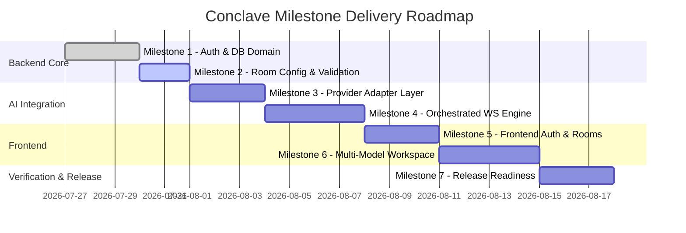

# Conclave Implementation Roadmap — Index

Welcome to the **Conclave** Implementation Roadmap. This document serves as the master index and architectural guide for building Conclave sequentially. 

Conclave is a multi-provider context unification platform that orchestrates real-time, shared-context discussions between a human and multiple LLMs (such as Google Gemini, OpenAI, and Anthropic Claude) in a single virtual "meeting room."

---

## 1. System Hierarchies & Architecture

To preserve SOLID design and Clean Architecture principles, Conclave separates concerns across explicit boundaries.

### 1.1 Layer Hierarchy
```
+-------------------------------------------------------+
|                    Presentation                       |
|           React 19 (Vite) + Zustand UI                |
+--------------------------┬----------------------------+
                           │ HTTP REST / STOMP WebSocket
+--------------------------▼----------------------------+
|                  Application Services                 |
|         Message Orchestrator & Workflow Manager       |
+--------------------------┬----------------------------+
                           │
+--------------------------▼----------------------------+
|                       Domain                          |
|         Canonical Schemas & Domain Entities           |
+--------------------------┬----------------------------+
                           │
+--------------------------▼----------------------------+
|                   Integration / SPI                   |
|        ModelAdapter Layer & Model Registry            |
+--------------------------┬----------------------------+
                           │ Local Inference / Ollama
+--------------------------▼----------------------------+
|                  Infrastructure / DB                  |
|             Spring Boot JPA + PostgreSQL              |
+-------------------------------------------------------+
```

### 1.2 Module Hierarchy
- **`backend/` (Spring Boot Application)**
  - `config/`: Configuration beans (Security, WebSockets, Spring AI Client bindings).
  - `domain/`: Core business models (`CanonicalMessage`, `WorkflowState`, `User`, `Room`, `RoleAssignment`, `TokenUsageLog`).
  - `repository/`: Spring Data JPA interfaces.
  - `service/`: Core logic:
    - `AuthService`: Authentication, user management, and token generation.
    - `RoomService`: Room initialization, role assignments validation, and persistence.
    - `WorkflowStateService`: Compresses history, invokes Gemini "Janitor" for summary, maintains `WorkflowState` database.
    - `MessageOrchestrator`: Multi-model sequential queue processing, role-to-model resolution, and token logging.
  - `controller/`: REST controllers (`AuthController`, `RoomController`, `ChatController`).
  - `websocket/`: STOMP event dispatchers and configuration.
  - `integration/`: Model-specific adapter packages:
    - `adapter/`: Adapters for Llama 3, Mistral, and Gemma.
    - `registry/`: Dynamic registry and Ollama wrappers.
- **`frontend/` (React SPA)**
  - `src/assets/`: Shared assets.
  - `src/components/`: Reusable components (Sidebar, MessageBubble, TurnIndicator, ChatBar, AlertBanner).
  - `src/store/`: Zustand state management stores (`authStore`, `roomStore`, `chatStore`).
  - `src/services/`: Client wrappers (`api.js`, `websocket.js`).
  - `src/views/`: Primary views (`LoginView`, `SetupView`, `RoomView`).

### 1.3 Feature Hierarchy & Dependency Rules
```
CanonicalMessage DTO
         ↓
ModelAdapter Interface
         ↓
Llama, Mistral, Gemma Adapters (Ollama Local Inference)
         ↓
ModelRegistry Service
         ↓
MessageOrchestrator & WorkflowStateService
         ↓
STOMP WebSocket Configuration
         ↓
AuthController & RoomController & ChatController
         ↓
Frontend REST API Clients
         ↓
Frontend Zustand State Stores
         ↓
Frontend UI Components & Views
```
*Rule:* No client-side UI feature is scheduled before its corresponding WebSocket and database representations are fully unit-tested and functional.

---

## 2. Planning Inconsistencies & Open Questions

### Planning Inconsistencies
During analysis, the following structural discrepancies were found across documents:
1. **Pipeline Queue Definition & Execution State:** Gaps exist between `App_Flow.md`/`UIDesign.md` (which assume sequential pipelines) and `DB_Schema.md`/`API_Specification.md` (which do not define tables or payload fields for the pipeline sequence). 
   - *Roadmap Resolution:* We introduce a `pipeline_sequence` attribute (JSON/Text representing list of Role Names) and a `current_pipeline_index` (Integer) in the `rooms` table to track this state without introducing out-of-scope infrastructure.
2. **WebSocket Handshake Security:** REST routes are explicitly secured via JWT Bearer headers, but WebSocket endpoints have no specified authorization.
   - *Roadmap Resolution:* We incorporate STOMP connection frame interceptors that validate JWT tokens from headers.
3. **Model Registry Predefined Models:** The role assignment links a custom role to a `modelId`, but there is no list of supported models.
   - *Roadmap Resolution:* The roadmap specifies defining an enum of supported models (`ModelId`: `LLAMA3`, `MISTRAL`, `GEMMA`) to prevent validation gaps.

### Open Questions
> [!WARNING]
> **Dynamic Pipeline Configuration:** Can users dynamically update the pipeline sequence mid-session, or is it locked upon Room Creation?
> 
> **Authentication for WS Broker:** Are WebSocket connections allowed to fallback to anonymous in development profiles to simplify local client mock testing?

---

## 3. Development Phases

The implementation is divided into **12 sequential, atomic development phases**. Each phase is documented in its own file in this directory.

| Phase | Title | Focus | Primary Outputs |
| :--- | :--- | :--- | :--- |
| **01** | [Project Setup & Infrastructure](file:///d:/Coding/Projects----For%20Resume/Conclave/Docs/Roadmap/Phase_01_Project_Setup.md) | Setup monorepo structure | Directory layouts, Maven/Vite configuration, Postgres Docker compose |
| **02** | [Authentication & Domain](file:///d:/Coding/Projects----For%20Resume/Conclave/Docs/Roadmap/Phase_02_Authentication_And_Domain.md) | Schema design & REST auth | Database models, Spring JPA repositories, Spring Security JWT flow |
| **03** | [Room Management API](file:///d:/Coding/Projects----For%20Resume/Conclave/Docs/Roadmap/Phase_03_Room_Management.md) | Setup space configuration | `Room` endpoints, role mappings validation, config persistence |
| **04** | [Model Adapter Layer](file:///d:/Coding/Projects----For%20Resume/Conclave/Docs/Roadmap/Phase_04_Model_Adapter_Layer.md) | Context translation contracts | `ModelAdapter` interfaces, Llama/Mistral/Gemma prompt templates |
| **05** | [LLM Clients & Model Registry](file:///d:/Coding/Projects----For%20Resume/Conclave/Docs/Roadmap/Phase_05_LLM_Clients_And_Registry.md) | Vertex AI & Mock engines | Vertex AI binding, Fake chat clients with simulated latency, Registry |
| **06** | [Orchestration & WorkflowState](file:///d:/Coding/Projects----For%20Resume/Conclave/Docs/Roadmap/Phase_06_Orchestration_And_WorkflowState.md) | Session orchestration | `MessageOrchestrator`, Gemini Janitor summarization, Token logs |
| **07** | [WebSocket Real-time Layer](file:///d:/Coding/Projects----For%20Resume/Conclave/Docs/Roadmap/Phase_07_WebSocket_Realtime.md) | STOMP event broadcasting | Spring STOMP broker configuration, Event messages serialization |
| **08** | [Pipeline Control System](file:///d:/Coding/Projects----For%20Resume/Conclave/Docs/Roadmap/Phase_08_Pipeline_Control.md) | Pause / Resume orchestration | Thread-safe room locking state machine, Intervention logic |
| **09** | [Frontend Foundation](file:///d:/Coding/Projects----For%20Resume/Conclave/Docs/Roadmap/Phase_09_Frontend_Base.md) | Frontend core & STOMP integration | React router, Zustand authorization & socket stores, API clients |
| **10** | [Frontend UI Components](file:///d:/Coding/Projects----For%20Resume/Conclave/Docs/Roadmap/Phase_10_Frontend_UI_Components.md) | Interactive Chat View UI | Message Matrix, @-Mention selector, Shared Context Sidebar, overlays |
| **11** | [Developer Experience & Environment Setup](file:///d:/Coding/Projects----For%20Resume/Conclave/Docs/Roadmap/Phase_11_Developer_Experience_And_Setup.md) | Onboarding & verification | Environment audit, startup flows validation, troubleshooting configs |
| **12** | [Documentation & Repository Audit](file:///d:/Coding/Projects----For%20Resume/Conclave/Docs/Roadmap/Phase_12_Documentation_And_Repository_Audit.md) | End-to-End verification | Playwright tests suite, Learning handbook index, repository release |

---

## 4. Milestones

Every milestone compiles, runs, and leaves the codebase in a healthy state.



### Milestone 1: Authenticated Base Engine (Phases 01 - 02)
- **Completed Functionality:** Local Postgres DB up, Hibernate JPA schema matching DB spec, user creation and JWT login.
- **Demonstration Capability:** Spin up server, send `POST /auth/register` and `POST /auth/login` via Bruno/Postman to retrieve token, attempt accessing protected endpoint without token to verify 401 response.
- **Testing Checkpoint:** `UserRepositoryTests` and `AuthenticationControllerTests` passing.
- **Intentionally Incomplete Work:** Rooms cannot yet be created; WebSockets and AI services are mock-declared but not wired.

### Milestone 2: Meeting Room Blueprint (Phase 03)
- **Completed Functionality:** Creation of rooms and Role assignments per room. Validates model assignments and colors.
- **Demonstration Capability:** Call `POST /rooms` with authorization headers sending Room Objective and Model mapping configuration. Response lists the initialized Room status.
- **Testing Checkpoint:** `RoomValidationTests` checking duplicate roles, bad modelIds, and Hex codes.
- **Intentionally Incomplete Work:** Conversation history is empty. Posting a message does not route to AI.

### Milestone 3: Adapter Verification (Phases 04 - 05)
- **Completed Functionality:** Canonical messages translate seamlessly into Llama, Mistral, and Gemma formats. Registry correctly returns matching Spring AI ChatModel beans.
- **Demonstration Capability:** Executing JUnit test suites showing bidirectional serialization to/from Llama, Mistral, and Gemma structures and templates.
- **Testing Checkpoint:** Complete suite of adapter unit tests.
- **Intentionally Incomplete Work:** No HTTP Chat endpoint, no live WebSockets.

### Milestone 4: Orchestrated Real-time Session Engine (Phases 06 - 08)
- **Completed Functionality:** POST `/chat/message` routes mentions, runs ChatModels (using local Ollama inference), processes token usage tracking, manages pipeline pause/resume, and broadcasts updates via STOMP WebSockets.
- **Demonstration Capability:** Trigger `/chat/message` via client/HTTP. Observe WebSocket connection receiving `TURN_STARTED`, `CONTENT_CHUNK` sequences, and `TURN_COMPLETED` containing updated `WorkflowState` summaries.
- **Testing Checkpoint:** `MessageOrchestrationTests` and `JanitorStateTests` verifying DB purge on >10 messages.
- **Intentionally Incomplete Work:** No user interface exists.

### Milestone 5: Connected Frontend Core (Phase 09)
- **Completed Functionality:** React routing, Zustand stores managing auth token and rooms, STOMP client establishing connection and topic subscription.
- **Demonstration Capability:** Log in via UI, view empty dashboard, create a room, view room info sidebar. Console logs confirm active WebSocket connection.
- **Testing Checkpoint:** React testing library validation of auth state and room creation views.
- **Intentionally Incomplete Work:** Chat screen is a basic textbox; no color-coded model bubbles, pause overlay, or @-mention helper.

### Milestone 6: Live Workspace & Dev Experience (Phases 10 - 11)
- **Completed Functionality:** Full Chat Room interface, colored model-bubble alignment, pause-and-intervene warning deck, token audit metrics display, verified developer onboarding checklists, and environment startup diagnostics.
- **Demonstration Capability:** Launch the application from a clean build environment following the onboarding checklist; verify that port drift and external services are correctly monitored.
- **Testing Checkpoint:** Development environment diagnostics and port checks pass.

### Milestone 7: Verified Release (Phase 12)
- **Completed Functionality:** Automated E2E test coverage, verified project Learning engineering handbook, repository consistency checks, and a production-ready repository tagging.
- **Demonstration Capability:** Execute automated Playwright E2E tests (`npm run test:e2e`) passing successfully. View complete engineering documentation index.
- **Testing Checkpoint:** Playwright E2E integration test suite runs and passes.

---

## 5. Implementation Strategy & Complexity

- **Estimated Total Scope:** 30 developer-days (approx. 6 weeks for a single developer).
- **Suggested Commit Strategy:** Commit after every atomic sub-task. Group commits under branch merges for each Phase.
- **GitHub Epics:**
  1. `Epic-01: Core Platform & Auth` (Phases 01 - 03)
  2. `Epic-02: Adapter Translation & Model Engines` (Phases 04 - 05)
  3. `Epic-03: Message Orchestrator & WS Transport` (Phases 06 - 08)
  4. `Epic-04: Client Dashboard & Socket Client` (Phase 09)
  5. `Epic-05: Collaborative Workspace UI` (Phase 10)
  6. `Epic-06: Developer Experience Setup` (Phase 11)
  7. `Epic-07: Verification & Handover Audit` (Phase 12)
