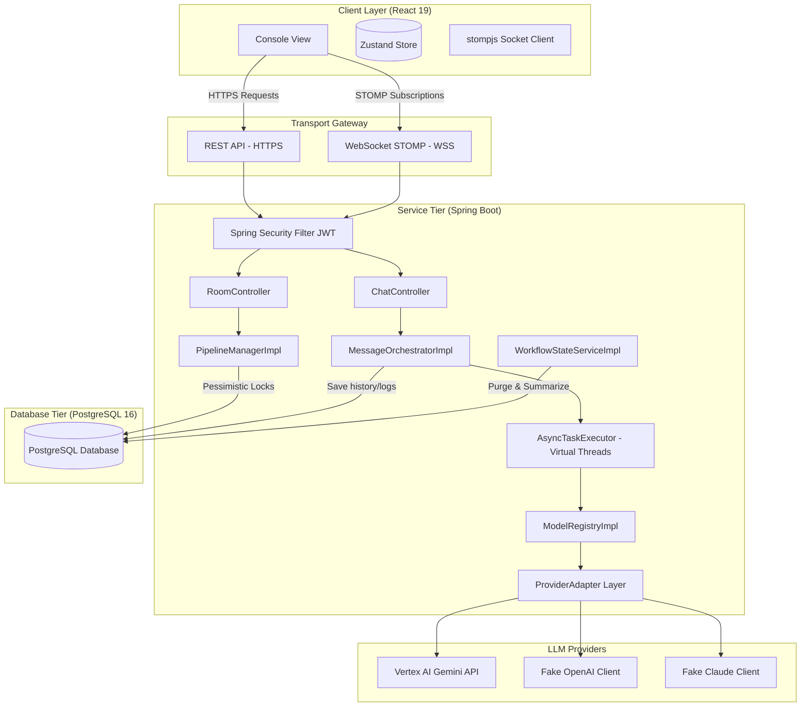

# System Architecture Specification: Conclave

This document defines the high-level system architecture, layout component trees, database entity mappings, and concurrent execution patterns for the **Conclave** platform.

---

## 1. System Topology Overview

The Conclave platform consists of a single-page React frontend and a monolithic Spring Boot backend. The system orchestrates multiple AI model wrappers while maintaining state consistency via relational databases and WebSocket message streams.



---

## 2. Layout Component Hierarchy

The frontend is structured as a viewport-locked (100vh/100vw) split-screen console, prioritizing density and quick updates over heavy animations.

```
App.jsx (Router & Session Gate)
 ├── LoginView.jsx / RegisterView.jsx (Autofill-override forms; centered cards)
 ├── SetupView.jsx (Low-profile room creation & role assignment layout)
 └── RoomView.jsx (Active room console container)
      ├── AlertBanner.jsx (Warning stripes display when room status = PAUSED)
      ├── Header Console (PID indicator, workspace title, STOMP connection status)
      └── Splitter Panel Layout (100% Height Flex Split)
           ├── Sidebar.jsx (Left panel: Objective description, Consensus Draft, telemetry stats)
           └── Main Chat Area (Center: Chronological message board)
                ├── MessageBubble.jsx (Model color-coded text, timestamp, and mock indicator)
                ├── TurnIndicator.jsx (Model status indicator orb)
                └── ChatBar.jsx (Command entry textarea and popover mention selector)
```

---

## 3. Database Entity Mappings (JPA Tier)

Entity relationships map to the database schema defined in `DB_Schema.md`. The Spring Data JPA tier enforces transactional boundaries for these models:

*   **`User` (1 : N) `Room`:** A user owns multiple collaborative rooms. Deleting a user cascadingly deletes their rooms.
*   **`Room` (1 : 1) `WorkflowState`:** Each room maintains exactly one active task state containing the unified summary (`current_draft`, `review_comments`).
*   **`Room` (1 : N) `RoleAssignment`:** Mappings linking custom roles (e.g. "Code Reviewer") to specific model keys (e.g. `FAKE_CLAUDE`) per workspace. An index enforces uniqueness on the composite key `(room_id, role_name)`.
*   **`Room` (1 : N) `CanonicalMessage`:** Represents the chronological record of the conversation. Ordered via `created_at` timestamp index.
*   **`Room` (1 : N) `TokenUsageLog`:** Metrics record for room consumption reports. Enables query aggregations on prompt and generation tokens.

---

## 4. Concurrency & Locking Strategy

Handling slow, blocking, multi-vendor LLM calls alongside real-time user commands requires a robust concurrency design to prevent thread starvation and race conditions.

```
   [ Concurrent Session API Call Lifecycle ]

   User POST Turn Request -> carrier-thread (Tomcat)
                                  │
                                  ├──> Delegate to AsyncTaskExecutor (Virtual Thread)
                                  │    * Tomcat carrier-thread immediately released back to pool.
                                  │
                                  └──> Virtual Thread executes executeStreamingTurnAsync()
                                       * Blocking call to Gemini/Mock API.
                                       * JVM unmounts virtual thread from carrier thread.
                                       * Carrier thread remains free to handle incoming requests.
                                       * Once I/O response chunk arrives, virtual thread remounts.
```

### 4.1 Tomcat Carrier Protection: Java 21 Virtual Threads
*   **The Problem:** Standard Spring Boot servers allocate one OS thread per request. If multiple rooms are simultaneously streaming responses from slow LLM APIs (which can take seconds), all Tomcat worker threads can quickly become blocked, causing the server to hang.
*   **The Solution:** Conclave configures a custom `AsyncTaskExecutor` backed by **Virtual Threads** (`Executors.newVirtualThreadPerTaskExecutor()`). When a turn executes, the worker thread delegates the task to this executor and immediately returns to Tomcat's pool. During slow blocking calls (such as streaming from Gemini Pro), the JVM unmounts the virtual thread, freeing the underlying OS carrier thread to process other incoming traffic.

### 4.2 State Safety: Pessimistic Database Locking
*   **The Problem:** During sequential pipelines (e.g., Model A &rarr; Model B), a user might click "Pause" or type an "Intervention" message at the exact moment a model response is completing. This can cause race conditions where both threads try to update the room status, objective, or index simultaneously, leading to state inconsistencies.
*   **The Solution:** Conclave implements **Pessimistic Write Locking** using Hibernate's `LockModeType.PESSIMISTIC_WRITE` on the `Room` repository:
    ```java
    @Repository
    public interface RoomRepository extends JpaRepository<Room, UUID> {
        @Lock(LockModeType.PESSIMISTIC_WRITE)
        @Query("SELECT r FROM Room r WHERE r.id = :id")
        Optional<Room> findWithLockById(@Param("id") UUID id);
    }
    ```
    When `PipelineManager.pausePipeline` or `MessageOrchestrator.executeStreamingTurnAsync` executes, it locks the room record (`SELECT ... FOR UPDATE`). Any concurrent request trying to alter or read the room state blocks until the active transaction completes and releases the lock. This guarantees sequential, safe state updates.

### 4.3 Why Reactive Spring (WebFlux) Was Rejected
We evaluated using Spring WebFlux for non-blocking I/O. While WebFlux scales efficiently, it introduces significant downsides:
1.  **Framework Complexity:** Forces code into reactive streams (`Mono`/`Flux`), which increases complexity for standard business logic.
2.  **Relational Database Impedance:** Reactive database drivers (R2DBC) lack mature support for Hibernate features (like automated dirty checking, entity graph resolution, and pessimistic locking annotations).
3.  **Thread Local Integration:** Spring Security contexts and transaction state are difficult to manage across reactive threads.
*   **Verdict:** Using Java 21 Virtual Threads combined with Spring Data JPA (`PESSIMISTIC_WRITE`) provides the best of both worlds: standard, maintainable imperative Java code with high concurrency performance.
