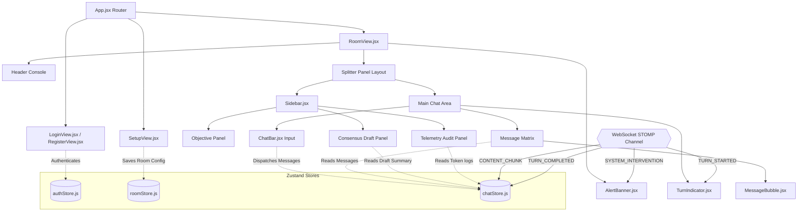

# UI/UX Design System Specification: Conclave

This document defines the visual rules, layout architecture, typography scales, color elevations, and interactive component specs for the **Conclave** console interface.

---

## 1. Brand Identity & Logo Rationale

Conclave's brand identity represents its core function: **multi-agent LLM consensus orchestration**. 

```
          [Dasheed Orbital Ring]   --->  Represents independent AI engines (Llama, Mistral, Gemma)
                *  *  *  *
             *     /\     *
            *    /    \    *
            *  <   ★    >  *       --->  Converging Triad Star (Four-Pointed Vesica Piscis)
            *    \    /    *             representing vectors of thought joining into consensus
             *     \/     *
                *  *  *  *
```

*   **The Consensus Star:** The logo is a geometric, four-pointed vesica piscis star surrounded by a dashed orbital ring. The ring represents external models orbiting the workspace, and the star represents vectors of thought converging to a central consensus point.
*   **Background Independence:** The logo is solid and free of cutout shapes, ensuring it remains readable on any background (Level 0 canvas, Level 1 sidebars, or monochrome favicon assets).
*   **Cache-Busting Favicon:** Linked in index.html with version query parameters (`favicon.svg?v=2`) to force prompt updates across browser sessions.
*   **Monochrome Scalability:** The geometry scales down to `16px` for the browser address bar and up to high-resolution headers.

---

## 2. Design Tokens

### 2.1 Theme Color Scales & Surface Elevations
To achieve the premium, low-contrast aesthetics of tools like Cursor, Linear, and Claude, Conclave implements a strict Level-based surface elevation system:

| Token Name | HSL / Hex | Usage / Component | System Rationale |
| :--- | :--- | :--- | :--- |
| **Level 0 (Base Canvas)** | `hsl(240, 15%, 4%)` / `#08080A` | Main page canvas background | Deep, low-fatigue slate base. |
| **Level 1 (Panels)** | `hsl(240, 10%, 8%)` / `#121214` | Solid opaque headers, sidebars, cards | Isolates layout sections. No transparency. |
| **Level 2 (Elevated)** | `hsl(240, 10%, 10%)` / `#18181C` | Input boxes, buttons, code blocks | Actionable surfaces. |
| **Level 3 (Active)** | `hsl(240, 10%, 15%)` / `#222227` | Active selection, button hover | Direct feedback state. |
| **Border (Subtle)** | `hsl(240, 10%, 13%)` / `#1F1F24` | Default container separators | Thin 1px grid alignments. |
| **Border (Focus)** | `hsl(240, 10%, 20%)` / `#2E2E36` | Focused inputs, hovered cards | High-fidelity highlight state. |

#### Color Accents (Used Sparingly):
*   **Primary Purple (`#8B5CF6`):** Standard interactive buttons and active role badges.
*   **Warning Amber (`#EAB308`):** Pipeline status alerts and sequential halt warnings (`[SYSTEM_HALT]`).
*   **Success Emerald (`#10B981`):** Active STOMP WebSocket connection indicators.
*   **Alert Red (`#EF4444`):** Error banners and room deletion triggers.

### 2.2 Typography Scale
Conclave enforces a clear textual hierarchy to distinguish operational logs from conversation text:
*   **Standard Interface (`Inter`):** Used for all labels, headings, and descriptions.
*   **Data Telemetry (`JetBrains Mono` / `SF Mono`):** Used for status headers (`STATUS::ACTIVE`), token metrics, identifiers, and keyboard shortcuts.

| Text Token | Utility Class | Style Description |
| :--- | :--- | :--- |
| **Workspace Title** | `text-lg font-bold tracking-tight text-white uppercase` | Main workspace title branding |
| **Section Header** | `text-xs font-mono font-bold uppercase tracking-wider text-zinc-300` | Sidebar sections and table headers |
| **Monospace Label** | `text-[9px] font-mono font-bold uppercase tracking-widest text-zinc-500` | Input labels and token metrics |
| **Body Message** | `text-xs leading-relaxed text-zinc-300` | Standard message content |
| **Telemetry Metric** | `text-xs font-mono font-bold text-zinc-200` | Real-time token logging outputs |

---

## 3. Layout Grid & Spacing Rules

To maintain a premium feel, Conclave reduces nested borders and wrappers in favor of continuous flow and thin structural lines:
*   **Continuous Surface Flow:** Section margins (`mb-12`) and thin horizontal rules (`border-t border-brand-border/60 pt-12`) separate content sections instead of nesting boxes.
*   **Grid Sequence Row Lists:** Model and color mappings render as a list of grid rows (separated by `divide-y divide-brand-border/60`) instead of separate card components.
*   **Accessibly-Proportioned Padding:** Panel padding is kept tight (`p-5` in sidebars) to maximize vertical space for the chat stream.

---

## 4. Form UX & Browser Safe Inputs

To prevent browser autofill behaviors from disrupting the dark theme, inputs use custom vendor overrides:
*   **Autofill Override CSS:** Overrides webkit-autofill classes to prevent default yellow/white backgrounds:
    ```css
    input:-webkit-autofill,
    input:-webkit-autofill:hover,
    input:-webkit-autofill:focus,
    input:-webkit-autofill:active {
      -webkit-text-fill-color: #F4F4F6 !important;
      -webkit-box-shadow: 0 0 0px 1000px #18181C inset !important;
      caret-color: #F4F4F6 !important;
    }
    ```
*   **Form Composition:** Authentication pages (`LoginView`, `RegisterView`) use a side-by-side split layout:
    *   **Left Column (Illustration Deck):** Displays system status logs in monospace.
    *   **Right Column (Form Surface):** Renders fields on a clean Level 1 background (no floating borders). On mobile, the left column collapses cleanly.
*   **Accessibility Anchors:** All input controls include unique `id`, `name`, and standard semantic `autoComplete` attributes (`email`, `current-password`) to prevent credential manager conflicts.

---

## 5. UI Component Hierarchy & Store Relationships

The following diagram maps the React component layout tree, its interaction with Zustand store slices, and STOMP event connections:


