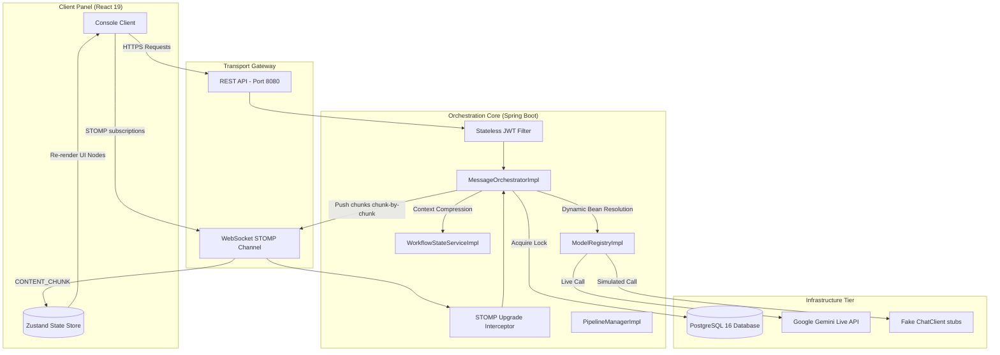

# Conclave — Multi-Provider Context Unification Platform

[]()
[]()
[]()
[]()

Conclave is an enterprise-grade multi-agent collaboration workspace designed to unify conversation context across fragmented LLM providers (Google Gemini, OpenAI GPT, Anthropic Claude). 

The platform serves as a systems engineering portfolio showcasing advanced Java/Spring Boot orchestration patterns, real-time WebSocket communication, thread-safe pessimistic locking, and reactive state management.

---

## 🎯 Project Overview & Motivation

### The Problem
The generative AI landscape is highly siloed. Power users frequently "tab-hop" between different model interfaces to leverage their unique strengths (e.g., Claude for coding, GPT-4 for logic, Gemini for large-context creative drafting). This workflow introduces **Context Fragmentation**: users must manually copy-paste background information, goals, and previous outputs between tabs to maintain a coherent thread. This results in:
1.  **Context Tax:** Cognitive load and wasted time manually syncing state.
2.  **Information Decay:** Loss of details and nuances during copy-pasting.
3.  **Token Inefficiency:** Redundant transcript uploads that bloat token consumption.

### The Solution: Context Unification
Conclave provides a unified **"meeting room"** where multiple models participate as distinct agents in a single, moderated thread. Rather than binding database schemas to one vendor, Conclave stores all turns in a provider-agnostic **Canonical Schema** (`CanonicalMessage`). 

Outgoing history is dynamically mapped to the target vendor's API format at runtime, and incoming responses are normalized back. All models share the same "memory" and objective state automatically, eliminating manual copy-pasting.

---

## 🚀 System Topology

The following diagram maps the high-level system topology, protocol boundaries, and integration flows of Conclave:



---

## 🛠️ Feature Showcase

*   **Multi-Provider Schema Translation:** Out-of-the-box translation mapping canonical history records to Gemini’s alternating user/model lists, Claude’s top-level system parameter structure, and OpenAI’s flat payloads.
*   **Dynamic Registry resolution:** A custom `@Service` registry resolving Spring AI client beans dynamically at runtime based on assigned roles.
*   **Real-time WebSocket Streaming:** Standardized STOMP protocol channels pushing model "typing" states (`TURN_STARTED`), word-by-word streaming deltas (`CONTENT_CHUNK`), and completion usage metrics (`TURN_COMPLETED`) to clients.
*   **Pause & Intervene (Pessimistic Locking):** Database-level locks (`SELECT FOR UPDATE`) halting active sequential queues instantly when a pause is triggered, allowing users to inject manual corrections (`isIntervention = true`) before resuming the pipeline.
*   **Context Janitor (Auto-Compression):** Automatically triggers when message logs exceed 10. Invokes Gemini to compress history into a structured `WorkflowState` (draft and comments) and purges middle database rows, cutting token costs by up to 75%.

---

## 💻 Technology Stack

| Layer | Selected Tech | Version | Rationale & Rationale |
| :--- | :--- | :--- | :--- |
| **Backend** | Spring Boot | `3.3.1` | Baseline for DI, security filters, and transaction scopes. |
| **Concurrency** | Java (JDK) | `21` | Uses **Virtual Threads** (Loom) to handle slow blocking LLM calls at scale. |
| **AI Integration** | Spring AI | `1.0.0-M1` | Standardizes chat client interfaces across different vendors. |
| **Database** | PostgreSQL | `16` | Relational consistency. Enforces pessimistic write locks for pipeline safety. |
| **Realtime Gateway** | WebSockets (STOMP) | `Spring Message` | Multiplexed subscription routing and custom headers. |
| **Frontend** | React | `19` | High-performance rendering loops during real-time streams. |
| **State Store** | Zustand | `latest` | Decouples WebSocket stream callbacks from React re-render paths. |
| **Styling** | Tailwind CSS | `latest` | High-density grid alignments, color elevations (Level 0-3), autofill overrides. |

---

## 📂 Repository Structure

```
Conclave/
├── docker-compose.yml                      # Provisions PostgreSQL 16 local instance
├── Docs/                                   # Architectural Specifications & Release notes
│   ├── Learning/                           # 9 Onboarding Engineering Handbook Chapters
│   │   ├── README.md                       # Handbook Index / Table of Contents
│   │   └── 01_Developer_Environment_Setup.md  # Developer Environment boot configurations
│   ├── API_Specification.md                # Request payloads, lifecycles, and sequences
│   ├── DB_Schema.md                        # ER Diagram, indexes, and locking strategies
│   └── Security_Architecture.md            # JWT structures, WS handshakes, and tenant safety
├── backend/                                # Spring Boot Java Application
│   ├── src/main/java/com/conclave/         # Java codebase
│   │   ├── security/                       # Security filters and token providers
│   │   ├── integration/                    # Adapters, registries, and client stubs
│   │   └── service/                        # Message orchestration and pipeline locks
│   └── pom.xml                             # Maven dependency configuration
└── frontend/                               # React Single Page Client
    ├── src/components/                     # MessageBubble, ChatBar, Sidebar, etc.
    ├── src/store/                          # Zustand Store managers (auth, chat, room)
    └── e2e/                                # Playwright browser integration tests
```

---

## 🏁 Setup & Quickstart Guide

### Step 1: Boot the Database
Provision the local PostgreSQL 16 container:
```bash
docker compose up -d
```

### Step 2: Start the Spring Boot Backend
1. Navigate to the backend folder: `cd backend`
2. Create your `.env` file from `.env.example` and set keys.
3. Start the application with the `dev` profile:
   ```bash
   ./mvnw spring-boot:run -Dspring-boot.run.profiles=dev
   ```
   The backend server starts on `http://localhost:8080`.

### Step 3: Run the React Client
1. Navigate to the frontend folder: `cd frontend`
2. Install node modules and start Vite:
   ```bash
   npm install
   npm run dev
   ```
   Open your browser to `http://localhost:5173`.

---

## 🧪 Testing Strategy

The repository includes test suites spanning the entire development lifecycle:
*   **Backend Unit & Integration Tests:** Run `mvn test` in the `backend/` directory to run adapter schema validations, dynamic registry mappings, and concurrency lock thread tests.
*   **Frontend Unit Tests:** Run `npm run test` inside `frontend/` to run component-level tests.
*   **Playwright E2E Integration Tests:** Run `npm run test:e2e` inside `frontend/` to spin up a mock-driven user session, validating page navigation and room setup workflows.

---

## 📚 Complete Engineering Documentation

### Architectural Specifications:
*   **[Product Requirements Document (PRD)](file:///d:/Coding/Projects----For%20Resume/Conclave/Docs/PRD.md):** Vision, persona requirements, and constraints.
*   **[System Architecture Specification](file:///d:/Coding/Projects----For%20Resume/Conclave/Docs/System_Architecture.md):** Concurrency strategies, component trees, and JPA entities.
*   **[API Specification & Contracts](file:///d:/Coding/Projects----For%20Resume/Conclave/Docs/API_Specification.md):** REST endpoints, sequence diagrams, and STOMP payloads.
*   **[Database Schema & Locking](file:///d:/Coding/Projects----For%20Resume/Conclave/Docs/DB_Schema.md):** ER diagrams, indexes, and transactions.
*   **[Security Architecture](file:///d:/Coding/Projects----For%20Resume/Conclave/Docs/Security_Architecture.md):** JWT REST filters, WebSocket handshake authorization, and tenant isolation.
*   **[Error Handling Strategy](file:///d:/Coding/Projects----For%20Resume/Conclave/Docs/Error_Handling_Strategy.md):** Exceptions registry and async WebSocket recovery.
*   **[WebSocket STOMP Specifications](file:///d:/Coding/Projects----For%20Resume/Conclave/Docs/WebSocket_Architecture.md):** Pub/sub event routing and reconnection fallbacks.
*   **[Testing & Concurrency Strategies](file:///d:/Coding/Projects----For%20Resume/Conclave/Docs/Testing_Strategy.md):** Three-tiered validation mapping.

### Internal Onboarding Handbook (Index):
Explore detailed architectural designs in our **[Internal Engineering Handbook](file:///d:/Coding/Projects----For%20Resume/Conclave/Docs/Learning/README.md)**.

---

## 🚦 Roadmap

### Version 1.0.0 (Current)
*   Provider-agnostic Canonical Message persistence.
*   Live Google Gemini API streaming.
*   Offline mock adapters for OpenAI and Claude.
*   Pessimistic DB lock pipeline synchronization.
*   Context Janitor history compression.
*   Stateless JWT security and socket authorization.
*   React 19 console layouts with Zustand stores.

### Version 2.0.0 (Planned)
*   Swap fake beans for live OpenAI/Claude integrations via Spring dev profiles.
*   Add billing integration (Stripe) based on audited `token_usage_log` entries.
*   Support document upload context (Vector RAG integration).

### Version 3.0.0 (Planned)
*   Parallel Consensus: Run multiple models in parallel on a prompt, followed by a critic model synthesizing their answers.
*   Autonomous sequential pipelines (models execute loops autonomously).

---

## ⚠️ Known Limitations & Future Improvements
*   **Vertex AI Free-Tier Limits:** Rate limits on Google Gemini free keys constrain consecutive stream executions.
*   **Single-Threaded Pipeline Queue:** Pipeline loops execute sequentially. Parallel multi-model consensus checks are planned for v3.0.0.
