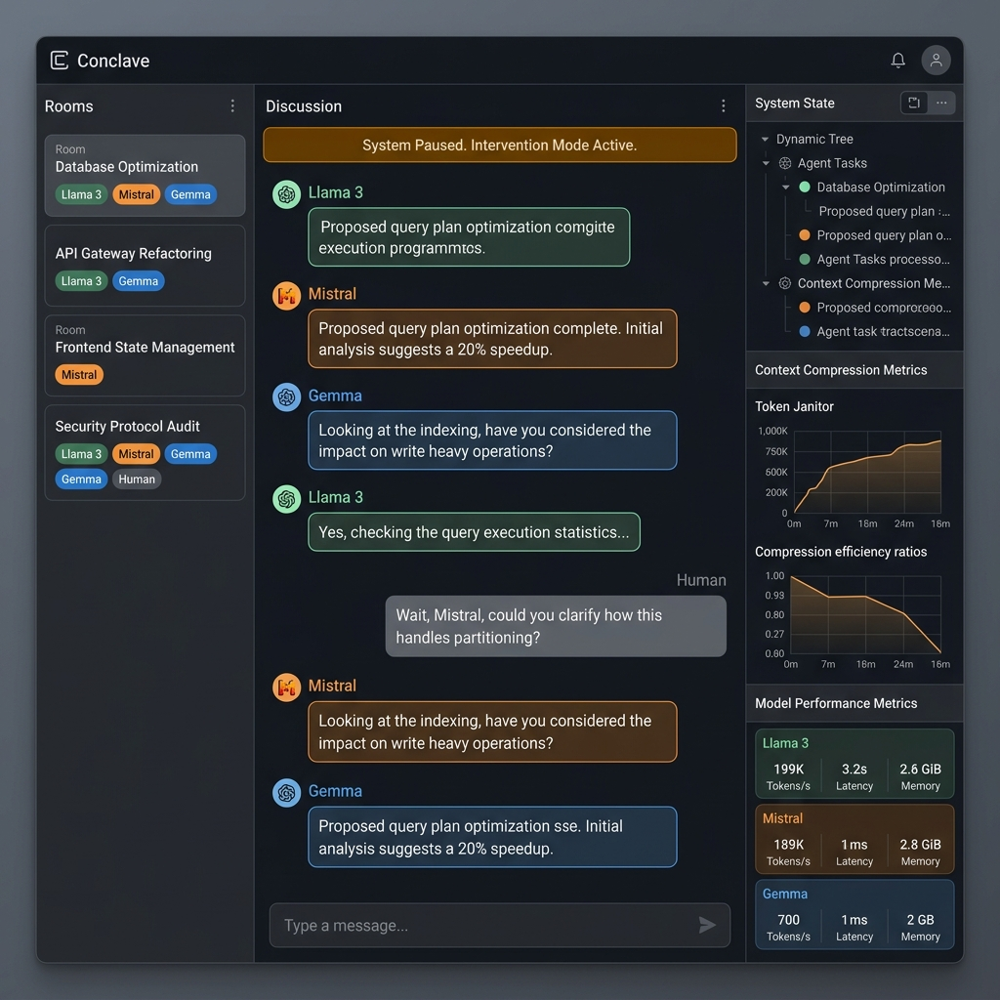
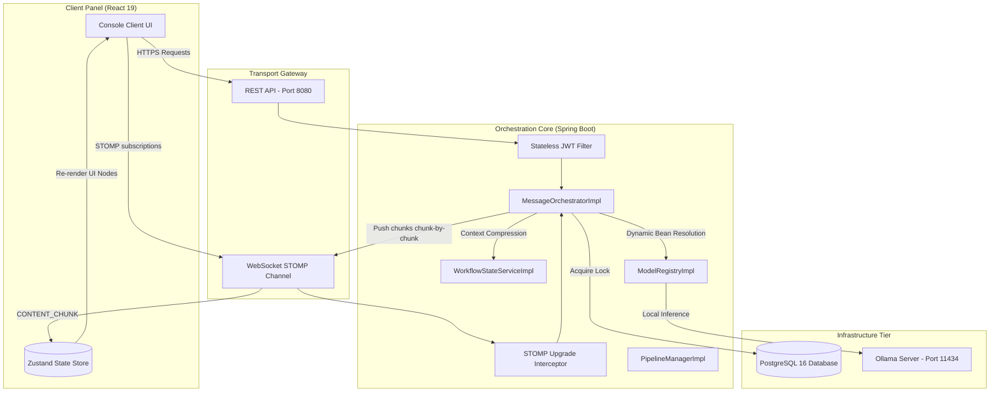

# Conclave — Multi-Provider Context Unification Platform

[]()
[]()
[]()
[]()
[]()

Conclave is an enterprise-grade multi-agent collaboration workspace designed to unify conversation context across fragmented local Large Language Models (LLM) run via Ollama. 

The platform serves as a systems engineering portfolio showcasing advanced Java/Spring Boot orchestration patterns, real-time WebSocket communication, thread-safe pessimistic locking, and reactive state management.

---

## 🎯 Project Overview & Motivation

### The Problem
The generative AI landscape is highly siloed. Power users frequently "tab-hop" between different model interfaces to leverage their unique strengths (e.g., Llama 3 for coding, Mistral for creative writing, Gemma for structured logical tasks). This workflow introduces **Context Fragmentation**: users must manually copy-paste background information, goals, and previous outputs between tabs to maintain a coherent thread. This results in:
1. **Context Tax:** High cognitive load and wasted time manually syncing state across multiple windows.
2. **Information Decay:** Loss of details, nuances, and conversational history during copy-pasting.
3. **Token Inefficiency:** Redundant transcript uploads that bloat local context windows and system memory.

### The Solution: Context Unification
Conclave provides a unified **"meeting room"** where multiple models participate as distinct agents in a single, moderated thread. Rather than binding database schemas to one vendor, Conclave stores all turns in a provider-agnostic **Canonical Schema** (`CanonicalMessage`). 

Outgoing history is dynamically mapped to the target vendor's API format at runtime, and incoming responses are normalized back. All models share the same "memory" and objective state automatically, eliminating manual copy-pasting.

---

## 📸 Workspace Showcase

Below is a mockup of the Conclave Console, showcasing the multi-agent room layout with color-coded message bubbles and the pause control desk:



---

## 🚀 High-Level Architecture

The following diagram maps the high-level system topology, protocol boundaries, and integration flows of Conclave. It details how the React client interacts with the Spring Boot service and local Ollama daemon:



---

## 🛠️ Key Features

*   **Multi-Model Schema Translation:** Out-of-the-box translation mapping canonical history records to Llama 3 special tokens, Mistral INST format, and Gemma control token structures.
*   **Dynamic Registry Resolution:** A custom `@Service` registry resolving Spring AI client beans dynamically at runtime based on assigned roles.
*   **Real-time WebSocket Streaming:** Standardized STOMP protocol channels pushing model "typing" states (`TURN_STARTED`), word-by-word streaming deltas (`CONTENT_CHUNK`), and completion usage metrics (`TURN_COMPLETED`) to clients.
*   **Pause & Intervene (Pessimistic Locking):** Database-level locks (`SELECT FOR UPDATE`) halting active sequential queues instantly when a pause is triggered, allowing users to inject manual corrections (`isIntervention = true`) before resuming the pipeline.
*   **Context Janitor (Auto-Compression):** Automatically triggers when message logs exceed 10. Invokes Llama 3 to compress history into a structured `WorkflowState` (draft and comments) and purges middle database rows, cutting token costs by up to 75%.

---

## 💻 Technology Stack & Rationale

| Layer | Selected Tech | Version | Rationale |
| :--- | :--- | :--- | :--- |
| **Backend** | Spring Boot | `3.3.1` | Solid baseline for Dependency Injection, security filters, and transaction scopes. |
| **Concurrency** | Java (JDK) | `21` | Utilizes **Virtual Threads** (Project Loom) to handle slow blocking LLM calls at scale without exhausting thread pools. |
| **AI Integration** | Spring AI | `1.0.0-M1` | Standardizes chat client interfaces across local models using Ollama. |
| **Database** | PostgreSQL | `16` | Relational consistency. Enforces pessimistic write locks (`SELECT FOR UPDATE`) for pipeline safety. |
| **Realtime Gateway** | WebSockets (STOMP) | `Spring Message` | Multiplexed subscription routing and custom headers for real-time events. |
| **Frontend** | React | `19` | High-performance rendering loops during real-time streams. |
| **State Store** | Zustand | `latest` | Decouples WebSocket stream callbacks from React re-render paths. |
| **Styling** | Tailwind CSS | `latest` | High-density grid alignments, HSL color elevations (Level 0-3), and autofill overrides. |

---

## 📂 Repository Structure

```
Conclave/
├── docker-compose.yml                      # Provisions PostgreSQL 16 local instance
├── README.md                               # This file (Repository Landing Page)
├── Docs/                                   # Architectural Specifications & Index
│   ├── README.md                           # Documentation Index & Navigation Portal
│   ├── PRD.md                              # Vision, requirements, and scope limits
│   ├── System_Architecture.md              # Class diagrams, JPA mappings, execution flow
│   ├── DB_Schema.md                        # ER diagrams, pessimistic locking, index designs
│   ├── API_Specification.md                # Endpoint specs, WebSocket STOMP payload schemas
│   ├── Security.md                         # JWT details, WebSocket auth interceptor flow
│   ├── Error_Handling_Strategy.md          # Global Exception Handler and recovery flow
│   ├── WebSocket_Architecture.md           # Message routing and fallback retry strategies
│   ├── Testing_Strategy.md                 # Validation matrix across all project tiers
│   ├── UI_Design.md                        # Front-end layout structures and color guides
│   ├── Model_Adapter_Strategy.md           # Prompt token mapping strategies
│   ├── Portfolio_And_Interview_Readiness_Defense.md  # System design highlights and FAQs
│   ├── Release_Notes_v1.0.0.md             # Version 1.0.0 release log
│   ├── Learning/                           # Onboarding Engineering Handbook
│   │   ├── README.md                       # Handbook Index / Table of Contents
│   │   └── 01_Developer_Environment_Setup.md ... 09_Tailwind_Customization_For_Tactical_UIs.md
│   └── Roadmap/                            # Implementation Phases
│       ├── README.md                       # Roadmap Index & Development Workflow
│       └── Phase_01_Project_Setup.md ... Phase_12_Documentation_And_Repository_Audit.md
├── backend/                                # Spring Boot Java Application
│   ├── README.md                           # Backend Deep Dive & Service Specifications
│   ├── pom.xml                             # Maven dependency configuration
│   └── src/main/java/com/conclave/         # Java codebase
│       ├── BackendApplication.java         # Main entrance class
│       ├── config/                         # Configuration (Async, Security, WebSocket)
│       ├── controller/                     # REST controllers (Auth, Room, Chat)
│       ├── domain/                         # Canonical DTOs and JPA Entities
│       ├── exception/                      # Exception handling structures
│       ├── integration/                    # Adapters (Llama/Mistral/Gemma) & Registry
│       ├── repository/                     # Spring Data JPA repositories
│       ├── security/                       # Security filters and token providers
│       ├── service/                        # Message orchestration and pipeline locks
│       └── util/                           # Parsing and validation utilities
└── frontend/                               # React Single Page Client
    ├── README.md                           # Frontend Deep Dive & Component Structure
    ├── package.json                        # NPM script registry and dependencies
    ├── tailwind.config.js                  # Color palette configurations
    ├── vite.config.js                      # Dev-server configuration
    ├── index.html                          # Root HTML entrance
    ├── e2e/                                # Playwright browser integration tests
    └── src/                                # React source folder
        ├── App.css / index.css             # Style overrides and design tokens
        ├── components/                     # MessageBubble, ChatBar, Sidebar, etc.
        ├── services/                       # API and WebSocket client adapters
        ├── store/                          # Zustand store managers (auth, room, chat)
        ├── tests/                          # Vitest component unit tests
        └── views/                          # Page Views (Login, Register, Setup, Room)
```

---

## 🏁 Setup & Quickstart Guide

For a detailed step-by-step walkthrough, refer to [Docs/Learning/01_Developer_Environment_Setup.md](file:///d:/Coding/Projects----For%20Resume/Conclave/Docs/Learning/01_Developer_Environment_Setup.md).

### Step 1: Boot the Database
Provision the local PostgreSQL 16 container:
```bash
docker compose up -d
```

### Step 2: Start the Spring Boot Backend
1. Navigate to the backend folder:
   ```bash
   cd backend
   ```
2. Copy the `.env.example` file in the root folder to `backend/.env` (or configure host variables).
3. Start the application with the `dev` profile:
   ```bash
   ./mvnw spring-boot:run -Dspring-boot.run.profiles=dev
   ```
   The backend server starts on `http://localhost:8080`.

### Step 3: Start the React Client
1. Navigate to the frontend folder:
   ```bash
   cd ../frontend
   ```
2. Install node modules and start the Vite local server:
   ```bash
   npm install
   npm run dev
   ```
   Open your browser to `http://localhost:5173`.

---

## 🔌 Local Inference Setup (Ollama)
To run local models:
1. Install [Ollama](https://ollama.com/) on your machine.
2. Pull the required models:
   ```bash
   ollama pull llama3
   ollama pull mistral
   ollama pull gemma
   ```
3. Verify Ollama is running locally on port `11434` (`curl http://localhost:11434`).

---

## 🧬 System Workflow & Pipeline Control

1. **User Message Submission:** The user submits a prompt mentioning models (e.g. *"@llama3 write a function, @mistral review it"*).
2. **Context Resolution:** The backend receives the message, parses the mentions, and locks the room using a pessimistic database lock to enforce transaction isolation.
3. **Pipeline Sequential Loop:** The backend iterates through the mentioned models sequentially.
4. **Adapter Translation:** Before invoking the model via Ollama, the message history is translated into the model's native format.
5. **Streaming Output:** Model responses are streamed back chunk-by-chunk via the WebSockets STOMP broker directly updating the React Zustand store.
6. **Compression (Janitor):** If the history length exceeds 10 messages, the `WorkflowStateServiceImpl` runs a compression pass to keep token size low and purges older DB messages.
7. **Pause/Resume:** The user can pause execution mid-pipeline, insert an intervention, and resume, updating the database state immediately.

---

## 🧪 Testing

The repository includes test suites spanning the entire development lifecycle:
*   **Backend Unit & Integration Tests:** Run `mvn test` in the `backend/` directory to run adapter schema validations, dynamic registry mappings, and concurrency lock thread tests.
*   **Frontend Unit Tests:** Run `npm run test` inside `frontend/` to run component-level tests.
*   **Playwright E2E Integration Tests:** Run `npm run test:e2e` inside `frontend/` to spin up a mock-driven user session, validating page navigation and room setup workflows.

For the full testing strategy, review [Docs/Testing_Strategy.md](file:///d:/Coding/Projects----For%20Resume/Conclave/Docs/Testing_Strategy.md).

---

## 📖 Documentation Index

Use the table below to navigate to the core documentation modules:

| Document | Direct Link | Purpose |
| :--- | :--- | :--- |
| **Documentation Portal** | [Docs/README.md](file:///d:/Coding/Projects----For%20Resume/Conclave/Docs/README.md) | Entry point to all specifications, diagrams, and audits. |
| **Product Requirements** | [Docs/PRD.md](file:///d:/Coding/Projects----For%20Resume/Conclave/Docs/PRD.md) | Vision, target audience, features list, and constraints. |
| **System Architecture** | [Docs/System_Architecture.md](file:///d:/Coding/Projects----For%20Resume/Conclave/Docs/System_Architecture.md) | High-level system structure, database design, and sequence diagrams. |
| **Database Schema** | [Docs/DB_Schema.md](file:///d:/Coding/Projects----For%20Resume/Conclave/Docs/DB_Schema.md) | Entity relationships, pessimistic lock descriptions, and indices. |
| **Security Architecture** | [Docs/Security.md](file:///d:/Coding/Projects----For%20Resume/Conclave/Docs/Security.md) | Stateless JWT security, WebSocket handshake, and endpoint authority. |
| **Engineering Handbook** | [Docs/Learning/README.md](file:///d:/Coding/Projects----For%20Resume/Conclave/Docs/Learning/README.md) | 9-chapter onboarding curriculum covering specific backend/frontend implementations. |
| **Implementation Roadmap** | [Docs/Roadmap/README.md](file:///d:/Coding/Projects----For%20Resume/Conclave/Docs/Roadmap/README.md) | 12 atomic phases and milestones for building Conclave. |

---

## 🚦 Future Roadmap

*   **Vector RAG Integration (v2.0.0):** Document uploads and automatic vector chunking to inject relevant context during LLM inference.
*   **Billing Engine (v2.0.0):** Support Stripe billing integrated with audited token usage logs.
*   **Parallel Consensus (v3.0.0):** Query multiple models simultaneously and generate a combined evaluation via a critic model.

---

## 🤝 Contributing
Contributions are welcome. Please ensure that:
1. All Maven tests pass (`mvn test`).
2. Frontend lint checks pass (`npm run lint`).
3. You follow the Git branch name policy defined in [Docs/Roadmap/README.md](file:///d:/Coding/Projects----For%20Resume/Conclave/Docs/Roadmap/README.md).

---

## 🏆 Acknowledgements
*   **Spring Boot & Spring AI teams** for simplifying local model clients.
*   **Ollama project** for enabling lightweight local model inference.

---

## 📄 License

This project is licensed under the MIT License - see the [LICENSE](LICENSE) file for details.
