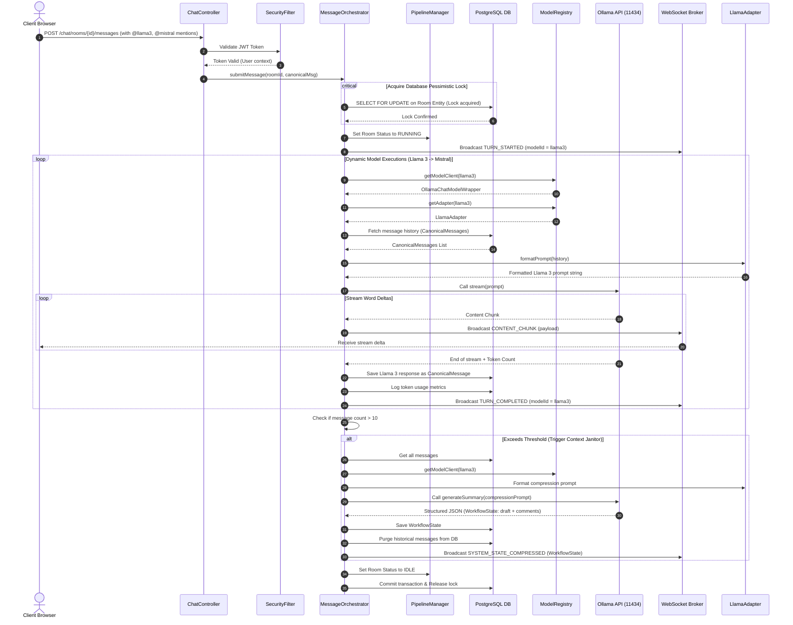

# Conclave Backend Service Spec

The Conclave backend is a monolithic Spring Boot service built using Java 21 (featuring Project Loom Virtual Threads), Spring Security, Spring AI, WebSockets (STOMP), and Hibernate JPA on PostgreSQL.

---

## 🎯 Backend Purpose
The backend serves as the core orchestration and coordination engine of the Conclave platform. It:
1. **Unifies Context:** Manages conversation history in a model-agnostic canonical schema.
2. **Orchestrates Runs:** Executes sequential pipelines of local LLMs based on mentions in user messages.
3. **Ensures Thread Safety:** Prevents race conditions during pipeline control (pause, resume, intervene) using pessimistic database locks.
4. **Optimizes System Context:** Triggers context compaction (the "Janitor" service) when history limits are exceeded to minimize token consumption.

---

## 🏗️ Architecture & Layer Responsibilities

```
+-------------------------------------------------------------+
|                     Presentation Layer                      |
|      AuthController | RoomController | ChatController       |
+------------------------------┬------------------------------+
                               │ Uses REST / STOMP WebSockets
+------------------------------▼------------------------------+
|                      Application Services                   |
|  MessageOrchestratorImpl | PipelineManagerImpl | RoomService |
+------------------------------┬------------------------------+
                               │ Handles logic, locking, sync
+------------------------------▼------------------------------+
|                         Domain Model                        |
|   CanonicalMessage | Room | WorkflowState | TokenUsageLog   |
+------------------------------┬------------------------------+
                               │ Defines state schemas
+------------------------------▼------------------------------+
|                     Integration & SPI Layer                 |
|     ModelRegistryImpl | ModelAdapter | OllamaChatWrapper    |
+------------------------------┬------------------------------+
                               │ Dynamic ChatModel resolution
+------------------------------▼------------------------------+
|                      Infrastructure Layer                   |
|       JPA Repositories | PostgreSQL 16 | Ollama Server      |
+-------------------------------------------------------------+
```

### Layer Responsibilities
*   **Security & Gateway Layer:** Intercepts incoming HTTP requests to validate JWT headers and checks STOMP handshake headers during WebSocket upgrades to establish user context.
*   **Controller Layer (`controller/`):** Exposes JSON endpoints for authentication, room creation, and REST-based chat operations.
*   **Service Layer (`service/`):** Contains the stateful orchestration logic:
    *   `MessageOrchestratorImpl`: Coordinates sequential model runs, updates token metrics, and dispatches socket chunks.
    *   `PipelineManagerImpl`: Directs pessimistic locking states (`PipelineStatus`: `IDLE`, `RUNNING`, `PAUSED`, `INTERRUPTED`).
    *   `RoomService`: Manages room config, role assignments, and member rules.
    *   `WorkflowStateServiceImpl`: Periodically condenses history and invokes the Llama 3 Janitor compression engine.
*   **Integration Layer (`integration/`):** Decouples Spring Boot from specific LLM vendors:
    *   `adapter/`: Serializes message history to LLM specific prompt templates and parses raw responses.
    *   `registry/`: Dynamically resolves model names (e.g. `llama3`, `mistral`, `gemma`) to local Ollama client beans.
*   **Persistence Layer (`repository/`):** Manages entity access and custom transactional queries.

---

## 🔄 Request Lifecycle & Orchestration Sequence

The following diagram tracks the detailed sequence of events when a user sends a message that triggers a multi-model pipeline:



---

## 🔐 Authentication Flow

1.  **REST Security:** The `JwtAuthenticationFilter` intercepts all HTTP REST endpoints matching `/api/**` (except `/api/auth/**`). It extracts the JWT token from the `Authorization: Bearer <token>` header, parses the claims, and registers the user context into Spring's `SecurityContextHolder`.
2.  **WebSocket Handshake Security:** Standard STOMP connections lack standard HTTP headers after the handshake. Conclave secures WebSockets by registering a custom `ChannelInterceptor` in `WebSocketConfig`. During the `CONNECT` frame, the interceptor extracts the JWT token from the `Authorization` header, validates the signature, and sets the WebSocket session user principal. Connection frames without a valid token are rejected immediately.

---

## 🌐 WebSocket & STOMP Architecture

Conclave uses Spring's built-in message broker to stream LLM responses and synchronize room status in real-time.

### Event Channel Subscriptions
*   **Subscribe Destination:** `/topic/rooms/{roomId}`
    *   Clients subscribe to this path to receive all real-time events relating to the specific room session.
*   **Send Destination:** `/app/rooms/{roomId}/pause` or `/app/rooms/{roomId}/resume`
    *   Clients use these paths to send control commands directly to the `PipelineManager`.

### WebSocket Message Types
Messages sent over the WebSocket channel follow a unified envelope containing a `type` field:
*   `TURN_STARTED`: Indicates a model has begun generating a response (triggers loading and typing indicators in the client).
*   `CONTENT_CHUNK`: Contains word-by-word streaming deltas from Ollama.
*   `TURN_COMPLETED`: Sent when a model finishes its execution (includes token logs and final outputs).
*   `SYSTEM_INTERVENTION`: Fired when a pipeline is interrupted by a user comment.
*   `SYSTEM_STATE_COMPRESSED`: Broadcasts the newly compacted `WorkflowState` (draft and comment summary) after the Context Janitor runs.

---

## 🤖 Model Registry & Dynamic Resolution

Conclave decouples model routing through the `ModelRegistryImpl`.
1.  **Bean Binding:** At startup, Spring AI binds local Ollama configuration profiles to standard chat client instances.
2.  **Dynamic Lookup:** When `MessageOrchestrator` needs to run a model (e.g. `llama3`), it queries the `ModelRegistryImpl`.
3.  **ChatWrapper Delegation:** The registry returns an `OllamaChatModelWrapper`, which handles local execution details, adds retries, and normalizes Spring AI responses.

---

## 🔌 Model Adapter Layer

To maintain a model-agnostic database schema, all conversation history is saved in the `CanonicalMessage` entity. However, local models require very different prompting styles to maintain instruct accuracy.
The `ModelAdapter` interface abstracts this:
```java
public interface ModelAdapter {
    String formatPrompt(List<CanonicalMessage> history, String systemPrompt);
    String parseResponse(String rawOutput);
    ModelId getModelId();
}
```
*   **`LlamaAdapter`:** Formats messages using Llama 3 tags: `<|start_header_id|>user<|end_header_id|>\n\n{content}<|eot_id|>`.
*   **`MistralAdapter`:** Formats messages using Mistral tags: `[INST] {system_prompt} \n {user_message} [/INST]`.
*   **`GemmaAdapter`:** Formats messages using Gemma tags: `<start_of_turn>user\n{content}<end_of_turn>`.

---

## 🧹 WorkflowState & Context Janitor Lifecycle

To prevent GPU memory bloat and long inference delays, Conclave implements a context compression engine known as the **Context Janitor**:
1.  **Threshold Check:** After every completed pipeline turn, `WorkflowStateServiceImpl` queries the database for the active message count.
2.  **Janitor Invoke:** If count > 10, the Janitor is invoked.
3.  **Llama 3 Compression:** The Janitor retrieves all messages, formats a compression prompt, and commands Llama 3 to compile the discussion history into a structured JSON payload containing two fields:
    *   `draft`: The current state of the document/code being worked on.
    *   `comments`: Key feedback and discussion points raised.
4.  **Database Purging:** The service saves the `WorkflowState` object, links it to the active room, and purges the middle conversation history from the `messages` table, leaving only the last two messages as direct conversational context.
5.  **Re-synchronization:** The updated `WorkflowState` is pushed via WebSocket to all clients to refresh the sidebar workspace.

---

## ⚙️ Configuration Properties

The backend parses settings from environment variables. Copy `.env.example` to `.env` or configure them on your host:

| Environment Variable | Config Property | Description | Default Value |
| :--- | :--- | :--- | :--- |
| `JWT_SECRET` | `security.jwt.secret` | HMAC secret key used to sign JWTs (min 256 bits). | `ConclavePlatformSuperSecureSecretKey123!` |
| `JWT_EXPIRATION` | `security.jwt.expiration` | Validity duration of a signed JWT (ms). | `86400000` (24 Hours) |
| `DB_URL` | `spring.datasource.url` | JDBC connection string to the Postgres DB. | `jdbc:postgresql://localhost:5432/conclave_db` |
| `DB_USER` | `spring.datasource.username` | PostgreSQL username. | `conclave_user` |
| `DB_PASSWORD` | `spring.datasource.password` | PostgreSQL password. | `conclave_password` |
| `OLLAMA_BASE_URL` | `spring.ai.ollama.base-url` | URL pointing to the active Ollama daemon. | `http://localhost:11434` |

---

## 🛠️ CLI Operations & Maven Workflows

Navigate to the `backend/` directory to run these commands:

### Compile Backend Code
```bash
./mvnw clean compile
```

### Run Backend Test Suite
```bash
./mvnw test
```
The test suite includes:
*   **Unit Tests (`/src/test/java/.../unit`):** Validates parser rules, model adapters prompts output formatting, and response extraction.
*   **Integration Tests (`/src/test/java/.../integration`):** Verifies WebSecurity JWT validation filters, database transaction configurations, and thread-safe sequential execution rules using mock database entries.

### Start Local Development Server
```bash
./mvnw spring-boot:run -Dspring-boot.run.profiles=dev
```

---

## 🧩 Extension Points (Adding a New Model)

To register a new local model (e.g. `phi3`):
1.  **Add to ModelId Enum:** Add `PHI3` to the `ModelId` enum class.
2.  **Create Adapter:** Create a `Phi3Adapter.java` implementing the `ModelAdapter` interface. Add formatting logic for Phi-3 tags: `<|user|>\n{content}<|end|>\n<|assistant|>`.
3.  **Register Adapter:** Annotate the new adapter class with `@Component`. The `ModelRegistryImpl` will automatically scan and register the adapter bean at boot time.
4.  **Pull Local Model:** Pull the model via Ollama CLI: `ollama pull phi3`.
